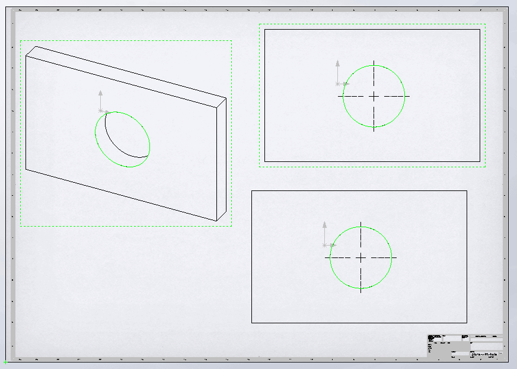

{ width=300 }

This example demonstrates different approaches of selecting entities (e.g. edge, face, vertex) in the drawing views using SOLIDWORKS API

1. Selecting entity in the target view via direct [IView:SelectEntity](https://help.solidworks.com/2012/english/api/sldworksapi/SolidWorks.Interop.sldworks~SolidWorks.Interop.sldworks.IView~SelectEntity.html) method. This method is useful when it is required to select entity without the need of passing any additional data (such as selection mark or callout).
1. Selecting entity by specifying the view in the selection data via [ISelectData::View](https://help.solidworks.com/2012/english/api/sldworksapi/SolidWorks.Interop.sldworks~SolidWorks.Interop.sldworks.ISelectData~View.html) SOLIDWORKS API property. This enables more flexibility compared to previous method as it is possible to provide more selection information.
1. Selecting visual entities. This approach allows to find the entity in the context of the drawing view. The main benefit as it would only attempt to select the entity which is visible in the current view orientation while previous two approaches do not consider the case where entity is hidden behind other entities.

* To run the macro download the [sample model and the drawing](plate-with-hole.zip).
* Circular edge was named *Hole* in the part document

{ width=300 }

* Run the macro and this edge is selected in all 3 views with 3 different approaches described above.

~~~ vb
Const ENT_NAME As String = "Hole"

Dim swApp As SldWorks.SldWorks
Dim swDraw As SldWorks.DrawingDoc

Sub main()

    Set swApp = Application.SldWorks
    
    Set swDraw = swApp.ActiveDoc
    
    Dim swView1 As SldWorks.view
    Dim swView2 As SldWorks.view
    Dim swView3 As SldWorks.view
    
    Set swView1 = swDraw.FeatureByName("Drawing View1").GetSpecificFeature()
    Set swView2 = swDraw.FeatureByName("Drawing View2").GetSpecificFeature()
    Set swView3 = swDraw.FeatureByName("Drawing View3").GetSpecificFeature()
    
    Dim swRefDoc As SldWorks.PartDoc
    Set swRefDoc = swView1.ReferencedDocument
    
    Dim swEdge As SldWorks.Edge
    Set swEdge = swRefDoc.GetEntityByName(ENT_NAME, swSelectType_e.swSelEDGES)
    
    swDraw.ClearSelection2 True
    
    SelectInView swView1, swEdge
    SelectInViewBySelData swView2, swEdge
    SelectFromVisibleEntities swView3
    
End Sub

Sub SelectInView(view As SldWorks.view, ent As SldWorks.Entity)
    view.SelectEntity ent, True
End Sub

Sub SelectInViewBySelData(view As SldWorks.view, ent As SldWorks.Entity)
    
    Dim swSelMgr As SldWorks.SelectionMgr
    Dim swSelData As SldWorks.SelectData
    
    Set swSelMgr = swDraw.SelectionManager
    
    Set swSelData = swSelMgr.CreateSelectData
    swSelData.view = view 'specify the view to select entity in
    
    ent.Select4 True, swSelData
    
End Sub

Sub SelectFromVisibleEntities(view As SldWorks.view)
    
    Dim vVisComps As Variant
    vVisComps = view.GetVisibleComponents()
    
    Dim vVisEnts As Variant
    vVisEnts = view.GetVisibleEntities2(vVisComps(0), swViewEntityType_e.swViewEntityType_Edge)
    
    Dim i As Integer
    
    For i = 0 To UBound(vVisEnts)
        Dim swEdge As SldWorks.Entity
        Set swEdge = vVisEnts(i)
        If swEdge.ModelName = ENT_NAME Then
            swEdge.Select4 True, Nothing 'no need to explicitly specify the view to select in as pointer to the entity already belongs to the view
            Exit Sub
        End If
    Next
    
End Sub
~~~

