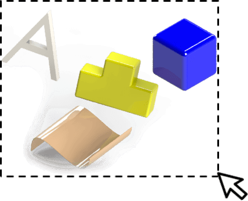
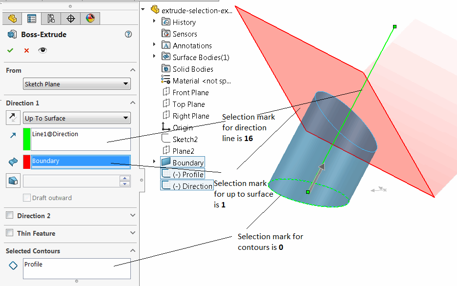
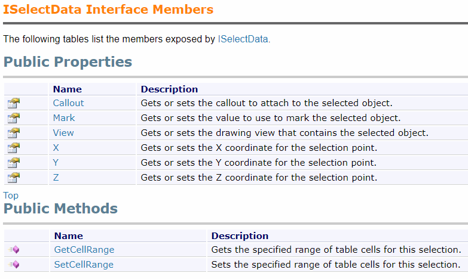
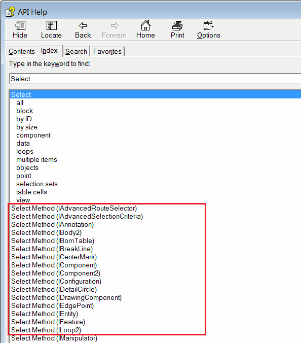

{ width=300 }

选择是SOLIDWORKS API开发过程中的重要部分。本文将讨论不同的选择方法和选择选项。

### 应用

主要用途包括：

* [创建特征](/docs/codestack/solidworks-api/document/features-manager)（例如，挤压特征需要选择草图和可选的方向）
* [配对](/docs/codestack/solidworks-api/document/assembly/mates)
* 评估（例如，表面积或周长计算）
* [标注](/docs/codestack/solidworks-api/document/dimensions)
* 高亮显示

### 选择标记

{ width=500 }

选择标记是与所选实体关联的整数属性，用于区分不同目的的不同对象组。例如，在属性管理器页面中使用的不同选择框中的选择将具有不同的选择标记。可以在选择新对象时通过[IModelDocExtension::SelectByID2](https://help.solidworks.com/2012/english/api/sldworksapi/solidworks.interop.sldworks~solidworks.interop.sldworks.imodeldocextension~selectbyid2.html)方法或直接的*Select*方法（例如，[IFeature::Select2](https://help.solidworks.com/2012/english/api/sldworksapi/solidworks.interop.sldworks~solidworks.interop.sldworks.ifeature~select2.html)）分配选择标记。

选择标记也可以在[Selection Data](#selection-data)的[ISelectData::Mark](https://help.solidworks.com/2016/english/api/sldworksapi/SolidWorks.Interop.sldworks~SolidWorks.Interop.sldworks.ISelectData~Mark.html)属性中传递，因为某些选择方法期望将此对象作为*Data*参数传递给方法（例如，[IComponent2::Select4](https://help.solidworks.com/2012/english/api/sldworksapi/SOLIDWORKS.Interop.sldworks~SOLIDWORKS.Interop.sldworks.IComponent2~Select4.html)，[IAnnotation::Select3](https://help.solidworks.com/2012/english/api/sldworksapi/SolidWorks.Interop.sldworks~SolidWorks.Interop.sldworks.IAnnotation~Select3.html)方法）。

使用[ISelectionMgr::SetSelectedObjectMark](https://help.solidworks.com/2012/english/api/sldworksapi/SolidWorks.Interop.sldworks~SolidWorks.Interop.sldworks.ISelectionMgr~SetSelectedObjectMark.html)方法更改已选择对象的选择标记。

### 选择数据

选择数据是通过[ISelectionMgr::CreateSelectData](https://help.solidworks.com/2012/english/api/sldworksapi/solidworks.interop.sldworks~solidworks.interop.sldworks.iselectionmgr~createselectdata.html)SOLIDWORKS API方法创建的对象，可以传递给各种选择方法（例如，[IBody2::Select2](https://help.solidworks.com/2012/english/api/sldworksapi/SOLIDWORKS.Interop.sldworks~SOLIDWORKS.Interop.sldworks.IBody2~Select2.html)）。

选择数据允许提供附加的选择指令：

* 将[标注](/docs/codestack/solidworks-api/adornment/callouts)元素与选择关联
* 分配[选择标记](#选择标记)属性
* 指定要在其中选择元素的绘图视图
* 设置选择点。对于已选择的对象，也可以通过[ISelectionMgr::SetSelectionPoint2](https://help.solidworks.com/2012/english/api/sldworksapi/SolidWorks.Interop.sldworks~SolidWorks.Interop.sldworks.ISelectionMgr~SetSelectionPoint2.html)方法设置此选项。
* 设置要在表格注释中选择的单元格范围。

选择数据是一个可选参数。如果不使用它，请将*NULL*传递给方法。

有关更多信息，请参阅[ISelectData](https://help.solidworks.com/2012/english/api/sldworksapi/SolidWorks.Interop.sldworks~SolidWorks.Interop.sldworks.ISelectData_members.html)SOLIDWORKS API接口成员。

{ width=500 }

### 选择方法

在SOLIDWORKS中，有多种选择实体的方法。以下列表是选择元素的最常见方法：

* 按名称或按坐标。此方法通常在宏记录中使用，并选择对象“原样”（即，与用户界面中选择的方式相同）。这种方法存在潜在问题，通常是宏[不稳定和不一致](/docs/codestack/solidworks-api/troubleshooting/macros/selection-inconsistency)的原因，应避免使用。请参阅[按名称和坐标选择对象](select-by-id)文章，了解此方法的优缺点。

* 通过直接的*SelectX*方法。SOLIDWORKS中的大多数可选择对象都提供直接的*SelectX*方法，允许从指针选择元素：

{ width=300 }

这是一种较好的选择方法，因为它提供了一致性，并且不依赖于视图的方向。请参阅[选择所有草图元素](select-all-sketch-elements)示例，了解如何选择不同的草图元素。

* 批量模式下的对象调度。这是一种有用的选择任何可选择对象的方式，无需将其转换为特定接口。请参阅[批量选择任何SOLIDWORKS对象](select-objects)示例。

* 按类型（例如，标准平面或视图）。请参阅[按类型选择标准平面或原点](select-standard-ref-geometry)示例。

* 按命名实体（面、边或顶点）的名称。请参阅[选择命名实体](select-named-entity)。

* 直接将对象添加到选择列表中。阅读[仅用于API的对象选择](api-only-selection)文章，了解更多信息。

* 在装配中使用[高级组件选择](https://help.solidworks.com/2012/english/api/sldworksapi/Use_Advanced_Component_Selection_Example_VB.htm)。

* 使用[交叉射线](https://help.solidworks.com/2012/english/api/sldworksapi/Select_Objects_Using_Intersecting_Ray_Example_VB.htm)的向量。

### 在绘图视图中选择实体

可以通过[IModelDocExtension::SelectByID2](https://help.solidworks.com/2012/english/api/sldworksapi/solidworks.interop.sldworks~solidworks.interop.sldworks.imodeldocextension~selectbyid2.html)方法选择绘图视图中的实体（即在3D模型中创建的元素），但它引入了与在3D模型中使用此方法相同的问题（参见[选择方法](#选择方法)部分）。请参阅[在绘图视图中选择实体](drawing-view-entities)文章，了解选择绘图视图中实体的不同方法的示例。