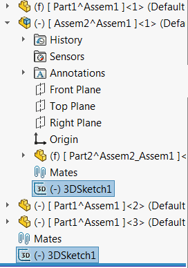

{ width=250 }

这个VBA宏使用SOLIDWORKS API选择活动模型（零件、装配或绘图）中的所有特征。对于绘图和装配，还会选择子组件中的特征。

与[获取特征类型名称](/docs/codestack/solidworks-api/document/features-manager/get-feature-type-name/)一起使用此宏，以获取用于过滤的所需特征类型名称。

## 配置

修改宏开头的常量

~~~ vb
Const APPEND_SELECTION As Boolean = False 'True表示追加选择，False表示清除现有选择
Const TYPE_NAME As String = "" '从特征中获取类型名称，参考'获取特征类型名称'宏
~~~

此宏可与其他需要预先选择特征的宏一起使用。它还可以与SOLIDWORKS批量操作（如删除或抑制）一起使用。

~~~ vb
Const APPEND_SELECTION As Boolean = False
Const TYPE_NAME As String = "3DProfileFeature" '3DSketch

Dim swApp As SldWorks.SldWorks

Sub main()

    Set swApp = Application.SldWorks
    
    Dim swModel As SldWorks.ModelDoc2
    
    Set swModel = swApp.ActiveDoc
    
    If Not swModel Is Nothing Then
            
        Dim vFeats As Variant
        vFeats = GetAllFeaturesByType(swModel, TYPE_NAME)
        
        swModel.Extension.MultiSelect2 vFeats, False, Nothing
        
        'If swModel.Extension.MultiSelect2(vFeats, False, Nothing) = UBound(vFeats) + 1 Then
            'Err.Raise vbError, "", "无法选择特征"
        'End If
        
    Else
        MsgBox "请打开模型"
    End If
    
End Sub

Function GetAllFeaturesByType(model As SldWorks.ModelDoc2, typeName As String) As Variant
    
    Dim swFeatMgr As SldWorks.FeatureManager
        
    Set swFeatMgr = model.FeatureManager
    
    Dim swRootFeatNode As SldWorks.TreeControlItem
    
    Set swRootFeatNode = swFeatMgr.GetFeatureTreeRootItem2(swFeatMgrPane_e.swFeatMgrPaneBottom)
    
    If Not swRootFeatNode Is Nothing Then
        Dim swFeatsColl As Collection
        Set swFeatsColl = New Collection
        TraverseFeatureNode swRootFeatNode, typeName, swFeatsColl
    Else
        Err.Raise vbError, "", "无法获取根节点"
    End If
    
    If swFeatsColl.Count() > 0 Then
        
        Dim swFeats() As SldWorks.Feature
        ReDim swFeats(swFeatsColl.Count() - 1)
        
        Dim i As Integer
        
        For i = 0 To UBound(swFeats)
            Set swFeats(i) = swFeatsColl.item(i + 1)
        Next
        
        GetAllFeaturesByType = swFeats
        
    Else
        GetAllFeaturesByType = Empty
    End If
    
End Function

Sub TraverseFeatureNode(featNode As SldWorks.TreeControlItem, typeName As String, feats As Collection)
    
    If featNode.ObjectType = swTreeControlItemType_e.swFeatureManagerItem_Feature Then
        
        Dim swFeat As SldWorks.Feature
        Set swFeat = featNode.Object
        
        If swFeat.GetTypeName2() = "HistoryFolder" Then
            Exit Sub
        End If
        
        If LCase(swFeat.GetTypeName2) = LCase(typeName) Then
            If Not Contains(feats, swFeat) Then
                'swFeat.Select2 True, -1
                feats.Add swFeat
            End If
        End If
        
    End If
    
    Dim swChildFeatNode As SldWorks.TreeControlItem
    
    Set swChildFeatNode = featNode.GetFirstChild()
    
    While Not swChildFeatNode Is Nothing
        TraverseFeatureNode swChildFeatNode, typeName, feats
        Set swChildFeatNode = swChildFeatNode.GetNext
    Wend
    
End Sub

Function Contains(coll As Collection, item As Object) As Boolean
    
    Dim i As Integer
    
    For i = 1 To coll.Count
        If coll.item(i) Is item Then
            Contains = True
            Exit Function
        End If
    Next
    
    Contains = False
    
End Function
~~~