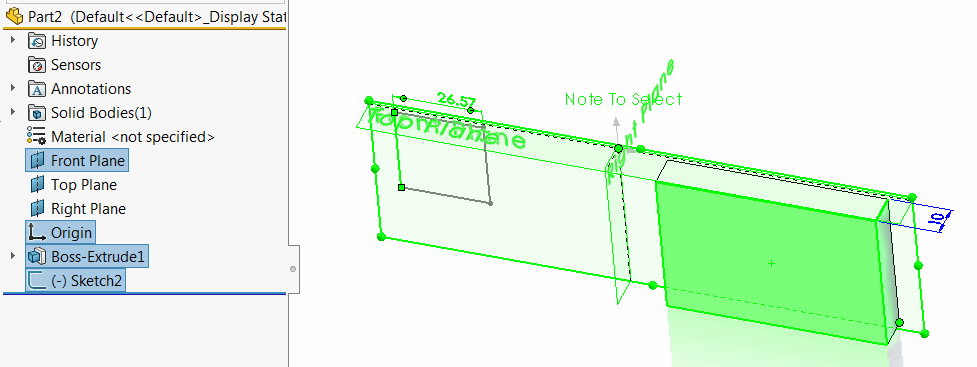

 该示例演示了如何以批量模式选择任意SOLIDWORKS对象（实体、特征、注释等）。
image: select-objects.png
labels: [选择, 批量选择, 调度]
---

该示例演示了如何以批量模式选择任意SOLIDWORKS对象（实体、特征、注释等）。

当对象的类型事先不知道时，这种技术非常有用。与使用SOLIDWORKS API逐个选择对象相比，一次选择多个对象可以提高性能。

以下示例提供了类似于SOLIDWORKS的[创建选择集](https://help.solidworks.com/2015/english/whatsnew/t_creating_selection_sets.htm)的功能：

{ width=300 }

* 打开任何模型并选择任意对象（可以是不同类型的对象，如特征、实体、注释等）。
* 运行宏。宏将收集所有选定对象的指针。
* 清除选择并停止执行。
* 继续执行，之前选择的所有对象将被重新选择。

VBA示例

~~~ vb
Dim swApp As SldWorks.SldWorks

Sub main()

    Set swApp = Application.SldWorks
    
    Dim swModel As SldWorks.ModelDoc2

    Set swModel = swApp.ActiveDoc
    
    If Not swModel Is Nothing Then
        
        Dim vObjects As Variant
        vObjects = GetAllSelectedObjects(swModel)
        
        swModel.ClearSelection2 True
        
        Stop
        
        swModel.Extension.MultiSelect2 vObjects, False, Nothing
        
    Else
        MsgBox "请打开文档"
    End If
    
End Sub

Function GetAllSelectedObjects(model As SldWorks.ModelDoc2) As Variant
    
    Dim swSelMgr As SldWorks.SelectionMgr
    Dim swObjects() As Object
    
    Set swSelMgr = model.SelectionManager
    
    Dim i As Integer
    
    For i = 1 To swSelMgr.GetSelectedObjectCount2(-1)
        
        Dim swObj As Object
        Set swObj = swSelMgr.GetSelectedObject6(i, -1)
        
        ReDim Preserve swObjects(i - 1)
        Set swObjects(i - 1) = swObj
    Next
    
    GetAllSelectedObjects = swObjects
    
End Function
~~~

C#示例

~~~ cs
using System.Collections.Generic;
using SolidWorks.Interop.sldworks;
using System.Diagnostics;
using System.Runtime.InteropServices;

namespace CodeStack
{
    public partial class SolidWorksMacro
    {
        public void Main()
        {
            List<DispatchWrapper> swObjects = new List<DispatchWrapper>();

            IModelDoc2 model = swApp.IActiveDoc2;

            if (model != null)
            {
                ISelectionMgr selMgr = model.ISelectionManager;

                for (int i = 0; i < selMgr.GetSelectedObjectCount2(-1); i++)
                {
                    object swSelObj = selMgr.GetSelectedObject6(i + 1, -1);
                    swObjects.Add(new DispatchWrapper(swSelObj));//it is required to wrap dispatch pointers to allow selection of objects of different types (i.e. faces, annotations, components etc.) together
                }

                model.ClearSelection2(true);

                Debugger.Break();

                model.Extension.MultiSelect2(swObjects.ToArray(), false, null);
            }
            else
            {
                swApp.SendMsgToUser("请打开模型");
            }
        }

        public SldWorks swApp;
    }
}

~~~

