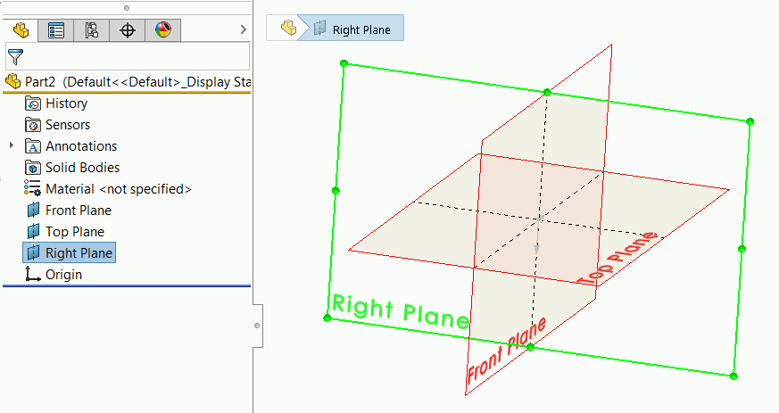

 该示例演示了如何使用SOLIDWORKS API按类型选择标准平面（顶部、前面或右侧）和原点
image: plane.svg
labels: [选择, 平面, 原点]
group: 模型
redirect-from:
  - /solidworks-api/document/selection/select-standard-plane/
---
{ width=400 }

该示例演示了如何使用SOLIDWORKS API按类型选择标准平面（顶部、前面或右侧）或原点，以便无论平面名称如何，选择都是一致的。不建议按名称选择标准平面，因为名称不一致，可能会在模板中更改（例如，不同的本地化或标准）。

此宏选择根文档的主平面或原点。要选择装配体中特定组件的主平面或原点，请将鼠标悬停在任何组件实体上（无需选择它）并运行宏。

此宏基于默认的SOLIDWORKS平面始终以相同的顺序排序，即前、顶和右平面是模型中的第一个平面，在原点特征之前放置，并且无法重新排序或删除。



## 配置

### 目标平面或原点

要配置宏，请将要选择的平面类型设置为**REF_GEOM**变量。支持的值：**Right**、**Top**、**Front**、**Origin**

~~~ vb
Dim REF_GEOM As swRefGeom_e
~~~

~~~ vb jagged
#Else
    REF_GEOM = swRefGeom_e.Right 
#End If
~~~

### 滚动到选择

此宏允许通过设置**SCROLL**常量来指定是否应将平面滚动到视图中

~~~ vb
Const SCROLL As Boolean = False' 滚动平面到视图中
~~~

> 注意，此宏将忽略**特征管理器 -> 将选定项滚动到视图中**选项，并根据上述选项滚动，保留SOLIDWORKS中的设置。

### 追加选择

如果按下**ctrl**键，则宏将追加选择，除非将**APPEND_SEL**常量设置为true。在这种情况下，选择将始终追加。当使用宏按钮的快捷方式时，这很有用，因为**ctrl**将与快捷方式冲突。

~~~ vb
Const APPEND_SEL As Boolean = True
~~~

## CAD+

此宏与[Toolbar+](https://cadplus.xarial.com/toolbar/)和[Batch+](https://cadplus.xarial.com/batch/)工具兼容，因此可以将按钮添加到工具栏并分配快捷方式以便更轻松地访问或在批处理模式下运行。

要启用[宏参数](https://cadplus.xarial.com/toolbar/configuration/arguments/)，请将**ARGS**常量设置为true

~~~ vb
#Const ARGS = True
~~~

在这种情况下，不需要复制宏来设置单独的[目标平面或原点](#target-plane-or-origin)。而是使用相应目标实体的**FRONT**、**TOP**、**RIGHT**、**ORIGIN**参数。

您可以下载每个按钮的图标：[前平面](front.svg)、[顶部平面](top.svg)、[右平面](right.svg)、[原点](origin.svg)，或使用您自己的图标。

~~~ vb
#Const ARGS = False

Declare PtrSafe Function GetKeyState Lib "user32" (ByVal nVirtKey As Long) As Integer
Const VK_CONTROL As Long = &H11

Public Enum swRefGeom_e
    Origin = 4
    Front = 1
    Top = 2
    Right = 3
End Enum

Dim REF_GEOM As swRefGeom_e
Const SCROLL As Boolean = False
Const APPEND_SEL As Boolean = False

Dim swApp As SldWorks.SldWorks
    
Sub main()
    
    Set swApp = Application.SldWorks

    Dim swModel As SldWorks.ModelDoc2

    Set swModel = swApp.ActiveDoc

#If ARGS Then
    Dim macroRunner As Object
    Set macroRunner = CreateObject("CadPlus.MacroRunner.Sw")
    
    Dim param As Object
    Set param = macroRunner.PopParameter(swApp)
    
    Dim vArgs As Variant
    vArgs = param.Get("Args")
    
    Dim planeName As String
    planeName = CStr(vArgs(0))
    
    Select Case UCase(planeName)
        Case "ORIGIN"
            REF_GEOM = swRefGeom_e.Origin
        Case "TOP"
            REF_GEOM = swRefGeom_e.Top
        Case "FRONT"
            REF_GEOM = swRefGeom_e.Front
        Case "RIGHT"
            REF_GEOM = swRefGeom_e.Right
    End Select
#Else
    REF_GEOM = swRefGeom_e.Top
#End If
    
    If Not swModel Is Nothing Then
        
        If swModel.GetType() = swDocumentTypes_e.swDocASSEMBLY Or _
            swModel.GetType() = swDocumentTypes_e.swDocPART Then
            
            Dim swSelMgr As SldWorks.SelectionMgr
            Set swSelMgr = swModel.SelectionManager
                        
            Dim swComp As SldWorks.Component2
            Set swComp = swSelMgr.GetSelectedObjectsComponent3(-1, -1)
            
            If swComp Is Nothing Then
                SelectRefGeom swModel.FirstFeature(), REF_GEOM
            Else
                SelectRefGeom swComp.FirstFeature(), REF_GEOM
            End If
            
        Else
            MsgBox "仅支持装配体和零件"
        End If
    Else
        MsgBox "请打开零件或装配体"
    End If
    
End Sub

Sub SelectRefGeom(firstFeat As SldWorks.Feature, refGeomType As swRefGeom_e)

    Dim refGeomIndex As Integer
    
    Dim swFeat As SldWorks.Feature
    
    Set swFeat = firstFeat

    Do While Not swFeat Is Nothing

        If swFeat.GetTypeName = "RefPlane" Or swFeat.GetTypeName2() = "OriginProfileFeature" Then

            refGeomIndex = refGeomIndex + 1
            
            If CInt(refGeomType) = refGeomIndex Then
                
                Dim defScrollState As Boolean
                defScrollState = swApp.GetUserPreferenceToggle(swUserPreferenceToggle_e.swFeatureManagerEnsureVisible)
                swApp.SetUserPreferenceToggle swUserPreferenceToggle_e.swFeatureManagerEnsureVisible, SCROLL
                
                Dim append As Boolean
                
                If APPEND_SEL Then
                    append = True
                Else
                    append = GetKeyState(VK_CONTROL) < 0
                End If
                
                If refGeomType = Origin Then
                    SelectOrigin swFeat, append
                Else
                    swFeat.Select2 append, -1
                End If
                
                swApp.SetUserPreferenceToggle swUserPreferenceToggle_e.swFeatureManagerEnsureVisible, defScrollState
                
                Exit Sub

            End If

        End If
    
        Set swFeat = swFeat.GetNextFeature

    Loop
    
End Sub

Sub SelectOrigin(origFeat As SldWorks.Feature, append As Boolean)
    
    Dim swSketch As SldWorks.Sketch
    Set swSketch = origFeat.GetSpecificFeature2
    
    Dim swSkPoint As SldWorks.SketchPoint
    Set swSkPoint = swSketch.GetSketchPoints2()(0)
    
    swSkPoint.Select4 append, Nothing
    
End Sub
~~~