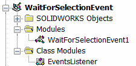

本文介绍了使用SOLIDWORKS API在SOLIDWORKS文档中等待对象选择的两种方法，这些方法可以在VBA宏中使用。

对于这两种方法，在宏的开头指定要等待选择的过滤器。可用的过滤器值在[swSelectType_e](https://help.solidworks.com/2014/english/api/swconst/SolidWorks.Interop.swconst~SolidWorks.Interop.swconst.swSelectType_e.html)枚举中定义。

``` vb
Const FILTER As Integer = swSelectType_e.swSelEDGES
```

## 阻塞线程等待选择

这种方法循环遍历所选对象，并阻塞当前线程，直到完成所需的选择。在每次迭代中调用*DoEvents*函数以继续消息队列，以便SOLIDWORKS窗口不会被锁定。

- 运行宏
- 选择边缘（或在过滤器中指定的对象）

{ width=250 }

- 宏停止执行，并将*swObject*的引用设置为所选元素

{ width=550 }

``` vb
Const FILTER As Integer = swSelectType_e.swSelEDGES

Dim swApp As SldWorks.SldWorks

Sub main()

    Set swApp = Application.SldWorks
    
    Dim swModel As SldWorks.ModelDoc2
    
    Set swModel = swApp.ActiveDoc
    
    If Not swModel Is Nothing Then
        
        swModel.ClearSelection2 True
        
        Dim swSelMgr As SldWorks.SelectionMgr
        
        Set swSelMgr = swModel.SelectionManager
        
        Dim swObject As Object
        
        While swObject Is Nothing
            
            Dim i As Integer
            
            For i = 1 To swSelMgr.GetSelectedObjectCount2(-1)
                If swSelMgr.GetSelectedObjectType3(i, -1) = FILTER Then
                    Set swObject = swSelMgr.GetSelectedObject6(i, -1)
                End If
            Next
            DoEvents
        Wend
        
        Stop
        
    Else
        MsgBox "请打开模型"
    End If
    
End Sub
```


## 处理选择事件

这种方法使用SOLIDWORKS通知来处理选择。这是更可取的选项，因为它不会阻塞主线程，但是该选项需要添加类模块和额外的同步（根据要求），因为事件是异步处理的。

- 创建宏模块和类模块，如下所示



- 运行宏并选择边缘（或在过滤器中指定的对象）
- 与前一种方法类似，代码在选择后停止，并将*swObject*的引用设置为所选元素

{ width=550 }

### 宏模块

``` vb
Const FILTER As Integer = swSelectType_e.swSelEDGES

Dim swApp As SldWorks.SldWorks
Dim swEventsListener As EventsListener

Sub main()

    Set swApp = Application.SldWorks
        
    Dim swModel As SldWorks.ModelDoc2
    
    Set swModel = swApp.ActiveDoc
    
    If Not swModel Is Nothing Then
        
        Set swEventsListener = New EventsListener
        swEventsListener.WaitForSelection swModel, FILTER
        
    Else
        MsgBox "请打开模型"
    End If
End Sub
```


### EventsListener 类模块

``` vb
Dim WithEvents swPart As SldWorks.PartDoc
Dim WithEvents swAssy As SldWorks.AssemblyDoc
Dim WithEvents swDraw As SldWorks.DrawingDoc

Dim swModel As SldWorks.ModelDoc2
Dim swSelMgr As SldWorks.SelectionMgr

Dim swSelFilter As Integer

Sub WaitForSelection(model As SldWorks.ModelDoc2, selFilter As Integer)
        
    Set swModel = model
    swSelFilter = selFilter
            
    Set swSelMgr = swModel.SelectionManager
            
    If TypeOf model Is SldWorks.PartDoc Then
        Set swPart = model
    ElseIf TypeOf model Is SldWorks.AssemblyDoc Then
        Set swAssy = model
    ElseIf TypeOf model Is SldWorks.DrawingDoc Then
        Set swDraw = model
    End If
    
End Sub

Private Function swPart_NewSelectionNotify() As Long
    HandleSelection
End Function

Private Function swAssy_NewSelectionNotify() As Long
    HandleSelection
End Function

Private Function swDraw_NewSelectionNotify() As Long
    HandleSelection
End Function

Sub HandleSelection()
    
    Dim selCount As Integer
    selCount = swSelMgr.GetSelectedObjectCount2(-1)
    
    If selCount > 0 Then
        If swSelMgr.GetSelectedObjectType3(selCount, -1) = swSelFilter Then
            Dim swObject As Object
            Set swObject = swSelMgr.GetSelectedObject6(selCount, -1)
            Stop
        End If
    End If
End Sub
```