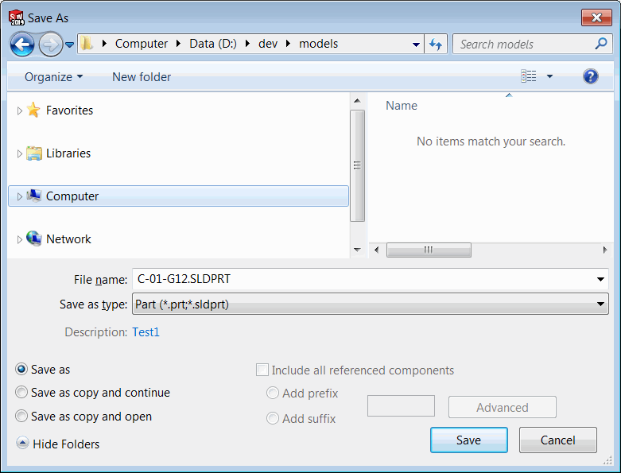

 VBA macro to automatically assign new file name for the document based on the referenced drawing view or custom property using SOLIDWORKS API
image: save-as-dialog.png
labels: [new file name,auto name]
group: Model
---
This VBA macro allows to automatically set the name for the new file based on the custom property value or drawing view referenced model using SOLIDWORKS API.

This macro will only run for the files which were never saved before.

{ width=350 }

## Configuration

Macro can be configured by changing the values of constants at the beginning of the macro

### Setting the name source

Source for the name can be set by changing the *NAME_SOURCE* constant which can take one of the following values

* DefaultDrawingViewFileName - extracts the name from the title of the referenced document of the view in the drawing
* DefaultDrawingViewCustomProperty - extracts the value from the custom property of the default view in the drawing
* CustomProperty - extracts the value from the custom property

If *DefaultDrawingViewCustomProperty* or *CustomProperty* option is used it is required to specify the name of the custom property to read value from in the *PRP_NAME* constant

~~~vb
Const NAME_SOURCE As Integer = NameSource_e.CustomProperty
Const PRP_NAME As String = "PartNo"
~~~

### Setting the title mode

There are 2 modes for the macro which can be set via *AUTO_SAVE* constant

* True - file will be automatically saved to the same folder as original model
* False - title will be assigned and pre-filled in the *Save As* dialog when manually saved

~~~vb
Const AUTO_SAVE As Boolean = True
~~~

~~~ vb
Public Enum NameSource_e
    DefaultDrawingViewFileName
    DefaultDrawingViewCustomProperty
    CustomProperty
End Enum

Const NAME_SOURCE As Integer = NameSource_e.CustomProperty
Const PRP_NAME As String = "PartNo"

Const AUTO_SAVE As Boolean = True

Dim swApp As SldWorks.SldWorks

Sub main()

    Set swApp = Application.SldWorks
    
    Dim swModel As SldWorks.ModelDoc2
    
    Set swModel = swApp.ActiveDoc
    
    If Not swModel Is Nothing Then
        
        If swModel.GetPathName() = "" Then
            
            Dim newFileName As String
            newFileName = CreateSaveFileName(swModel, Not AUTO_SAVE, NAME_SOURCE, PRP_NAME)
            If newFileName <> "" Then
                
                If AUTO_SAVE Then
                    
                    Dim errs As Long
                    Dim warns As Long
                
                    If False = swModel.Extension.SaveAs(newFileName, swSaveAsVersion_e.swSaveAsCurrentVersion, swSaveAsOptions_e.swSaveAsOptions_Silent, Nothing, errs, warns) Then
                        Err.Raise vbError, "", "Failed to save model: " & errs
                    End If
                Else
                    If False = swModel.SetTitle2(newFileName) Then
                        Err.Raise vbError, "", "Failed to set model title"
                    End If
                End If
            Else
                Err.Raise vbError, "", "Failed to generate file name"
            End If
            
        End If
        
    Else
        Err.Raise vbError, "", "Model is nothing"
    End If
    
End Sub

Function CreateSaveFileName(model As SldWorks.ModelDoc2, nameOnly As Boolean, src As NameSource_e, Optional prpName As String = "")
    
    Dim swCurModel As SldWorks.ModelDoc2
    Dim fileName As String
    
    If src = NameSource_e.CustomProperty Then
        
        Dim swConf As SldWorks.Configuration
        Set swConf = model.ConfigurationManager.ActiveConfiguration
        
        Dim confName As String
        
        If Not swConf Is Nothing Then
            confName = swConf.Name
        Else
            confName = ""
        End If
        
        Set swCurModel = model
        
        fileName = GetCustomPropertyValue(model, prpName, confName)
        
    ElseIf src = NameSource_e.DefaultDrawingViewFileName Or src = NameSource_e.DefaultDrawingViewCustomProperty Then
            
        If model.GetType() = swDocumentTypes_e.swDocDRAWING Then
            
            Dim swView As SldWorks.view
            Dim swDraw As SldWorks.DrawingDoc
            Set swDraw = model
            Set swView = GetDefaultView(swDraw.GetCurrentSheet())
            
            If Not swView Is Nothing Then
                
                Dim swViewModel As SldWorks.ModelDoc2
                Set swViewModel = swView.ReferencedDocument
                
                Set swCurModel = swViewModel
                
                If Not swViewModel Is Nothing Then
                    If src = NameSource_e.DefaultDrawingViewFileName Then
                        fileName = GetFileName(swViewModel)
                    ElseIf src = NameSource_e.DefaultDrawingViewCustomProperty Then
                        fileName = GetCustomPropertyValue(swViewModel, prpName, swView.ReferencedConfiguration)
                    Else
                        Err.Raise vbError, "", "Not supported source for drawing"
                    End If
                Else
                    Err.Raise vbError, "", "Failed to get model from view"
                End If
                
            Else
                Err.Raise vbError, "", "Failed to find default view"
            End If
        Else
            Err.Raise vbError, "", "Source is only applicable for drawings"
        End If
    Else
        Err.Raise vbError, "", "Not supported source"
    End If
    
    If nameOnly Then
        CreateSaveFileName = fileName
    Else
        CreateSaveFileName = GetFilePath(model, swCurModel, fileName)
    End If
    
End Function

Function GetFileName(model As SldWorks.ModelDoc2) As String
    
    Dim path As String
    path = model.GetPathName
    
    Dim fileName As String
    
    fileName = Right(path, Len(path) - InStrRev(path, "\"))
    
    fileName = Left(fileName, InStrRev(fileName, ".") - 1)
    
    GetFileName = fileName
    
End Function

Function GetFilePath(targModel As SldWorks.ModelDoc2, srcModel As SldWorks.ModelDoc2, fileName As String)
    
    Dim ext As String
    
    Select Case targModel.GetType()
        Case swDocumentTypes_e.swDocPART
            ext = ".sldprt"
        Case swDocumentTypes_e.swDocASSEMBLY
            ext = ".sldasm"
        Case swDocumentTypes_e.swDocDRAWING
            ext = ".slddrw"
    End Select
    
    Dim dirPath As String
    
    dirPath = srcModel.GetPathName
    
    If dirPath = "" Then
        Err.Raise vbError, "", "Model is not saved"
    End If
    
    dirPath = Left(dirPath, InStrRev(dirPath, "\"))
    
    GetFilePath = dirPath & fileName & ext
    
End Function

Function GetCustomPropertyValue(model As SldWorks.ModelDoc2, prpName As String, confName As String)
    
    Dim swCustPrpMgr As SldWorks.CustomPropertyManager
    Set swCustPrpMgr = model.Extension.CustomPropertyManager(confName)
    
    Dim val As String
    Dim resVal As String
    swCustPrpMgr.Get4 prpName, False, val, resVal
    
    If resVal = "" Then
        Set swCustPrpMgr = model.Extension.CustomPropertyManager("")
        swCustPrpMgr.Get4 prpName, False, val, resVal
    End If
    
    GetCustomPropertyValue = resVal
    
End Function

Function GetDefaultView(swSheet As SldWorks.Sheet) As SldWorks.view
    
    Dim vViews As Variant
    
    vViews = swSheet.GetViews
    
    If Not IsEmpty(vViews) Then
        
        Dim i As Integer
        
        For i = 0 To UBound(vViews)
            
            Dim swView As SldWorks.view
            Set swView = vViews(i)
            
            If UCase(swView.Name) = UCase(swSheet.CustomPropertyView) Then
                Set GetDefaultView = swView
                Exit Function
            End If
            
        Next
        
        Set GetDefaultView = vViews(0) 'use first one
        
    End If
    
End Function
~~~

