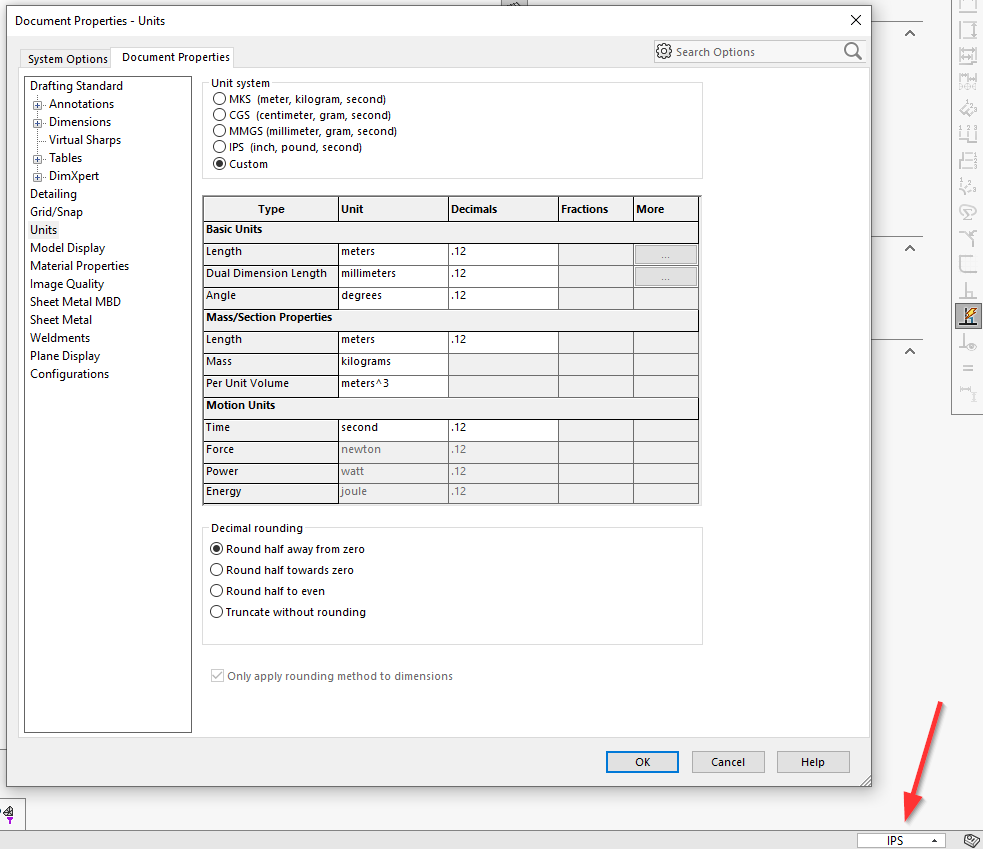

 用于在SOLIDWORKS文档中设置单位系统或自定义单位（长度、角度、质量、体积、时间）的VBA宏
image: document-units.png
---
{ width=600 }

该宏允许更改活动的SOLIDWORKS文档（零件或装配）的单位。

配置宏的常量以指定目标单位系统

~~~ vb
Const UNIT_SYSTEM As Integer = swUnitSystem_e.swUnitSystem_Custom '根据下面的常量设置自定义单位

Const CUSTOM_LENGTH_UNIT As Integer = swLengthUnit_e.swMETER
Const CUSTOM_ANGLE_UNIT As Integer = swAngleUnit_e.swDEGREES
Const CUSTOM_MASS_UNIT As Integer = swUnitsMassPropMass_e.swUnitsMassPropMass_Pounds
Const CUSTOM_VOLUME_UNIT As Integer = swUnitsMassPropVolume_e.swUnitsMassPropVolume_Feet3
Const CUSTOM_TIME_UNIT As Integer = swUnitsTimeUnit_e.swUnitsTimeUnit_Second
~~~

如果**UNIT_SYSTEM**常量设置为**swUnitSystem_e.swUnitSystem_Custom**，则需要通过更改**CUSTOM_???**常量来提供每个自定义类型的单位。

~~~ vb
Const UNIT_SYSTEM As Integer = swUnitSystem_e.swUnitSystem_IPS

Const CUSTOM_LENGTH_UNIT As Integer = swLengthUnit_e.swINCHES
Const CUSTOM_ANGLE_UNIT As Integer = swAngleUnit_e.swRADIANS
Const CUSTOM_MASS_UNIT As Integer = swUnitsMassPropMass_e.swUnitsMassPropMass_Kilograms
Const CUSTOM_VOLUME_UNIT As Integer = swUnitsMassPropVolume_e.swUnitsMassPropVolume_Meters3
Const CUSTOM_TIME_UNIT As Integer = swUnitsTimeUnit_e.swUnitsTimeUnit_Minute

Dim swApp As SldWorks.SldWorks

Sub main()

    Set swApp = Application.SldWorks
        
    Dim swModel As SldWorks.ModelDoc2
    
    Set swModel = swApp.ActiveDoc

    If Not swModel Is Nothing Then
                
        swModel.Extension.SetUserPreferenceInteger swUserPreferenceIntegerValue_e.swUnitSystem, swUserPreferenceOption_e.swDetailingNoOptionSpecified, UNIT_SYSTEM
                
        If UNIT_SYSTEM = swUnitSystem_e.swUnitSystem_Custom Then
        
            swModel.Extension.SetUserPreferenceInteger swUserPreferenceIntegerValue_e.swUnitsLinear, swUserPreferenceOption_e.swDetailingNoOptionSpecified, CUSTOM_LENGTH_UNIT
            swModel.Extension.SetUserPreferenceInteger swUserPreferenceIntegerValue_e.swUnitsDualLinear, swUserPreferenceOption_e.swDetailingNoOptionSpecified, CUSTOM_LENGTH_UNIT
            
            swModel.Extension.SetUserPreferenceInteger swUserPreferenceIntegerValue_e.swUnitsAngular, swUserPreferenceOption_e.swDetailingNoOptionSpecified, CUSTOM_ANGLE_UNIT
            
            swModel.Extension.SetUserPreferenceInteger swUserPreferenceIntegerValue_e.swUnitsMassPropLength, swUserPreferenceOption_e.swDetailingNoOptionSpecified, CUSTOM_LENGTH_UNIT
            swModel.Extension.SetUserPreferenceInteger swUserPreferenceIntegerValue_e.swUnitsMassPropMass, swUserPreferenceOption_e.swDetailingNoOptionSpecified, CUSTOM_MASS_UNIT
            swModel.Extension.SetUserPreferenceInteger swUserPreferenceIntegerValue_e.swUnitsMassPropVolume, swUserPreferenceOption_e.swDetailingNoOptionSpecified, CUSTOM_VOLUME_UNIT
            
            swModel.Extension.SetUserPreferenceInteger swUserPreferenceIntegerValue_e.swUnitsTimeUnits, swUserPreferenceOption_e.swDetailingNoOptionSpecified, CUSTOM_TIME_UNIT
            
        End If
                
    Else
        Err.Raise vbError, "", "未打开模型"
    End If
        
End Sub
~~~