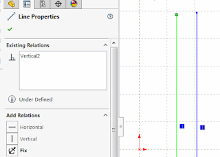

 该示例演示了如何使用SOLIDWORKS API将活动草图中的所有草图线（添加草图关系）与所选选项之一（沿X、Y或Z轴）对齐。
image: sw-sketch-line-relation.png
labels: [示例, 水平, 关系, 草图, solidworks api, 垂直]
redirect-from:
  - /2018/03/solidworks-api-sketch-align-line-relations.html
---

该示例演示了如何使用SOLIDWORKS API将活动草图中的所有草图线（添加草图关系）与所选选项对齐（沿X轴、Y轴或Z轴）：

* 沿X轴（水平）
* 沿Y轴（垂直）
* 沿Z轴

此示例适用于2D和3D草图。

使用[SOLIDWORKS API接口ISketchRelationManager](https://help.solidworks.com/2018/english/api/sldworksapi/solidworks.interop.sldworks~solidworks.interop.sldworks.isketchrelationmanager.html)来管理草图实体的关系。

{ width=320 height=229 }

~~~ vb
Enum AlignmentDir_e
    AlongX = 1
    AlongY = 2
    AlongZ = 3
End Enum

Dim swApp As SldWorks.SldWorks
Dim swModel As SldWorks.ModelDoc2
Dim swSketch As SldWorks.Sketch
Dim swSketchRelMgr As SldWorks.SketchRelationManager

Sub main()

    On Error Resume Next
    
    Set swApp = Application.SldWorks
    
    Set swModel = swApp.ActiveDoc
    
    If Not swModel Is Nothing Then
        
        Set swSketch = swModel.SketchManager.ActiveSketch
        
        If Not swSketch Is Nothing Then
            
            Dim dir As AlignmentDir_e
            dir = InputBox("Specify the type of alignment for sketch lines: 1 - Along X, 2 - Along Y, 3 - Along Z")
            
            Set swSketchRelMgr = swSketch.RelationManager
            
            Dim vSegs As Variant
                        
            vSegs = swSketch.GetSketchSegments
         
            Dim swSkLines() As SldWorks.SketchSegment
            Dim isSkLinesArrInit As Boolean
            isSkLinesArrInit = False
            
            For i = 0 To UBound(vSegs)
                
                Dim swSkSeg As SldWorks.SketchSegment
                Set swSkSeg = vSegs(i)
                
                If swSkSeg.GetType() = swSketchSegments_e.swSketchLINE Then
                    
                    If Not isSkLinesArrInit Then
                        isSkLinesArrInit = True
                        ReDim swSkLines(0)
                    Else
                        ReDim Preserve swSkLines(UBound(swSkLines) + 1)
                    End If
                    
                    Set swSkLines(UBound(swSkLines)) = swSkSeg
                    
                End If
                
            Next
            
            Dim constType As swConstraintType_e
                
            Select Case dir
                Case AlignmentDir_e.AlongX
                    If swSketch.Is3D() Then
                        constType = swConstraintType_e.swConstraintType_ALONGX3D
                    Else
                        constType = swConstraintType_e.swConstraintType_HORIZONTAL
                    End If
                Case AlignmentDir_e.AlongY
                    If swSketch.Is3D Then
                        constType = swConstraintType_e.swConstraintType_ALONGY3D
                    Else
                        constType = swConstraintType_e.swConstraintType_VERTICAL
                    End If
                Case AlignmentDir_e.AlongZ
                    If swSketch.Is3D Then
                        constType = swConstraintType_e.swConstraintType_ALONGZ
                    Else
                        MsgBox "无效。Z轴不是2D草图的有效方向"
                        End
                    End If
            End Select
            
            swSketchRelMgr.AddRelation swSkLines, constType
        
        Else
            MsgBox "请打开草图"
        End If
    
    Else
        MsgBox "请打开文档"
    End If
    
End Sub

~~~