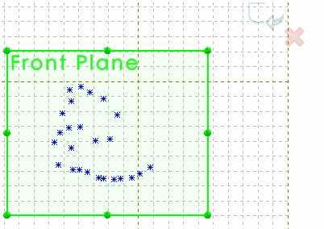

该宏使用SOLIDWORKS API将从指定的CSV（逗号分隔值）文件中读取的点云导入到活动的草图中。支持2D和3D草图。

## 配置

宏有几个配置选项，可以通过更改宏开头的常量的值来修改。

~~~ vb
Const USE_SYSTEM_UNITS As Boolean = True
Const FIRST_ROW_HEADER As Boolean = True
~~~

* **FIRST_ROW_HEADER** 指定CSV文件的第一行是否被视为标题并应被忽略。如果CSV文件不包含标题，请将该常量的值设置为**False**。
* **USE_SYSTEM_UNITS** 指示CSV文件中的坐标值是否以系统单位（米）表示。如果将此选项设置为**False**，宏将使用当前文档单位。
* 宏还可以导入相对于坐标系的点。在运行宏之前，预先选择目标坐标系，否则点将相对于全局坐标系插入。

> 输入的CSV文件可以包含3个坐标（X、Y、Z）或2个坐标（X、Y）。

## 示例文件

* [示例2D点云CSV文件](points-2d.csv)
* [示例3D点云CSV文件](points-3d.csv)

## 如何运行宏

* 打开模型并创建2D或3D草图（或编辑现有草图）
* （可选）如果需要将点导入到相对于此系统的坐标系中，请预先选择坐标系
* 运行宏。在显示的文件浏览对话框中指定CSV文件的完整路径
* 单击确定。点将在活动草图中创建

~~~ vb
Const USE_SYSTEM_UNITS As Boolean = True
Const FIRST_ROW_HEADER As Boolean = True

Dim swApp As SldWorks.SldWorks

Sub main()

try_:
    
    On Error GoTo catch_
    
    Set swApp = Application.SldWorks
        
    Dim swModel As SldWorks.ModelDoc2
    Set swModel = swApp.ActiveDoc
    
    If Not swModel Is Nothing Then
    
        Dim swSketch As SldWorks.Sketch
        
        Set swSketch = swModel.SketchManager.ActiveSketch
        
        If Not swSketch Is Nothing Then
            
            Dim vPoints As Variant
            Dim inputFile As String
            
            inputFile = swApp.GetOpenFileName("在显示的文件浏览对话框中指定CSV文件的完整路径", "", "CSV Files (*.csv)|*.csv|Text Files (*.txt)|*.txt|All Files (*.*)|*.*|", -1, "", "")
            
            If inputFile <> "" Then
            
                vPoints = ReadCsvFile(inputFile, FIRST_ROW_HEADER)
                
                vPoints = ConvertPointsLocations(vPoints, swModel, USE_SYSTEM_UNITS, GetSelectedCoordinateSystemTransform(swModel))
                
                DrawPoints swModel, vPoints
            
            End If
            
        Else
            Err.Raise vbError, "", "请打开2D或3D草图"
        End If
        
    Else
        Err.Raise vbError, "", "请打开模型"
    End If
        
    GoTo finally_
    
catch_:
    swApp.SendMsgToUser2 Err.Description, swMessageBoxIcon_e.swMbStop, swMessageBoxBtn_e.swMbOk
finally_:
        
End Sub

Function GetSelectedCoordinateSystemTransform(model As SldWorks.ModelDoc2) As SldWorks.mathTransform
    
    Dim swSelMgr As SldWorks.SelectionMgr
    
    Set swSelMgr = model.SelectionManager
    
    If swSelMgr.GetSelectedObjectType3(1, -1) = swSelectType_e.swSelCOORDSYS Then
        Dim swCoordSysFeat As SldWorks.Feature
        Set swCoordSysFeat = swSelMgr.GetSelectedObject6(1, -1)
        Set GetSelectedCoordinateSystemTransform = model.Extension.GetCoordinateSystemTransformByName(swCoordSysFeat.Name)
    Else
        Set GetSelectedCoordinateSystemTransform = Nothing
    End If
    
End Function

Sub DrawPoints(model As SldWorks.ModelDoc2, vPoints As Variant)
    
    model.SketchManager.AddToDB = True
    
    Dim i As Integer
    
    For i = 0 To UBound(vPoints)
        
        Dim swSkPt As SldWorks.SketchPoint
        Dim vPt As Variant
        vPt = vPoints(i)
        
        Dim x As Double
        Dim y As Double
        Dim z As Double
        
        x = CDbl(vPt(0))
        y = CDbl(vPt(1))
        z = CDbl(vPt(2))
        
        Set swSkPt = model.SketchManager.CreatePoint(x, y, z)
        
        If swSkPt Is Nothing Then
            Err.Raise vbError, "", "在位置：" & x & "; " & y & "; " & z & " 处创建点失败"
        End If
        
    Next
    
    model.SketchManager.AddToDB = False
    
End Sub

Function ConvertPointsLocations(points As Variant, model As SldWorks.ModelDoc2, useSystemUnits As Boolean, mathTransform As SldWorks.mathTransform) As Variant
    
    Dim swMathUtils As SldWorks.MathUtility
    
    Set swMathUtils = swApp.GetMathUtility
    
    Dim convFact As Double
    convFact = 1
    
    If Not useSystemUnits Then
        Dim swUserUnit As SldWorks.UserUnit
        Set swUserUnit = model.GetUserUnit(swUserUnitsType_e.swLengthUnit)
        convFact = 1 / swUserUnit.GetConversionFactor()
    End If
    
    Dim i As Integer
    
    For i = 0 To UBound(points)
        
        Dim vPt As Variant
        vPt = points(i)
        
        Dim dPt(2) As Double
        
        If UBound(vPt) >= 0 Then
            dPt(0) = CDbl(vPt(0)) * convFact
        Else
            dPt(0) = 0
        End If
        
        If UBound(vPt) >= 1 Then
            dPt(1) = CDbl(vPt(1)) * convFact
        Else
            dPt(1) = 0
        End If
        
        If UBound(vPt) >= 2 Then
            dPt(2) = CDbl(vPt(2)) * convFact
        Else
            dPt(2) = 0
        End If
        
        If Not mathTransform Is Nothing Then
            
            Dim swMathPt As SldWorks.MathPoint
            
            Set swMathPt = swMathUtils.CreatePoint(dPt)
            Set swMathPt = swMathPt.MultiplyTransform(mathTransform)
            
            vPt = swMathPt.ArrayData
            
        Else
            vPt = dPt
        End If
        
        points(i) = vPt
        
    Next
    
    ConvertPointsLocations = points
    
End Function

Function ReadCsvFile(filePath As String, firstRowHeader As Boolean) As Variant
    
    'rows x columns
    Dim vTable() As Variant
        
    Dim fileName As String
    Dim tableRow As String
    Dim fileNo As Integer

    fileNo = FreeFile
    
    Open filePath For Input As #fileNo
    
    Dim isFirstRow As Boolean
    Dim isTableInit As Boolean
    
    isFirstRow = True
    isTableInit = False
    
    Do While Not EOF(fileNo)
        
        Line Input #fileNo, tableRow
            
        If Not isFirstRow Or Not firstRowHeader Then
            
            Dim vCells As Variant
            vCells = Split(tableRow, ",")
            
            Dim i As Integer
            
            Dim dCells() As Double
            ReDim dCells(UBound(vCells))
            
            For i = 0 To UBound(vCells)
                dCells(i) = CDbl(vCells(i))
            Next
            
            Dim lastRowIndex As Integer
            
            If Not isTableInit Then
                lastRowIndex = 0
                isTableInit = True
                ReDim Preserve vTable(lastRowIndex)
            Else
                lastRowIndex = UBound(vTable, 1) + 1
                ReDim Preserve vTable(lastRowIndex)
            End If
            
            vTable(lastRowIndex) = dCells
            
        End If
        
        If isFirstRow Then
            isFirstRow = False
        End If
    
    Loop
    
    Close #fileNo
    
    ReadCsvFile = vTable
    
End Function
~~~