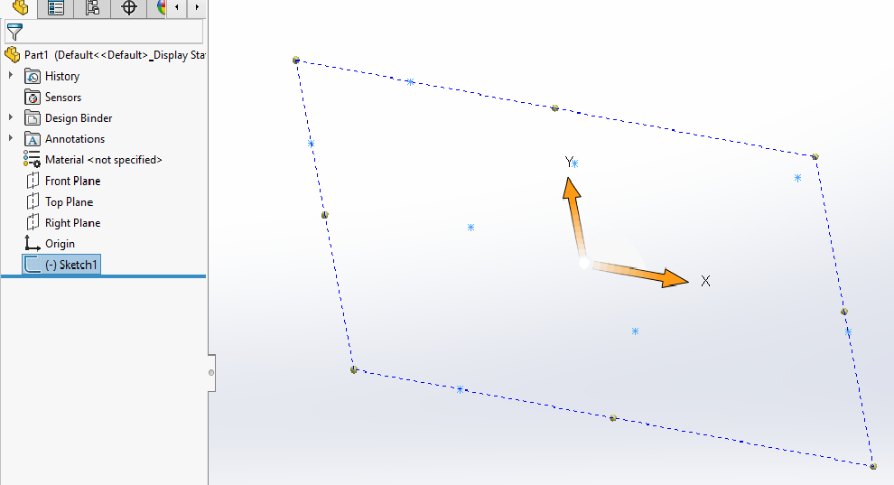

{ width=500 }

This VBA macro allows to export the coordinates of all sketch points from the selected sketch into the CSV file.

CSV file can be opened in Excel

Macro has an option to export coordinates in the sketch space (XY for 2D sketch) or in the model space (XYZ). Macro has an option to convert the points coordinates to system units (meters) or user units, currently assigned to the model.

Configure the macro by changing the constants below.

~~~ vb jagged-bottom
Const CONVERT_TO_USER_UNIT As Boolean = True 'True to use the current model units, False to use system units (meters)
Const CONVERT_TO_MODEL_SPACE As Boolean = True 'For 2D Sketches, True to export coordinates in the sketch space, False to convert coordinates to the model space
Const OUT_PATH As String = "D:\points.csv" 'Full path to the output file
~~~

~~~ vb
Const CONVERT_TO_USER_UNIT As Boolean = True
Const CONVERT_TO_MODEL_SPACE As Boolean = True
Const OUT_PATH As String = "D:\points.csv"

Dim swApp As SldWorks.SldWorks

Sub main()

    Set swApp = Application.SldWorks
    
    Dim swModel As SldWorks.ModelDoc2
    
try_:
    On Error GoTo catch_
    
    Set swModel = swApp.ActiveDoc
    
    If swModel Is Nothing Then
        Err.Raise vbError, "", "Please open model"
    End If
    
    Dim swSelMgr As SldWorks.SelectionMgr
    
    Set swSelMgr = swModel.SelectionManager
    
    Dim swSketchFeat As SldWorks.Feature
    
    Set swSketchFeat = swSelMgr.GetSelectedObject6(1, -1)
    
    Dim swSketch As SldWorks.sketch
    
    If Not swSketchFeat Is Nothing Then
        Set swSketch = swSketchFeat.GetSpecificFeature2
    End If
    
    If swSketch Is Nothing Then
        Err.Raise vbError, "", "Please select sketch"
    End If
    
    Dim vPts As Variant
    vPts = ExtractPoints(swModel, swSketch, CONVERT_TO_MODEL_SPACE, CONVERT_TO_USER_UNIT)
    
    WritePointsToCsvFile OUT_PATH, vPts
    
    GoTo finally_
        
catch_:
    swApp.SendMsgToUser2 Err.Description, swMessageBoxIcon_e.swMbStop, swMessageBoxBtn_e.swMbOk
finally_:

End Sub

Function ExtractPoints(model As SldWorks.ModelDoc2, sketch As SldWorks.sketch, convertCoordsToModelSpace As Boolean, convertCoordsToUserUnits As Boolean) As Variant
    
    Dim vSkPts As Variant
    vSkPts = sketch.GetSketchPoints2()
    
    Dim i As Integer
    
    If IsEmpty(vSkPts) Then
        Err.Raise vbError, "", "Sketch contains no points"
    End If
    
    Dim vPts() As Variant
    ReDim vPts(UBound(vSkPts))
    
    For i = 0 To UBound(vSkPts)
        
        Dim swSkPt As SldWorks.SketchPoint
        Set swSkPt = vSkPts(i)
        
        Dim dPt(2) As Double
        dPt(0) = swSkPt.X: dPt(1) = swSkPt.Y: dPt(2) = swSkPt.Z
        
        Dim vPt As Variant
        vPt = dPt
        
        If convertCoordsToModelSpace Then
            vPt = ConvertPointLocation(vPt, sketch.ModelToSketchTransform.Inverse())
        End If
        
        If convertCoordsToUserUnits Then
            vPt = ConvertToUserUnits(vPt, model)
        End If
        
        vPts(i) = vPt
        
    Next
    
    ExtractPoints = vPts
    
End Function

Function ConvertPointLocation(pt As Variant, transform As SldWorks.MathTransform) As Variant
    
    Dim swMathUtils As SldWorks.MathUtility
    Set swMathUtils = swApp.GetMathUtility
    
    Dim swMathPt As SldWorks.MathPoint
    Set swMathPt = swMathUtils.CreatePoint(pt)
    
    Set swMathPt = swMathPt.MultiplyTransform(transform)
    
    ConvertPointLocation = swMathPt.ArrayData
    
End Function

Function ConvertToUserUnits(pt As Variant, model As SldWorks.ModelDoc2) As Variant
    
    Dim swUserUnits As SldWorks.UserUnit
    Set swUserUnits = model.GetUserUnit(swUserUnitsType_e.swLengthUnit)
    
    Dim convFactor As Double
    convFactor = swUserUnits.GetConversionFactor
     
    Dim dPt(2) As Double
    
    dPt(0) = pt(0) * convFactor
    dPt(1) = pt(1) * convFactor
    dPt(2) = pt(2) * convFactor
    
    ConvertToUserUnits = dPt
    
End Function

Sub WritePointsToCsvFile(filePath As String, vPts As Variant)
    
    Dim fileNmb As Integer
    fileNmb = FreeFile
    
    Open filePath For Output As #fileNmb
    
    Dim i As Integer
    
    For i = 0 To UBound(vPts)
        
        Print #fileNmb, vPts(i)(0) & "," & vPts(i)(1) & "," & vPts(i)(2)
        
    Next
    
    Close #fileNmb
    
End Sub
~~~

