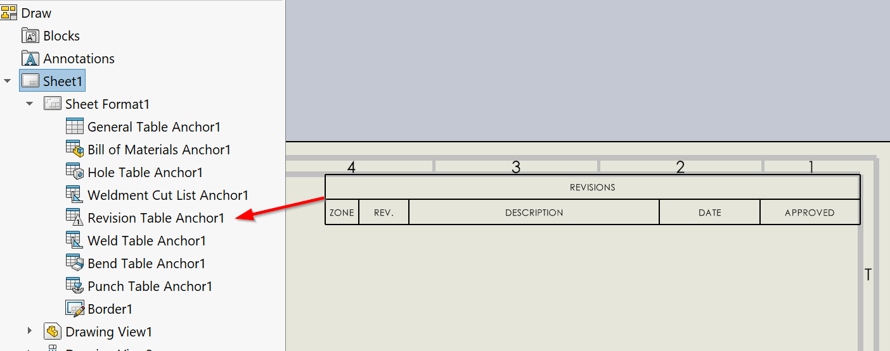

 SOLIDWORKS VBA macro to insert Revision table into active or all sheets with the specified parameters and attach to the anchor point
image: revision-table-anchor.png
---
{ width=600 }

This VBA macro inserts Revision table into all or active sheet of the active SOLIDWORKS drawing.

Revision table is attached to the Revision anchor point

Modify the constants in the macro to configure the Revision table options

~~~ vb
Const ANCHOR_TYPE As Integer = swBOMConfigurationAnchorType_e.swBOMConfigurationAnchor_TopLeft 'anchor type: swBOMConfigurationAnchor_BottomLeft, swBOMConfigurationAnchor_BottomRight, swBOMConfigurationAnchor_TopLeft, swBOMConfigurationAnchor_TopRight
Const TABLE_TEMPLATE As String = "" 'full path to Revision template *.sldrevtbt or empty string for the default template
Const SHAPE As Integer = swRevisionTableSymbolShape_e.swRevisionTable_CircleSymbol 'symbol shape: swRevisionTable_CircleSymbol, swRevisionTable_HexagonSymbol, swRevisionTable_SquareSymbol, swRevisionTable_TriangleSymbol
Const AUTO_UPDATE_ZONE_CELLS As Boolean = True 'True to auto update zone cells

Const ALL_SHEETS As Boolean = True 'True to process all sheets, False to process active sheet only
~~~

~~~ vb
Const ANCHOR_TYPE As Integer = swBOMConfigurationAnchorType_e.swBOMConfigurationAnchor_TopRight
Const TABLE_TEMPLATE As String = ""
Const SHAPE As Integer = swRevisionTableSymbolShape_e.swRevisionTable_CircleSymbol
Const AUTO_UPDATE_ZONE_CELLS As Boolean = True

Const ALL_SHEETS As Boolean = True

Dim swApp As SldWorks.SldWorks

Sub main()

    Set swApp = Application.SldWorks
    
    Dim swDraw As SldWorks.DrawingDoc
    
    Set swDraw = swApp.ActiveDoc
    
    If ALL_SHEETS Then
    
        Dim vSheetNames As Variant
        vSheetNames = swDraw.GetSheetNames
        
        Dim activeSheetName As String
        activeSheetName = swDraw.GetCurrentSheet().GetName
        
        Dim i As Integer
        
        For i = 0 To UBound(vSheetNames)
            Dim swSheet As SldWorks.sheet
            Set swSheet = swDraw.sheet(CStr(vSheetNames(i)))
            InsertRevisionTable swDraw, swSheet
        Next
        
        swDraw.ActivateSheet activeSheetName
        
    Else
        InsertRevisionTable swDraw, swDraw.GetCurrentSheet
    End If
    
End Sub

Sub InsertRevisionTable(draw As SldWorks.DrawingDoc, sheet As SldWorks.sheet)
    
    If False = draw.ActivateSheet(sheet.GetName()) Then
        Err.Raise vbError, "", "Failed to activate sheet " & sheet.GetName
    End If
    
    Dim swRevTableAnn As SldWorks.RevisionTableAnnotation
    
    Set swRevTableAnn = sheet.InsertRevisionTable2(True, 0, 0, ANCHOR_TYPE, TABLE_TEMPLATE, SHAPE, AUTO_UPDATE_ZONE_CELLS)
    
    If swRevTableAnn Is Nothing Then
        Err.Raise vbError, "", "Failed to insert Revision table into " & sheet.GetName
    End If
    
End Sub
~~~

