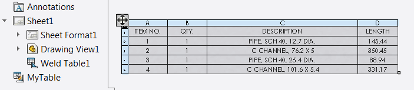

 Example demonstrates how to rename the selected table using SOLIDWORKS API
image: rename-table-annotation.png
labels: [table, rename]
---
{ width=450 }

This example demonstrates how to rename the selected table using SOLIDWORKS API via [ITableAnnotation](https://help.solidworks.com/2012/english/api/sldworksapi/SolidWorks.Interop.sldworks~SolidWorks.Interop.sldworks.ITableAnnotation.html) interface. Table should be selected in the graphics area (not in the feature tree)

Specify the name of the table by modifying the constant at the beginning of the macro:

~~~ vb
Const TABLE_NAME As String = "MyTable"
~~~

~~~ vb
Const TABLE_NAME As String = "MyTable"

Dim swApp As SldWorks.SldWorks
Dim swModel As SldWorks.ModelDoc2

Sub main()

    Set swApp = Application.SldWorks
    
    Set swModel = swApp.ActiveDoc
    
    If Not swModel Is Nothing Then
        
        Dim swSelMgr As SldWorks.SelectionMgr
        Set swSelMgr = swModel.SelectionManager
        
        Dim swTableAnn As SldWorks.TableAnnotation
        
        Set swTableAnn = swSelMgr.GetSelectedObject6(1, -1)
        
        If Not swTableAnn Is Nothing Then
        
            Dim swTableFeat As SldWorks.Feature
            
            Set swTableFeat = GetFeatureFromTableAnnotation(swTableAnn)
            
            Debug.Print swTableFeat.Name
            
            swTableFeat.Name = TABLE_NAME
        
        Else
            MsgBox "Please select table to rename"
        End If
        
    Else
        MsgBox "Please open the model"
    End If
    
End Sub

Function GetFeatureFromTableAnnotation(tableAnn As SldWorks.TableAnnotation) As SldWorks.Feature
    
    Dim swTableFeat As SldWorks.Feature
    
    Select Case tableAnn.Type
                
        Case swTableAnnotationType_e.swTableAnnotation_BillOfMaterials
            
            Dim swBomTableAnn As SldWorks.BomTableAnnotation
            Set swBomTableAnn = tableAnn
            Set swTableFeat = swBomTableAnn.BomFeature.GetFeature()
            
        Case swTableAnnotationType_e.swTableAnnotation_General
            
            Dim swGenTableAnn As SldWorks.GeneralTableAnnotation
            Set swGenTableAnn = tableAnn
            Set swTableFeat = swGenTableAnn.GeneralTable.GetFeature()
        
        Case swTableAnnotationType_e.swTableAnnotation_WeldmentCutList
            
            Dim swWeldCutListTableAnn As SldWorks.WeldmentCutListAnnotation
            Set swWeldCutListTableAnn = tableAnn
            Set swTableFeat = swWeldCutListTableAnn.WeldmentCutListFeature.GetFeature()
            
        Case swTableAnnotationType_e.swTableAnnotation_BendTable
            
            Dim swBendTableAnn As SldWorks.BendTableAnnotation
            Set swBendTableAnn = tableAnn
            Set swTableFeat = swBendTableAnn.BendTable.GetFeature()
            
        Case swTableAnnotationType_e.swTableAnnotation_GeneralTolerance
            
            Dim swGeneralToleranceTableAnn As SldWorks.GeneralToleranceTableAnnotation
            Set swGeneralToleranceTableAnn = tableAnn
            Set swTableFeat = swGeneralToleranceTableAnn.GeneralToleranceTableFeature.GetFeature()
            
        Case swTableAnnotationType_e.swTableAnnotation_HoleChart
            
            Dim swHoleTableAnn As SldWorks.HoleTableAnnotation
            Set swHoleTableAnn = tableAnn
            Set swTableFeat = swHoleTableAnn.HoleTable.GetFeature()
            
        Case swTableAnnotationType_e.swTableAnnotation_PunchTable
        
            Dim swPunchTableAnn As SldWorks.PunchTableAnnotation
            Set swPunchTableAnn = tableAnn
            Set swTableFeat = swPunchTableAnn.PunchTable.GetFeature()
            
        Case swTableAnnotationType_e.swTableAnnotation_RevisionBlock
            
            Dim swRevisionTableAnn As SldWorks.RevisionTableAnnotation
            Set swRevisionTableAnn = tableAnn
            Set swTableFeat = swRevisionTableAnn.RevisionTableFeature.GetFeature()
            
        Case swTableAnnotationType_e.swTableAnnotation_TitleBlock
        
            Dim swTitleBlockTableAnn As SldWorks.TitleBlockTableAnnotation
            Set swTitleBlockTableAnn = tableAnn
            Set swTableFeat = swTitleBlockTableAnn.TitleBlockTableFeature.GetFeature()
            
        Case swTableAnnotationType_e.swTableAnnotation_WeldTable
        
            Dim swWeldTableAnn As SldWorks.WeldmentCutListAnnotation
            Set swWeldTableAnn = tableAnn
            Set swTableFeat = swWeldTableAnn.WeldmentCutListFeature.GetFeature()
        
    End Select
    
    Set GetFeatureFromTableAnnotation = swTableFeat
    
End Function
~~~

