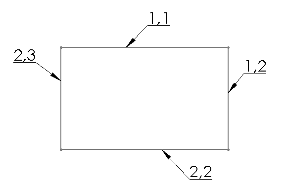

{ width=350 }

内部ID通常是整数或长整数值，用于在模型中唯一标识SOLIDWORKS对象。ID是持久的，在重建操作或会话之间不会更改。当对象发生更改时（例如，特征重命名或草图线更改坐标），ID也会更新。

> 草图元素（点、线段、填充）由2个整数或长整数ID组成

与[持久引用ID](/docs/codestack/solidworks-api/document/tracking-objects/persist-references)一样，内部ID不能更改或分配，并且在GUI中不可见（例如，仅在API中可用）。但与持久引用ID不同的是，无法通过内部ID查找对象，即需要遍历所有对象以按ID查找所需对象。

如果需要索引所有元素（例如，草图线段或特征）并最小化索引数据的大小（例如，如果需要将数据存储在第三方存储中或通过网络发送），则应使用内部ID。

可以访问以下对象的内部ID：

* 零件
* 配置
* 特征
* 图层
* 光源
* 图纸
* 草图填充
* 草图点
* 草图线段

以下示例演示了如何使用SOLIDWORKS API从所选对象中检索内部ID。返回的ID数组还包含在ElementType_e枚举器中定义的对象类型。

~~~ vb
Enum ElementType_e
    Component
    Configuration
    Feature
    Layer
    Light
    Sheet
    SketchHatch
    SketchPoint
    SketchSegment
End Enum

Dim swApp As SldWorks.SldWorks

Sub main()

    Set swApp = Application.SldWorks
    
    Dim swModel As SldWorks.ModelDoc2

    Set swModel = swApp.ActiveDoc
    
    If Not swModel Is Nothing Then
        
        Dim swSelMgr As SldWorks.SelectionMgr
        Set swSelMgr = swModel.SelectionManager
        
        Dim swObj As Object
        Set swObj = swSelMgr.GetSelectedObject6(1, -1)
        
        If Not swObj Is Nothing Then        
        
            Dim vId As Variant
            vId = GetObjectId(swObj)
        
            Dim i As Integer
            For i = 0 To UBound(vId)
                Debug.Print vId(i);
            Next
        Else
            MsgBox "请选择要获取ID的对象"
        End If
        
    Else
        MsgBox "请打开模型"
    End If
        
End Sub

Function GetObjectId(obj As Object) As Variant
    
    Dim id As Variant
    
    If TypeOf obj Is SldWorks.Component2 Then
        
        Dim swComp As SldWorks.Component2
        Set swComp = obj
        id = Array(ElementType_e.Component, swComp.GetId())
        
    ElseIf TypeOf obj Is SldWorks.Configuration Then
        
        Dim swConf As SldWorks.Configuration
        Set swConf = obj
        id = Array(ElementType_e.Configuration, swConf.GetId())
        
    ElseIf TypeOf obj Is SldWorks.Feature Then
        
        Dim swFeat As SldWorks.Feature
        Set swFeat = obj
        id = Array(ElementType_e.Feature, swFeat.GetId())
        
    ElseIf TypeOf obj Is SldWorks.Layer Then
        
        Dim swLayer As SldWorks.Layer
        Set swLayer = obj
        id = Array(ElementType_e.Layer, swLayer.GetId())
        
    ElseIf TypeOf obj Is SldWorks.Light Then
        
        Dim swLight As SldWorks.Light
        Set swLight = obj
        id = Array(ElementType_e.Light, swLight.GetId())
        
    ElseIf TypeOf obj Is SldWorks.Sheet Then
        
        Dim swSheet As SldWorks.Sheet
        Set swSheet = obj
        id = Array(ElementType_e.Sheet, swSheet.GetId())
        
    ElseIf TypeOf obj Is SldWorks.SketchHatch Then
        
        Dim swSkHatch As SldWorks.SketchHatch
        Set swSkHatch = obj
        Dim hatchId As Variant
        hatchId = swSkHatch.GetId()
        id = Array(ElementType_e.SketchHatch, swSkHatch.GetSketch().GetId(), hatchId(0), hatchId(1))
        
    ElseIf TypeOf obj Is SldWorks.SketchPoint Then
        
        Dim swSkPt As SldWorks.SketchPoint
        Set swSkPt = obj
        Dim skPtId As Variant
        skPtId = swSkPt.GetId()
        id = Array(ElementType_e.SketchPoint, swSkPt.GetSketch().GetId(), skPtId(0), skPtId(1))
        
    ElseIf TypeOf obj Is SldWorks.SketchSegment Then
        
        Dim swSkSeg As SldWorks.SketchSegment
        Set swSkSeg = obj
        Dim skSegId As Variant
        skSegId = swSkSeg.GetId()
        id = Array(ElementType_e.SketchSegment, swSkSeg.GetSketch().GetId(), skSegId(0), skSegId(1))
        
    Else
        Err.Raise vbObjectError, , "对象没有ID"
    End If
    
    GetObjectId = id
    
End Function
~~~