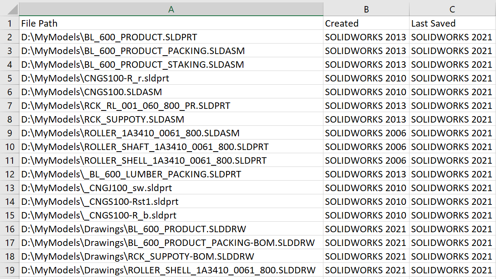

 这是一个VBA宏，用于生成指定文件夹中SOLIDWORKS文件的创建和最后保存版本的CSV报告（可在Excel中打开）。
image: solidworks-file-versions-report.png
---
 { width=500 }

这个VBA宏生成一个CSV报告（可以在Excel中打开），报告了指定文件夹中SOLIDWORKS文件的创建和最后保存版本。

> 这个宏不会逐个打开每个模型，这显著减少了处理时间。

可以通过更改下面的常量来配置宏的输入和输出参数。

~~~ vb
Const INPUT_FOLDER_PATH As String = "D:\MyModels" 'SOLIDWORKS文件所在文件夹的完整路径
Const OUT_FILE_PATH As String = "D:\sw-file-versions.csv" '报告的输出CSV文件的完整路径
Const FILES_FILTER As String = "*.sld*" '支持通配符的文件过滤器
Const INCLUDE_SUB_FOLDERS As Boolean = True 'True表示处理子文件夹，False表示只处理顶层文件
~~~

~~~ vb
Const INPUT_FOLDER_PATH As String = "D:\MyModels"
Const OUT_FILE_PATH As String = "D:\sw-file-versions.csv"
Const FILES_FILTER As String = "*.sld*"
Const INCLUDE_SUB_FOLDERS As Boolean = True

Dim swApp As SldWorks.SldWorks

Sub main()

    Set swApp = Application.SldWorks
    
    Dim vFilePaths As Variant
    vFilePaths = GetFiles(INPUT_FOLDER_PATH, INCLUDE_SUB_FOLDERS, FILES_FILTER)
    
    Dim i As Integer
    
    Dim fileNo As Integer
    fileNo = FreeFile
    
    Open OUT_FILE_PATH For Output As #fileNo
 
    Print #fileNo, "文件路径,创建日期,最后保存日期"
    
    For i = 0 To UBound(vFilePaths)
    
        Dim filePath As String
        filePath = vFilePaths(i)
        Dim vVers As Variant
        vVers = swApp.VersionHistory(filePath)
            
        Dim swCreatedVers As String
        Dim swLastSavedVers As String
        
        If Not IsEmpty(vVers) Then
            swCreatedVers = ConvertFileVersionToSwMajorVersion(ExtractSwRevisonFromHistoryRecord(CStr(vVers(0))))
            swLastSavedVers = ConvertFileVersionToSwMajorVersion(ExtractSwRevisonFromHistoryRecord(CStr(vVers(UBound(vVers)))))
        Else
            swCreatedVers = "???"
            swLastSavedVers = "???"
        End If
        
        Print #fileNo, filePath & "," & swCreatedVers & "," & swLastSavedVers
        
    Next
    
    Close #fileNo

End Sub

Function GetFiles(path As String, includeSubFolders As Boolean, Optional filter As String) As Variant

    Dim paths() As String
    Dim isInit As Boolean
    
    isInit = False
    
    Dim fso As Object
    Set fso = CreateObject("Scripting.FileSystemObject")
    
    Dim folder As Object
    Set folder = fso.GetFolder(path)
    
    CollectFilesFromFolder folder, includeSubFolders, filter, paths, isInit
    
    If isInit Then
        GetFiles = paths
    Else
        GetFiles = Empty
    End If
    
End Function

Sub CollectFilesFromFolder(folder As Object, includeSubFolders As Boolean, filter As String, ByRef paths() As String, ByRef isInit As Boolean)
    
    For Each file In folder.files
        
        If LCase(file.path) Like LCase(filter) Then
            If Not isInit Then
                ReDim paths(0)
                isInit = True
            Else
                ReDim Preserve paths(UBound(paths) + 1)
            End If
            paths(UBound(paths)) = file.path
        End If
    Next
    
    If includeSubFolders Then
        Dim subFolder As Object
        For Each subFolder In folder.SubFolders
            CollectFilesFromFolder subFolder, includeSubFolders, filter, paths, isInit
        Next
    End If
    
End Sub

Function ExtractSwRevisonFromHistoryRecord(fileVers As String) As String
    
    ExtractSwRevisonFromHistoryRecord = Left(fileVers, InStr(fileVers, "[") - 1)
    
End Function

Function ConvertFileVersionToSwMajorVersion(versNumber As Integer) As String
    
    Dim swVersMajor As String
    
    If versNumber >= 5000 Then
        swVersMajor = 2012 + (versNumber - 5000) / 1000
    Else
        Select Case versNumber
            Case 44
                swVersMajor = 95
            Case 243
                swVersMajor = 96
            Case 483
                swVersMajor = 97
            Case 629
                swVersMajor = "97Plus"
            Case 822
                swVersMajor = 98
            Case 1008
                swVersMajor = "98Plus"
            Case 1137
                swVersMajor = 99
            Case 1500
                swVersMajor = 2000
            Case 1750
                swVersMajor = 2001
            Case 1950
                swVersMajor = "2001Plus"
            Case 2200
                swVersMajor = 2003
            Case 2500
                swVersMajor = 2004
            Case 2800
                swVersMajor = 2005
            Case 3100
                swVersMajor = 2006
            Case 3400
                swVersMajor = 2007
            Case 3800
                swVersMajor = 2008
            Case 4100
                swVersMajor = 2009
            Case 4400
                swVersMajor = 2010
            Case 4700
                swVersMajor = 2011
        End Select
    End If
    
    ConvertFileVersionToSwMajorVersion = "SOLIDWORKS " & swVersMajor
    
End Function

~~~