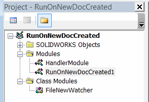

 使用SOLIDWORKS API在每次新文档创建时运行其他宏或代码的VBA宏
image: new-document.png
labels: [新文档]
group: 模型
---
{ width=350 }

这个VBA宏处理在SOLIDWORKS中创建新文档（零件、装配或图纸）的事件，并允许在此事件发生时自动运行自定义代码或其他宏。此宏还处理在SOLIDWORKS装配中创建新虚拟文档的情况。

## 配置

* 创建新的宏（例如*RunOnNewDocCreated.swp*）
* 将代码复制到宏的相应模块中。VBA宏树应该类似于下面的image: 

{ width=250 }

* 将代码放入*HandlerModule*模块的*main*子程序中。将[IModelDoc2](https://help.solidworks.com/2012/english/api/sldworksapi/SolidWorks.Interop.sldworks~SolidWorks.Interop.sldworks.IModelDoc2.html)文档的指针作为参数传递。在此事件到达时，使用此指针而不是[ISldWorks::ActiveDoc](https://help.solidworks.com/2012/english/api/sldworksapi/solidworks.interop.sldworks~solidworks.interop.sldworks.isldworks~activedoc.html)，因为新文档可能尚未设置为活动文档。

``` vb
Sub main(model As SldWorks.ModelDoc2)
    'TODO: 在这里添加你的代码
End Sub
```

* 可以将此宏与每个SOLIDWORKS会话自动运行。请参考[在SOLIDWORKS启动时自动运行宏](/docs/codestack/solidworks-api/getting-started/macros/run-macro-on-solidworks-start/)了解更多信息。
* 要了解如何运行另一个宏或一组宏，请参考[运行一组宏](/docs/codestack/solidworks-api/application/frame/run-macros-group/)文章。

## 宏模块

启动新文档创建事件监视的入口点

``` vb
Dim swFileNewWatcher As FileNewWatcher

Sub main()
    
    Set swFileNewWatcher = New FileNewWatcher
    
    While True
        DoEvents
    Wend
    
End Sub
```


## FileNewWatcher 类模块

处理SOLIDWORKS新文档API通知的类

``` vb
Dim WithEvents swApp As SldWorks.SldWorks

Private Sub Class_Initialize()
    Set swApp = Application.SldWorks
End Sub

Private Function swApp_FileNewNotify2(ByVal NewDoc As Object, ByVal DocType As Long, ByVal TemplateName As String) As Long
    HandlerModule.main NewDoc
End Function
```


## HandlerModule 模块

需要为每个新创建的文档运行的自定义VBA代码

``` vb
Sub main(model As SldWorks.ModelDoc2)
    'TODO: 实现你的过程
    MsgBox "创建文件: " & model.GetTitle()
End Sub
```