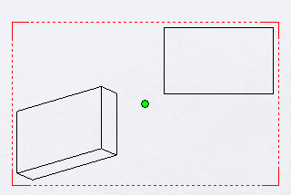

{ width=350 }

绘图文档中的所有绘图视图都有自己的草图，可以通过[SOLIDWORKS API方法IView::GetSketch](https://help.solidworks.com/2019/english/api/sldworksapi/solidworks.interop.sldworks~solidworks.interop.sldworks.iview~getsketch.html)来检索。

这是一个草图，可以使用[ISketchManager](https://help.solidworks.com/2019/english/api/draftsightapi/Interop.dsAutomation~Interop.dsAutomation.ISketchManager.html)接口绘制草图实体和点。

与[在图纸空间中创建草图段](/docs/codestack/solidworks-api/document/drawing/sheet-context-sketch/)不同，添加到视图草图中的段将随着视图一起移动，并且在视图的3D旋转时将被缩放和旋转。

与装配或零件中的草图类似，需要将坐标从模型空间转换为图纸空间，以正确定位段。

以下示例演示了如何在绘图视图中找到中心点（在图纸坐标系中），并使用SOLIDWORKS API使用变换直接在视图中绘制此点。

``` vb
Dim swApp As SldWorks.SldWorks

Sub main()

    Set swApp = Application.SldWorks
    
    Dim swDraw As SldWorks.DrawingDoc
    
    Set swDraw = swApp.ActiveDoc
    
    If Not swDraw Is Nothing Then
        
        Dim swView As SldWorks.view
        Set swView = swDraw.SelectionManager.GetSelectedObject6(1, -1)
        
        If Not swView Is Nothing Then
            DrawPoint swDraw, swView
        Else
            MsgBox "请选择绘图视图"
        End If
    Else
        MsgBox "请打开绘图文档"
    End If
    
End Sub

Sub DrawPoint(draw As SldWorks.DrawingDoc, view As SldWorks.view)
    
    Dim vBoundings As Variant
    vBoundings = view.GetOutline()
    
    Dim dCenterPt(2) As Double
    dCenterPt(0) = (vBoundings(0) + vBoundings(2)) / 2
    dCenterPt(1) = (vBoundings(1) + vBoundings(3)) / 2
    dCenterPt(2) = 0
    
    Dim swViewSketch As SldWorks.Sketch
    Set swViewSketch = view.GetSketch
    
    Dim swViewSketchXForm As SldWorks.MathTransform
    Set swViewSketchXForm = swViewSketch.ModelToSketchTransform
    
    Dim swMathUtils As SldWorks.MathUtility
    Set swMathUtils = swApp.GetMathUtility
    
    Dim swMathPt As SldWorks.MathPoint
    Set swMathPt = swMathUtils.CreatePoint(dCenterPt)
    
    Set swMathPt = swMathPt.MultiplyTransform(swViewSketchXForm)
    
    draw.ActivateView view.Name
    
    Dim vPt As Variant
    vPt = swMathPt.ArrayData
    
    draw.SketchManager.CreatePoint vPt(0), vPt(1), vPt(2)
    
End Sub
```

[//]: # (Permalink to this example)
[//]: # (Permalink to this image)