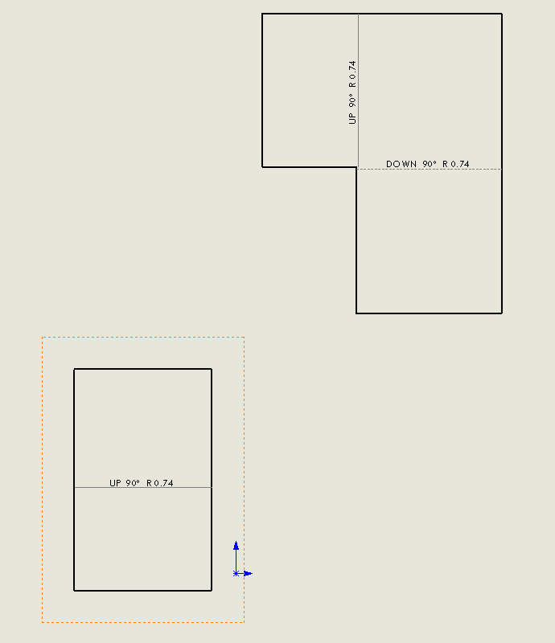

{ width=200 }

This VBA macro finds all bodies of the selected drawing view (including sheet metal flat pattern) and extracts their materials using SOLIDWORKS API.

[IView::Bodies](https://help.solidworks.com/2017/english/api/sldworksapi/solidworks.interop.sldworks~solidworks.interop.sldworks.iview~bodies.html) property finds the bodies of the drawing view, however this SOLIDWORKS API property returns Nothing for the drawing view created from sheet metal flat pattern.

{ width=250 }

Macro below extracts bodies and finds the materials assigned to them in both cases (for regular parts and for sheet metal patterns). The result is output to Immediate window of VBA editor.

~~~ vb
Dim swApp As SldWorks.SldWorks

Sub main()

    Set swApp = Application.SldWorks
    
    Dim swModel As SldWorks.ModelDoc2
    
    Set swModel = swApp.ActiveDoc
    
    If Not swModel Is Nothing Then
        
        Dim swView As SldWorks.view
        Set swView = swModel.SelectionManager.GetSelectedObject6(1, -1)
        
        If Not swView Is Nothing Then
            
            Dim vBodies As Variant
            vBodies = GetBodies(swView)
            
            Dim i As Integer
            
            For i = 0 To UBound(vBodies)
                
                Dim swBody As SldWorks.Body2
                Set swBody = vBodies(i)
                
                Dim matDb As String
                Dim matName As String
                
                matName = swBody.GetMaterialPropertyName(swView.ReferencedConfiguration, matDb)
                
                Debug.Print swView.Name & " - " & swBody.Name & " - " & matName & " - " & matDb
                
            Next
            
        Else
            MsgBox "Please select view"
        End If
        
    Else
        MsgBox "Please open model"
    End If
    
End Sub

Function GetBodies(view As SldWorks.view) As Variant
    
    If view.IsFlatPatternView() Then
        
        Dim vComps As Variant
        vComps = view.GetVisibleComponents()
        
        'Flat pattern can be only created for a single body (either single body part or select body for multi-body part)
        Dim swComp As SldWorks.Component2
        Set swComp = vComps(0)
        
        Dim vFaces As Variant
        vFaces = view.GetVisibleEntities2(swComp, swViewEntityType_e.swViewEntityType_Face)
        
        Dim swFace As SldWorks.Face2
        Set swFace = vFaces(0)
        
        Dim swBodies(0) As SldWorks.Body2
        Set swBodies(0) = swFace.GetBody()
        
        GetBodies = swBodies
        
    Else
        GetBodies = view.Bodies
    End If
    
End Function
~~~

