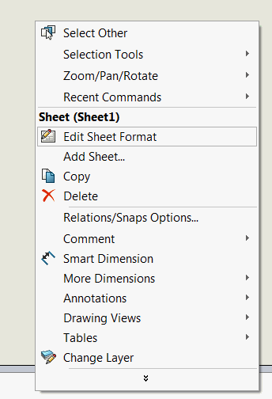
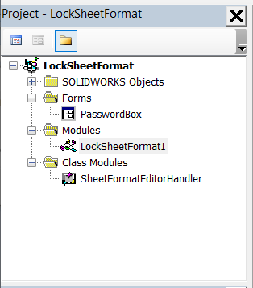

 使用SOLIDWORKS API锁定（或密码保护）表单格式编辑的VBA宏
image: locked-sheet-format.png
labels: [锁定,表单格式,保护]
group: 绘图
---
{ width=250 }

这个VBA宏允许使用SOLIDWORKS API禁用（或密码保护）SOLIDWORKS绘图中的表单格式编辑。

当需要禁止用户修改标准表单格式时，这个宏非常有用。

宏提供了两个选项，可以通过更改下面的常量进行配置：

~~~ vb
Public Const LOCK_WITH_PASSWORD As Boolean = False
Public Const PASSWORD As String = ""
~~~

## 锁定编辑

将*LOCK_WITH_PASSWORD*的值设置为*False*。

每次调用*编辑表单格式*命令并取消命令时，都会显示以下消息：

## 密码保护编辑

将*LOCK_WITH_PASSWORD*的值设置为*True*。将*PASSWORD*的值设置为目标密码。

建议对VBA宏进行密码保护，以便无法从宏本身查看密码。

每次调用*编辑表单格式*命令时，都会显示以下提示：

如果密码匹配，则可以编辑表单格式，否则将取消命令并显示错误消息。

## 创建宏

* 创建新的宏并粘贴[宏模块](#macro-module)的代码
* 添加新的[类模块](/docs/codestack/visual-basic/classes/)并将其命名为*SheetFormatEditorHandler*。将[class module](#sheetformateditorhandler-class)的代码粘贴到类模块中。
* 添加新的[用户窗体](/docs/codestack/visual-basic/user-forms/)并将其命名为*PasswordBox*。将[user form](#passwordbox-user-form)的代码粘贴到用户窗体代码中。
* 根据下图所示添加控件，并指定每个控件的名称。

* 将文本框控件的*PasswordChar*属性值设置为\*，以在输入时隐藏用户界面中的密码。

文件树应类似于下图。

按照[在SOLIDWORKS启动时运行宏](/docs/codestack/solidworks-api/getting-started/macros/run-macro-on-solidworks-start/)的说明设置宏在SOLIDWORKS启动时自动运行。

## 阻止其他命令

可以修改此宏以阻止其他命令。还可以更改以同时处理多个命令。为此，需要修改以下行：

~~~ vb
If Command = swCommands_Edit_Template Then
~~~

为

~~~ vb
If Command = CmdId1 Or Command = CmdId2 ... Or Command = CmdId3 Then
~~~

例如，以下行将阻止编辑草图、打开SOLIDWORKS选项对话框和打印文档。请参阅[Capture Commands](/docs/codestack/solidworks-api/application/frame/capture-commands/)宏，了解如何提取SOLIDWORKS中特定命令的ID的说明。

~~~ vb
If Command = 859 Or Command = 342 Or Command = 589 Then
~~~

### 宏模块

~~~ vb
Public Const LOCK_WITH_PASSWORD As Boolean = True
Public Const PASSWORD As String = "admin"

Dim swSheetFormatEditorHandler As SheetFormatEditorHandler

Sub main()

    Set swSheetFormatEditorHandler = New SheetFormatEditorHandler
    
End Sub

~~~

### SheetFormatEditorHandler 类

~~~ vb
Dim WithEvents swApp As SldWorks.SldWorks

Private Sub Class_Initialize()
    Set swApp = Application.SldWorks
End Sub

Private Function swApp_CommandOpenPreNotify(ByVal Command As Long, ByVal UserCommand As Long) As Long
    
    Const swCommands_Edit_Template As Long = 1501
    
    If Command = swCommands_Edit_Template Then
        Dim cancel As Boolean
        cancel = True
        
        If LOCK_WITH_PASSWORD Then
            
            Dim pwd As String
            PasswordBox.Message = "表单格式编辑已锁定。请输入密码以解锁"
            PasswordBox.ShowDialog
            pwd = PasswordBox.Password
            
            If pwd <> "" Then
                If pwd = Password Then
                    cancel = False
                Else
                    swApp.SendMsgToUser2 "密码不正确", swMessageBoxIcon_e.swMbStop, swMessageBoxBtn_e.swMbOk
                End If
            End If
        Else
            swApp.SendMsgToUser2 "表单格式编辑已锁定", swMessageBoxIcon_e.swMbInformation, swMessageBoxBtn_e.swMbOk
        End If
        
        swApp_CommandOpenPreNotify = IIf(cancel, 1, 0)
    End If
    
End Function
~~~

### PasswordBox 用户窗体

~~~ vb
Public Password As String

Public Property Let Message(msg As String)
     lblMessage.Caption = msg
End Property

Public Sub ShowDialog()
    Password = ""
    txtPassword.Text = ""
    Show vbModal
End Sub

Private Sub btnOk_Click()
    
    Password = txtPassword.Text
    Me.Hide
    
End Sub
~~~