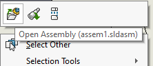

 VBA宏打开所选绘图视图引用的文档，并显示引用配置和显示状态
image: ref-doc-display-state.svg
labels: [绘图,引用,显示状态]
group: 绘图
---

这个VBA宏执行的操作类似于在所选的SOLIDWORKS绘图视图上执行**打开装配体命令**，但还会激活与绘图视图关联的引用显示状态。

~~~ vb
Dim swApp As SldWorks.SldWorks
Dim swModel As SldWorks.ModelDoc2

Sub main()

    Set swApp = Application.SldWorks
    
    Set swModel = swApp.ActiveDoc
    
    If Not swModel Is Nothing Then
    
        Dim swSelMgr As SldWorks.SelectionMgr
        
        Set swSelMgr = swModel.SelectionManager
        
        Dim swView As SldWorks.View
        
        Set swView = swSelMgr.GetSelectedObject6(1, -1)
        
        If Not swView Is Nothing Then
        
            Dim swRefDoc As SldWorks.ModelDoc2
            Set swRefDoc = swView.ReferencedDocument
            
            If swRefDoc Is Nothing Then
                Err.Raise vbError, "", "绘图视图模型未加载"
            End If
            
            swRefDoc.ShowConfiguration2 swView.ReferencedConfiguration
            
            Dim swConf As SldWorks.Configuration
            Set swConf = swRefDoc.GetConfigurationByName(swView.ReferencedConfiguration)
            
            swConf.ApplyDisplayState swView.DisplayState
            
            swRefDoc.Visible = True
            
        Else
            Err.Raise vbError, "", "请选择绘图视图"
        End If
        
    Else
        Err.Raise vbError, "", "没有活动文档"
    End If
    
End Sub
~~~