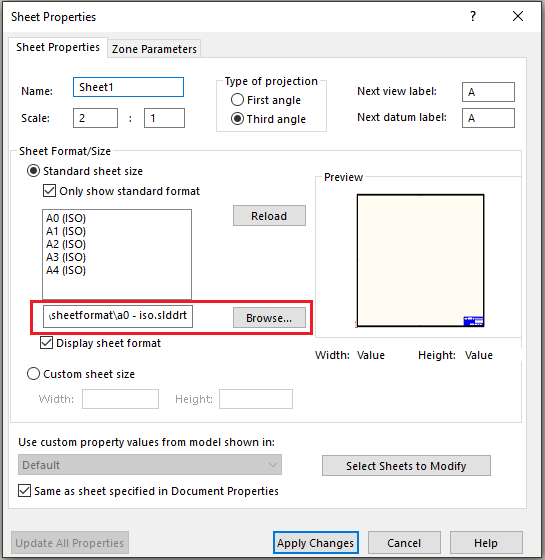

{ width=300 }

这个VBA宏根据指定的映射规则，替换活动图纸文档中所有图纸页的图纸格式（*.slddrt文件）。

## 配置

通过更改**REPLACE_MAP**数组来配置映射。该数组包含根据输入图纸的大小或图纸格式文件替换图纸页的指令。

该映射以以下格式包含一组匹配过滤器和结果图纸格式文件：

~~~
|{源纸张大小}|{源图纸格式文件路径}|{目标图纸格式文件路径}
~~~

源纸张大小是在[swDwgPaperSizes_e](https://help.solidworks.com/2016/english/api/swconst/solidworks.interop.swconst~solidworks.interop.swconst.swdwgpapersizes_e.html)枚举中定义的常量。请参阅下表。使用这些值之一或使用\*来匹配任何纸张大小。

| 大小        | 常量 |
|-------------|----------|
| A           | 0        |
| A纵向  | 1        |
| B           | 2        |
| C           | 3        |
| D           | 4        |
| E           | 5        |
| A4          | 6        |
| A4纵向 | 7        |
| A3          | 8        |
| A2          | 9        |
| A1          | 10       |
| A0          | 11       |

源图纸格式文件大小是图纸格式文件的完整文件路径，或者使用\*来匹配所有图纸格式。

例如，下面的映射将：

* 使用*D:\Formats\format1.slddrt*图纸格式文件替换所有A0大小（11）的图纸页，无论使用的图纸格式文件是什么（\*）。
* 使用*D:\Formats\format2.slddrt*文件，将所有图纸页无论大小（\*）替换为与*D:\OldFormats\oldformat1.slddrt*链接的图纸格式。

~~~ vb
REPLACE_MAP = Array("11|*|D:\Formats\format1.slddrt", "*|D:\OldFormats\oldformat1.slddrt|D:\Formats\format2.slddrt")
~~~

您可以指定任意数量的规则。

规则按指定的顺序执行。

如果没有规则与输入匹配 - 宏将抛出错误。

~~~ vb
Const REMOVE_MODIFIED_NOTES As Boolean = True
Const FILTER_ANY As String = "*"

Dim swApp As SldWorks.SldWorks

Dim REPLACE_MAP As Variant

Sub main()

    REPLACE_MAP = Array("*|*|D:\new-format.slddrt")

    Set swApp = Application.SldWorks
    
    Dim swDraw As SldWorks.DrawingDoc
    
    Set swDraw = swApp.ActiveDoc
    
    Dim vSheetNames As Variant
    vSheetNames = swDraw.GetSheetNames
    
    Dim i As Integer
    
    Dim activeSheet As String
    activeSheet = swDraw.GetCurrentSheet().GetName
    
    For i = 0 To UBound(vSheetNames)
        
        Dim sheetName As String
        sheetName = CStr(vSheetNames(i))
        
        Dim swSheet As SldWorks.sheet
        Set swSheet = swDraw.sheet(sheetName)
        
        Dim targetSheetFormatFileName As String
        targetSheetFormatFileName = GetReplaceSheetFormat(swSheet)
        
        swDraw.ActivateSheet sheetName
        
        ReplaceSheetFormat swDraw, swSheet, targetSheetFormatFileName

    Next
    
    swDraw.ActivateSheet activeSheet
    
End Sub

Function GetReplaceSheetFormat(sheet As SldWorks.sheet) As String
    
    Dim curTemplateName As String
    curTemplateName = sheet.GetTemplateName()
    
    Dim curSize As Integer
    curSize = sheet.GetSize(-1, -1)
    
    Dim i As Integer
    
    For i = 0 To UBound(REPLACE_MAP)
        
        Dim map As String
        map = REPLACE_MAP(i)
        
        Dim mapParams As Variant
        mapParams = Split(map, "|")
        
        Dim mapPaperSize As Integer
        Dim srcTemplateName As String
        
        If Trim(mapParams(0)) <> FILTER_ANY Then
            mapPaperSize = CInt(Trim(mapParams(0)))
        Else
            mapPaperSize = -1
        End If
        
        If Trim(mapParams(1)) <> FILTER_ANY Then
            srcTemplateName = CStr(Trim(mapParams(1)))
        Else
            srcTemplateName = ""
        End If
        
        If (mapPaperSize = -1 Or mapPaperSize = curSize) And (srcTemplateName = "" Or LCase(srcTemplateName) = LCase(curTemplateName)) Then
            
            Dim targetTemplateName As String

            targetTemplateName = CStr(Trim(mapParams(2)))
        
            If targetTemplateName = "" Then
                Err.Raise vbError, "", "未指定目标模板"
            End If
        
            GetReplaceSheetFormat = targetTemplateName
            Exit Function
            
        End If
        
    Next
    
    Err.Raise vbError, "", "未找到与当前图纸匹配的图纸格式"
    
End Function

Sub ReplaceSheetFormat(draw As SldWorks.DrawingDoc, sheet As SldWorks.sheet, targetSheetFormatFile As String)
    
    Debug.Print "正在替换'" & sheet.GetName() & "'为'" & targetSheetFormatFile & "'"
    
    Dim vProps As Variant
    vProps = sheet.GetProperties()
    
    Dim paperSize As Integer
    Dim templateType As Integer
    Dim scale1 As Double
    Dim scale2 As Double
    Dim firstAngle As Boolean
    Dim width As Double
    Dim height As Double
    Dim custPrpView As String
    
    paperSize = CInt(vProps(0))
    templateType = CInt(vProps(1))
    scale1 = CDbl(vProps(2))
    scale2 = CDbl(vProps(3))
    firstAngle = CBool(vProps(4))
    width = CDbl(vProps(5))
    height = CDbl(vProps(6))
    custPrpView = sheet.CustomPropertyView
    
    If False <> draw.SetupSheet5(sheet.GetName(), paperSize, templateType, scale1, scale2, firstAngle, targetSheetFormatFile, width, height, custPrpView, REMOVE_MODIFIED_NOTES) Then
        If sheet.ReloadTemplate(Not REMOVE_MODIFIED_NOTES) <> swReloadTemplateResult_e.swReloadTemplate_Success Then
            Err.Raise vbError, "", "重新加载图纸格式失败"
        End If
    Else
        Err.Raise vbError, "", "设置图纸格式失败"
    End If
    
End Sub
~~~