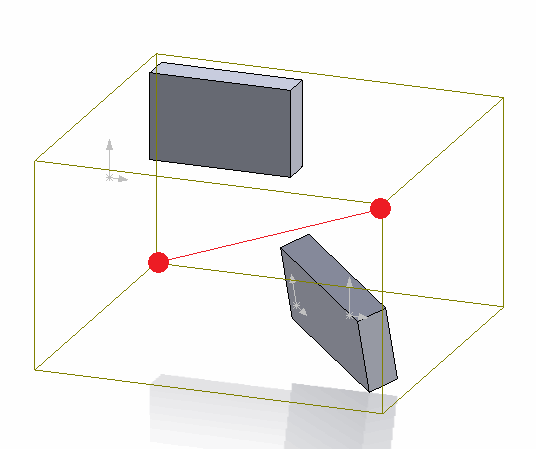
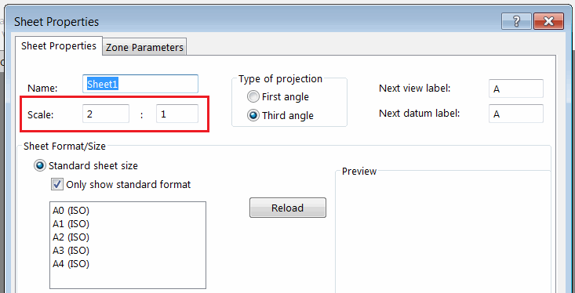

 使用SOLIDWORKS API在绘图工作表的上下文中绘制底层模型边界框的草图线段
image: drawing-view-line.png
labels: [草图,尺寸,边缘,边界框]
---

此代码示例演示了如何使用SOLIDWORKS API在绘图视图中绘制模型边界框的对角线。

{ width=250 }

边界框坐标系是从绘图视图的底层模型中提取的。这些坐标是相对于零件或装配体绘图视图的全局坐标系的。

为了将坐标正确转换为绘图工作表空间，需要考虑以下因素：

* 绘图视图变换。可以使用[SOLIDWORKS API方法IView::ModelToViewTransform](https://help.solidworks.com/2018/english/api/sldworksapi/solidworks.interop.sldworks~solidworks.interop.sldworks.iview~modeltoviewtransform.html)来提取。
* 绘图工作表变换。
* 绘图工作表比例。

{ width=350 }

上述变换的组合将返回从模型空间到当前工作表空间的坐标的完整变换。

> 在将草图线段插入绘图工作表时，需要调用[IDrawingDoc::ActivateView](https://help.solidworks.com/2018/english/api/sldworksapi/solidworks.interop.sldworks~solidworks.interop.sldworks.idrawingdoc~activateview.html)方法并将空字符串作为参数传递，以激活工作表空间。否则，实体将直接插入视图文档的模型空间中。

## 运行宏

* 打开绘图
* 插入零件或装配体的视图
* 修改视图和绘图工作表比例。您还可以旋转视图
* 运行宏。结果是在绘图工作表空间中绘制了表示底层模型边界框的对角线
* 移动视图。请注意，创建的线段不会随视图移动，这意味着它是在绘图工作表空间中创建的

{ width=300 }

~~~ vb
Dim swApp As SldWorks.SldWorks

Sub main()

    Set swApp = Application.SldWorks
    
    Dim swDraw As SldWorks.DrawingDoc
    
    Set swDraw = swApp.ActiveDoc
    
    If Not swDraw Is Nothing Then
        
        Dim swView As SldWorks.view
        Set swView = swDraw.SelectionManager.GetSelectedObject6(1, -1)
        
        If Not swView Is Nothing Then
            DrawBBoxDiagonal swDraw, swView
        Else
            MsgBox "请选择绘图视图"
        End If
    Else
        MsgBox "请打开绘图文档"
    End If
    
End Sub

Sub DrawBBoxDiagonal(draw As SldWorks.DrawingDoc, view As SldWorks.view)
    
    Dim vBox As Variant
    Dim swViewTransform As SldWorks.MathTransform
    
    Dim swMathPt As SldWorks.MathPoint
    Dim vStartPt As Variant
    Dim vEndPt As Variant
    
    vBox = GetViewRefModelBBox(view)
    Set swViewTransform = GetViewToSheetTransform(draw, view)
    
    Dim swMathUtils As SldWorks.MathUtility
    Set swMathUtils = swApp.GetMathUtility
    
    Dim dPt(2) As Double
    dPt(0) = vBox(0): dPt(1) = vBox(1): dPt(2) = vBox(2)
    
    Set swMathPt = swMathUtils.CreatePoint(dPt)
    Set swMathPt = swMathPt.MultiplyTransform(swViewTransform)
    vStartPt = swMathPt.ArrayData
    
    dPt(0) = vBox(3): dPt(1) = vBox(4): dPt(2) = vBox(5)
    
    Set swMathPt = swMathUtils.CreatePoint(dPt)
    Set swMathPt = swMathPt.MultiplyTransform(swViewTransform)
    vEndPt = swMathPt.ArrayData
    
    draw.ActivateView ""
        
    draw.ClearSelection2 True
        
    draw.SketchManager.CreateLine vStartPt(0), vStartPt(1), vStartPt(2), vEndPt(0), vEndPt(1), vEndPt(2)
    
End Sub

Function GetViewRefModelBBox(view As SldWorks.view) As Variant
    
    Dim swRefDoc As SldWorks.ModelDoc2
    Set swRefDoc = view.ReferencedDocument
    
    If Not swRefDoc Is Nothing Then
        If swRefDoc.GetType() = swDocumentTypes_e.swDocPART Then
            Dim swPart As SldWorks.PartDoc
            Set swPart = swRefDoc
            GetViewRefModelBBox = swPart.GetPartBox(True)
        ElseIf swRefDoc.GetType() = swDocumentTypes_e.swDocASSEMBLY Then
            Dim swAssy As SldWorks.AssemblyDoc
            Set swAssy = swRefDoc
            Const BOX_OPTS_DEFAULT As Integer = 0
            GetViewRefModelBBox = swAssy.GetBox(BOX_OPTS_DEFAULT)
        Else
            Err.Raise vbError, "", "不支持的视图文档"
        End If
    Else
        Err.Raise vbError, "", "未附加文档到视图"
    End If
    
End Function

Function GetViewToSheetTransform(draw As SldWorks.DrawingDoc, view As SldWorks.view) As SldWorks.MathTransform

    Dim swMathUtils As SldWorks.MathUtility
    Dim swSheet As SldWorks.sheet
    
    Set swMathUtils = swApp.GetMathUtility
    
    Set swSheet = view.sheet
    
    Dim vSheetPrps As Variant
    vSheetPrps = swSheet.GetProperties
    
    Dim sheetScaleNom As Double
    Dim sheetScaleDenom As Double
    
    sheetScaleNom = vSheetPrps(2)
    sheetScaleDenom = vSheetPrps(3)

    Dim dSheetData(15) As Double
    dSheetData(0) = 1: dSheetData(1) = 0: dSheetData(2) = 0: dSheetData(3) = 0
    dSheetData(4) = 1: dSheetData(5) = 0: dSheetData(6) = 0: dSheetData(7) = 0
    dSheetData(8) = 1: dSheetData(9) = 0: dSheetData(10) = 0: dSheetData(11) = 0
    dSheetData(12) = sheetScaleNom / sheetScaleDenom: dSheetData(13) = 0: dSheetData(14) = 0: dSheetData(15) = 0
    
    Dim swSheetTransform As SldWorks.MathTransform
    Set swSheetTransform = swMathUtils.CreateTransform(dSheetData)
            
    Set GetViewToSheetTransform = view.ModelToViewTransform.Multiply(swSheetTransform.Inverse())

End Function
~~~