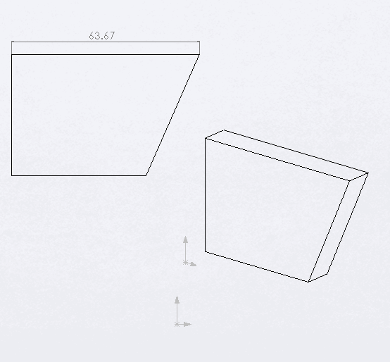

{ width=250 }

此示例演示了如何使用SOLIDWORKS API在所选绘图视图中添加线性尺寸到最长的边。

此宏遍历绘图视图中的所有可见实体，计算边的长度并找到最长的边。只有当最长的边可以维度化时（即它是线性或圆形边），宏才能正常工作。

从[IView::GetVisibleEntities](https://help.solidworks.com/2018/english/api/sldworksapi/solidworks.interop.sldworks~solidworks.interop.sldworks.iview~getvisibleentities.html)返回的实体已经处于绘图视图上下文中，可以直接通过[IEntity::Select4](https://help.solidworks.com/2018/english/api/sldworksapi/solidworks.interop.sldworks~solidworks.interop.sldworks.ientity~select4.html) SOLIDWORKS API方法选择它们，无需调用[IView::SelectEntity](https://help.solidworks.com/2018/english/api/sldworksapi/solidworks.interop.sldworks~solidworks.interop.sldworks.iview~selectentity.html)函数。

尺寸的位置是通过将维度化边的中点在法线曲线方向（切线方向和工作平面Z轴的叉乘）上偏移边长的20%来计算的。与[在工作平面上绘图](/docs/codestack/solidworks-api/document/drawing/sheet-context-sketch/)不同，绘图工作表比例在定位尺寸时不需要乘以视图变换矩阵。

~~~ vb
Dim swApp As SldWorks.SldWorks

Sub main()

    Set swApp = Application.SldWorks
    
    Dim swDraw As SldWorks.DrawingDoc
    
    Set swDraw = swApp.ActiveDoc
    
    If Not swDraw Is Nothing Then
        
        Dim swView As SldWorks.view
        Set swView = swDraw.SelectionManager.GetSelectedObject6(1, -1)
        
        If Not swView Is Nothing Then
            DimensionLongestEdge swDraw, swView
        Else
            MsgBox "请选择绘图视图"
        End If
    Else
        MsgBox "请打开绘图文档"
    End If
    
End Sub

Sub DimensionLongestEdge(draw As SldWorks.DrawingDoc, view As SldWorks.view)
    
    Dim vVisComps As Variant
    vVisComps = view.GetVisibleComponents
    
    Dim i As Integer
    
    Dim swLongestEdge As SldWorks.edge
    Dim curMaxLength As Double
    
    curMaxLength = 0
    
    For i = 0 To UBound(vVisComps)
        
        Dim swComp As SldWorks.Component2
        Set swComp = vVisComps(i)
        Dim vVisEnts As Variant
        
        vVisEnts = view.GetVisibleEntities2(swComp, swViewEntityType_e.swViewEntityType_Edge)
        
        Dim j As Integer
        
        For j = 0 To UBound(vVisEnts)
            
            Dim swEdge As SldWorks.edge
            Set swEdge = vVisEnts(j)
            
            Dim curLength As Double
            curLength = GetEdgeLength(swEdge)
            
            If curLength > curMaxLength Then
                Set swLongestEdge = swEdge
                curMaxLength = curLength
            End If
            
        Next
        
    Next
    
    If swLongestEdge Is Nothing Then
        Err.Raise vbError, "", "未找到最长的边"
    End If
    
    Dim swEnt As SldWorks.Entity
    Set swEnt = swLongestEdge
    
    swEnt.Select4 False, Nothing
    
    Dim vDimLoc As Variant
    vDimLoc = GetDimensionLocation(swLongestEdge, view)
    
    draw.AddDimension2 vDimLoc(0), vDimLoc(1), vDimLoc(2)
    
End Sub

Function GetEdgeLength(edge As SldWorks.edge) As Double
    
    Dim swCurve As SldWorks.Curve
    
    Set swCurve = edge.GetCurve()
    
    Dim swCurveParams As SldWorks.CurveParamData
    Set swCurveParams = edge.GetCurveParams3
    
    GetEdgeLength = swCurve.GetLength3(swCurveParams.UMinValue, swCurveParams.UMaxValue)
    
End Function

Function GetDimensionLocation(edge As SldWorks.edge, view As SldWorks.view) As Variant
    
    Dim swCurveParams As SldWorks.CurveParamData
    Set swCurveParams = edge.GetCurveParams3
    
    Dim vCurveData As Variant
    vCurveData = edge.Evaluate2((swCurveParams.UMinValue + swCurveParams.UMaxValue) / 2, 2)
    
    Dim dMidPt(2) As Double
    dMidPt(0) = vCurveData(0): dMidPt(1) = vCurveData(1): dMidPt(2) = vCurveData(2)
    
    Dim dDir(2) As Double
    dDir(0) = vCurveData(3): dDir(1) = vCurveData(4): dDir(2) = vCurveData(5)
    
    Dim dimOffset As Double
    Dim swCurve As SldWorks.Curve
    Set swCurve = edge.GetCurve
    dimOffset = swCurve.GetLength3(swCurveParams.UMinValue, swCurveParams.UMaxValue) * 0.2
        
    Dim swViewXForm As SldWorks.MathTransform
    Set swViewXForm = view.ModelToViewTransform
    
    Dim swMathUtils As SldWorks.MathUtility
    Set swMathUtils = swApp.GetMathUtility
    
    Dim swMathPt As SldWorks.MathPoint
    Set swMathPt = swMathUtils.CreatePoint(dMidPt)
    Set swMathPt = swMathPt.MultiplyTransform(swViewXForm)
    
    Dim swMathTangentVec As SldWorks.MathVector
    Set swMathTangentVec = swMathUtils.CreateVector(dDir)
    Set swMathTangentVec = swMathTangentVec.MultiplyTransform(swViewXForm)
    
    Dim swMathPerpVec As SldWorks.MathVector
    Dim dPerpVec(2) As Double
    dPerpVec(0) = 0: dPerpVec(1) = 0: dPerpVec(2) = 1
    Set swMathPerpVec = swMathUtils.CreateVector(dPerpVec)
    
    Dim swDimExtDir As SldWorks.MathVector
    Set swDimExtDir = swMathTangentVec.Cross(swMathPerpVec)
    
    GetDimensionLocation = MovePoint(swMathPt, swDimExtDir, dimOffset)
    
End Function

Function MovePoint(pt As SldWorks.MathPoint, dir As SldWorks.MathVector, dist As Double) As Variant
       
    Set dir = dir.Normalise()
    Set dir = dir.Scale(dist)
    
    Set pt = pt.AddVector(dir)
    
    MovePoint = pt.ArrayData
    
End Function
~~~