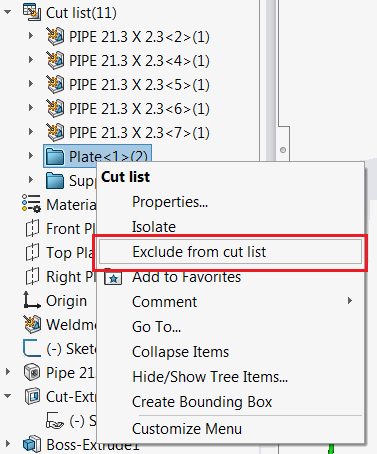

{ width=300 }

This macro allows to exclude the selected bodies from the weldment or sheet metal cut list using SOLIDWORKS API.

Bodies can be selected in the graphics view or feature tree which makes the process easier as it is not required to find the corresponding cut-list feature to exclude the body.

It is possible to use [selection filters](https://help.solidworks.com/2013/english/solidworks/sldworks/r_selection_filter_selection.htm) for bodies to simplify the picking of required ones from the graphics area.

It is also possible to select face, edge or vertex of the body to be excluded.

{ width=500 }

Watch [video demonstration](https://youtu.be/9uZCecGg25I?t=509)

~~~ vb
Dim swApp As SldWorks.SldWorks

Sub main()

    Dim swModel As SldWorks.ModelDoc2
    Dim swSelMgr As SldWorks.SelectionMgr

    Set swApp = Application.SldWorks
    
    Set swModel = swApp.ActiveDoc
    
    If Not swModel Is Nothing Then
        
        Set swSelMgr = swModel.SelectionManager
        
        Dim swCutListsColl As Collection
        Set swCutListsColl = New Collection
        
        Dim i As Integer
        
        Dim hasBodies As Boolean
                
        For i = 1 To swSelMgr.GetSelectedObjectCount2(-1)
            
            On Error Resume Next
            
            Dim swBody As SldWorks.Body2
        
            Set swBody = GetSelectedObjectBody(swSelMgr, i)
            
            If Not swBody Is Nothing Then
                
                Dim swCutListFeat As SldWorks.Feature
                Set swCutListFeat = GetCutListFromBody(swModel, swBody)
                
                If Not swCutListFeat Is Nothing Then
                    If Not Contains(swCutListsColl, swCutListFeat) Then
                        swCutListsColl.Add swCutListFeat
                    End If
                Else
                    MsgBox "Failed to find the cut list item for " & swBody.Name
                End If
                
            End If
        
        Next
        
        If swCutListsColl.Count() > 0 Then
        
            For i = 1 To swCutListsColl.Count
                swCutListsColl(i).ExcludeFromCutList = True
            Next
        
        Else
            MsgBox "Please select bodies to exclude from cut list"
        End If
        
    Else
        MsgBox "Please open model"
    End If
    
End Sub

Function GetSelectedObjectBody(selMgr As SldWorks.SelectionMgr, index As Integer) As SldWorks.Body2
    
    Dim swBody As SldWorks.Body2
    
    Dim selObj As Object
    Set selObj = selMgr.GetSelectedObject6(index, -1)
    
    If Not selObj Is Nothing Then
        If TypeOf selObj Is SldWorks.Body2 Then
            Set swBody = selObj
        ElseIf TypeOf selObj Is SldWorks.Face2 Then
            Dim swFace As SldWorks.Face2
            Set swFace = selObj
            Set swBody = swFace.GetBody
        ElseIf TypeOf selObj Is SldWorks.Edge Then
            Dim swEdge As SldWorks.Edge
            Set swEdge = selObj
            Set swBody = swEdge.GetBody
        ElseIf TypeOf selObj Is SldWorks.Vertex Then
            Dim swVertex As SldWorks.Vertex
            Set swVertex = selObj
            Set swBody = swVertex.GetBody
        End If
    End If

    Set GetSelectedObjectBody = swBody
    
End Function

Function GetCutListFromBody(model As SldWorks.ModelDoc2, body As SldWorks.Body2) As SldWorks.Feature
    
    Dim swFeat As SldWorks.Feature
    Dim swBodyFolder As SldWorks.BodyFolder
    
    Set swFeat = model.FirstFeature
    
    Do While Not swFeat Is Nothing
        
        If swFeat.GetTypeName2 = "CutListFolder" Then
            
            Set swBodyFolder = swFeat.GetSpecificFeature2
            
            Dim vBodies As Variant
            
            vBodies = swBodyFolder.GetBodies
            
            Dim i As Integer
            
            If Not IsEmpty(vBodies) Then
                For i = 0 To UBound(vBodies)
                    
                    Dim swCutListBody As SldWorks.Body2
                    Set swCutListBody = vBodies(i)
                    
                    If swApp.IsSame(swCutListBody, body) = swObjectEquality.swObjectSame Then
                        Set GetCutListFromBody = swFeat
                        Exit Function
                    End If
                    
                Next
            End If
            
        End If
        
        Set swFeat = swFeat.GetNextFeature
        
    Loop

End Function

Function Contains(coll As Collection, item As Object) As Boolean
    
    Dim i As Integer
    
    For i = 1 To coll.Count
        If coll.item(i) Is item Then
            Contains = True
            Exit Function
        End If
    Next
    
    Contains = False
    
End Function
~~~

