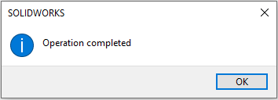
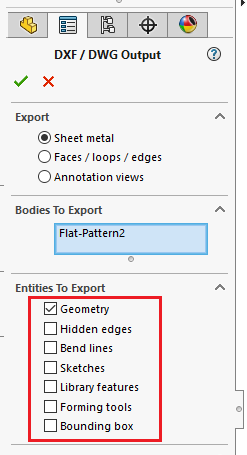

这个VBA宏允许从活动SOLIDWORKS装配或活动零件文档中的所有钣金组件导出所有展开图案到DXF/DWG。

宏允许在指定输出文件名时灵活使用占位符（原始文件名、特征名、自定义属性、切割列表自定义属性等）与自由文本结合，并支持指定子文件夹。

导出完成后将显示以下消息框。





## 配置

可以通过修改**OUT_NAME_TEMPLATE**和**FLAT_PATTERN_OPTIONS**常量来配置宏。

### 输出名称模板

此常量允许指定展开图案的输出路径模板。

这可以是绝对路径或相对路径。如果是后者，则结果将相对于装配目录保存。

扩展名（.dxf或.dwg）必须作为命名模板的一部分指定。

支持以下占位符：

* <\_FileName\_> - 钣金部件所在的零件文件的名称（不包括扩展名）
* <\_FeatureName\_> - 展开图案特征的名称
* <\_ConfName\_> - 此展开图案的配置的名称（即组件的引用配置）
* <\_AssmFileName\_> - 主装配的名称
* <$CLPRP:[PropertyName]> - 任何切割列表属性的名称，用于读取值，例如\<Thickness\>将被替换为切割列表自定义属性*Thickness*的值
* <$PRP:[PropertyName]> - 任何钣金零件的自定义属性的名称，用于读取值，例如\<PartNo\>将被替换为切割列表自定义属性*PartNo*的值
* <$ASSMPRP:[PropertyName]> - 任何主装配的自定义属性的名称，用于读取值，例如\<ProductId\>将被替换为切割列表自定义属性*ProductId*的值

占位符将在运行时为每个展开图案解析。

例如，以下值将使用零件文档的名称将展开图案保存在与主装配相同文件夹中的*DXFs*子文件夹中。

~~~ vb
Const OUT_NAME_TEMPLATE As String = "DXFs\<_FileName_>.dxf"
~~~

而以下名称将将所有展开图案作为DWG文件保存到*D*驱动器上的*Output*文件夹中，其中文件名将从每个相应展开图案的*PartNo*属性中提取。

~~~ vb
Const OUT_NAME_TEMPLATE As String = "D:\Output\<$CLPRP:PartNo>.dwg"
~~~

以下设置将创建与切割列表中的**Thickness**自定义属性值相对应的子文件夹，并使用从主装配中提取的**ProductName**自定义属性值，后跟下划线符号和来自钣金零件文档的**PartNo**属性值的文件名。

~~~ vb
Const OUT_NAME_TEMPLATE As String = "D:\Output\<$CLPRP:Thickness>\<$ASSMPRP:ProductName>_<$PRP:PartNo>.dwg"
~~~

### 在文件名中包含数量

此宏没有明确的变量来在文件名中包含展开图案的数量。但是，可以通过包含自动**QUANTITY**自定义属性的值与**<$CLPRP:QUANTITY>**占位符来提取多体钣金零件的数量值。

为了在装配中包含组件数量，请使用[将SOLIDWORKS装配中的组件数量写入自定义属性](/docs/codestack/solidworks-api/document/assembly/components/write-quantities/)宏。在导出之前运行此宏以创建具有数量值的自定义属性，然后使用**<$CLPRP:Qty>**占位符将其包含到输出文件名中。

> 注意，此宏不会将多体钣金零件的数量与组件数量相乘

### 展开图案选项

可以通过指定**FLAT_PATTERN_OPTIONS**的值来配置选项。使用**+**来组合选项



例如，要导出隐藏边、库特征和成型工具，请使用以下设置。

~~~ vb
Const FLAT_PATTERN_OPTIONS As Integer = SheetMetalOptions_e.IncludeHiddenEdges + SheetMetalOptions_e.ExportLibraryFeatures + SheetMetalOptions_e.ExportFormingTools
~~~

> 注意，必须始终指定几何选项，因为它是展开图案导出所必需的

## 跳过已创建的文件

**SKIP_EXISTING_FILES**选项允许指定如果输出文件已经存在，则宏是否应重新生成输出文件。

将此选项设置为true以跳过如果目标位置上存在输出文件（.dxf或.dwg）则不导出文件。

~~~ vb
Const SKIP_EXISTING_FILES As Boolean = True
~~~

当处理大型装配时，此选项可能很有用，并且需要在SOLIDWORKS重新启动后继续执行。导出展开图案是一个性能消耗很大的操作，因此在处理大型作业时，SOLIDWORKS可能会崩溃或挂起。此选项可以帮助在重新启动后继续导出。

## 故障排除

如果宏报告错误，在某些情况下，可能不会立即明确导致错误的原因，因为错误详细信息被异常处理程序“吞噬”了。为了禁用错误处理并显示导致错误的确切行，请在代码中将所有*On Error GoTo catch_*行注释掉，方法是在行的开头放置撇号'，如下所示。

~~~ vb jagged
Sub main()
        
    Set swApp = Application.SldWorks
    
try_:
    'On Error GoTo catch_
~~~

~~~ vb jagged
Sub ExportFlatPattern(part As SldWorks.PartDoc, flatPattern As SldWorks.Feature, outFilePath As String, opts As SheetMetalOptions_e, conf As String)
    
    Dim swModel As SldWorks.ModelDoc2
    Set swModel = part
    
    Dim error As ErrObject
    Dim hide As Boolean

try_:
    
    'On Error GoTo catch_
~~~

请提交[错误报告](https://github.com/xarial/codestack/issues/new?labels=bug)并附上此错误的快照和用于重现的模型（如果可能）。

## 注意事项

* 如果有轻量级组件，宏将要求解析它们。如果未解析组件，则宏可能会生成错误。
* 将导出每个多体钣金零件的每个展开图案。确保使用<\_FeatureName\_>或<$CLPRP:[PropertyName]>区分结果文件
* $PRP和$ASSMPRP值将首先从配置特定属性中提取，如果为空，则从一般文件属性中提取
* 如果指定的属性不存在（对于$CLPRP、$PRP和$ASSMPRP），则使用空字符串作为占位符值
* 宏将处理所有不同的组件（文件路径+配置）
* 宏将自动创建所需的文件夹
* 宏将使用\_替换所有路径无效符号
* 宏将仅导出切割列表下的唯一实体，并跳过属于已导出切割列表的展开图案

~~~ vb
Enum SheetMetalOptions_e
    ExportFlatPatternGeometry = 1
    IncludeHiddenEdges = 2
    ExportBendLines = 4
    IncludeSketches = 8
    MergeCoplanarFaces = 16
    ExportLibraryFeatures = 32
    ExportFormingTools = 64
    ExportBoundingBox = 2048
End Enum

Const SKIP_EXISTING_FILES As Boolean = False

Const OUT_NAME_TEMPLATE As String = "DXFs\<_FileName_>_<_FeatureName_>_<_ConfName_>_<$CLPRP:Description>.dxf"

Const FLAT_PATTERN_OPTIONS As Integer = SheetMetalOptions_e.ExportBendLines + SheetMetalOptions_e.ExportFlatPatternGeometry

Dim swApp As SldWorks.SldWorks

Sub main()
        
    Set swApp = Application.SldWorks
    
try_:
    On Error GoTo catch_
    
    Dim swModel As SldWorks.ModelDoc2
    Set swModel = swApp.ActiveDoc
    
    If swModel Is Nothing Then
        Err.Raise vbError, "", "请打开装配或零件文档"
    End If
    
    If swModel.GetType() = swDocumentTypes_e.swDocASSEMBLY Then
    
        Dim swAssy As SldWorks.AssemblyDoc
        
        Set swAssy = swModel
            
        swAssy.ResolveAllLightWeightComponents True
            
        Dim vComps As Variant
        vComps = GetDistinctSheetMetalComponents(swAssy)
        
        Dim i As Integer
        
        For i = 0 To UBound(vComps)
        
            Dim swComp As SldWorks.Component2
            Set swComp = vComps(i)
            
            ProcessSheetMetalModel swAssy, swComp.GetModelDoc2(), swComp.ReferencedConfiguration
        
        Next
        
    ElseIf swModel.GetType() = swDocumentTypes_e.swDocPART Then
        
        Dim swPart As SldWorks.PartDoc
        Set swPart = swApp.ActiveDoc
        
        ProcessSheetMetalModel swPart, swPart, swPart.ConfigurationManager.ActiveConfiguration.Name
        
    Else
        Err.Raise vbError, "", "仅支持装配和零件文档"
    End If
    
    swApp.SendMsgToUser2 "操作完成", swMessageBoxIcon_e.swMbInformation, swMessageBoxBtn_e.swMbOk
    
    GoTo finally_
    
catch_:
    swApp.SendMsgToUser2 Err.Description, swMessageBoxIcon_e.swMbStop, swMessageBoxBtn_e.swMbOk
finally_:

End Sub

Function GetDistinctSheetMetalComponents(assy As SldWorks.AssemblyDoc) As Variant
    
    Dim vComps As Variant
    vComps = assy.GetComponents(False)
        
    Dim i As Integer
    
    Dim swSheetMetalComps() As SldWorks.Component2
    
    For i = 0 To UBound(vComps)
        
        Dim swComp As SldWorks.Component2
        Set swComp = vComps(i)
                
        If False = swComp.IsSuppressed() Then
            
            If Not ContainsComponent(swSheetMetalComps, swComp) Then
                
                If IsSheetMetalComponent(swComp) Then
                    If (Not swSheetMetalComps) = -1 Then
                        ReDim swSheetMetalComps(0)
                    Else
                        ReDim Preserve swSheetMetalComps(UBound(swSheetMetalComps) + 1)
                    End If
                    
                    Set swSheetMetalComps(UBound(swSheetMetalComps)) = swComp
                End If
            
            End If
            
        End If
        
    Next
    
    If (Not swSheetMetalComps) = -1 Then
        GetDistinctSheetMetalComponents = Empty
    Else
        GetDistinctSheetMetalComponents = swSheetMetalComps
    End If
    
End Function

Function IsSheetMetalComponent(comp As SldWorks.Component2) As Boolean
    
    Dim vBodies As Variant
    vBodies = comp.GetBodies3(swBodyType_e.swSolidBody, Empty)
    
    If Not IsEmpty(vBodies) Then
        
        Dim i As Integer
        
        For i = 0 To UBound(vBodies)
            Dim swBody As SldWorks.Body2
            Set swBody = vBodies(i)
            
            If False <> swBody.IsSheetMetal() Then
                IsSheetMetalComponent = True
                Exit Function
            End If
            
        Next
    End If
    
    IsSheetMetalComponent = False
    
End Function

Function ContainsComponent(comps As Variant, swComp As SldWorks.Component2) As Boolean

    Dim i As Integer
    
    For i = 0 To UBound(comps)
        Dim swThisComp As SldWorks.Component2
        Set swThisComp = comps(i)
        
        If swThisComp.GetPathName() = swComp.GetPathName() And swThisComp.ReferencedConfiguration = swComp.ReferencedConfiguration Then
            ContainsComponent = True
            Exit Function
        End If
    Next
    
    ContainsComponent = False

End Function

Function ComposeOutFileName(template As String, rootModel As SldWorks.ModelDoc2, sheetMetalModel As SldWorks.ModelDoc2, conf As String, flatPatternFeat As SldWorks.Feature, cutListFeat As SldWorks.Feature) As String

    Dim regEx As Object
    Set regEx = CreateObject("VBScript.RegExp")
    
    regEx.Global = True
    regEx.IgnoreCase = True
    regEx.Pattern = "<[^>]*>"
    
    Dim regExMatches As Object
    Set regExMatches = regEx.Execute(template)
    
    Dim i As Integer
    
    Dim outFileName As String
    outFileName = template
    
    For i = regExMatches.Count - 1 To 0 Step -1
        
        Dim regExMatch As Object
        Set regExMatch = regExMatches.Item(i)
                    
        Dim tokenName As String
        tokenName = Mid(regExMatch.Value, 2, Len(regExMatch.Value) - 2)
        
        outFileName = Left(outFileName, regExMatch.FirstIndex) & ResolveToken(tokenName, rootModel, sheetMetalModel, conf, flatPatternFeat, cutListFeat) & Right(outFileName, Len(outFileName) - (regExMatch.FirstIndex + regExMatch.Length))
    Next
    
    ComposeOutFileName = ReplaceInvalidPathSymbols(GetFullPath(rootModel, outFileName))
    
End Function

Function ReplaceInvalidPathSymbols(path As String) As String
    
    Const REPLACE_SYMB As String = "_"
    
    Dim res As String
    res = Right(path, Len(path) - Len("X:\"))
    
    Dim drive As String
    drive = Left(path, Len("X:\"))
    
    Dim invalidSymbols As Variant
    invalidSymbols = Array("/", ":", "*", "?", """", "<", ">", "|")
    
    Dim i As Integer
    For i = 0 To UBound(invalidSymbols)
        Dim invalidSymb As String
        invalidSymb = CStr(invalidSymbols(i))
        res = Replace(res, invalidSymb, REPLACE_SYMB)
    Next
    
    ReplaceInvalidPathSymbols = drive + res
    
End Function

Function ResolveToken(token As String, rootModel As SldWorks.ModelDoc2, sheetMetalModel As SldWorks.ModelDoc2, conf As String, flatPatternFeat As SldWorks.Feature, cutListFeat As SldWorks.Feature) As String
    
    Const FILE_NAME_TOKEN As String = "_FileName_"
    Const ASSM_FILE_NAME_TOKEN As String = "_AssmFileName_"
    Const FEAT_NAME_TOKEN As String = "_FeatureName_"
    Const CONF_NAME_TOKEN As String = "_ConfName_"
    
    Const PRP_TOKEN As String = "$PRP:"
    Const CUT_LIST_PRP_TOKEN As String = "$CLPRP:"
    Const ASM_PRP_TOKEN As String = "$ASSMPRP:"
    
    Select Case LCase(token)
        Case LCase(FILE_NAME_TOKEN)
            ResolveToken = GetFileNameWithoutExtension(sheetMetalModel.GetPathName)
        Case LCase(FEAT_NAME_TOKEN)
            ResolveToken = flatPatternFeat.Name
        Case LCase(CONF_NAME_TOKEN)
            ResolveToken = conf
        Case LCase(ASSM_FILE_NAME_TOKEN)
            If rootModel.GetPathName() = "" Then
                Err.Raise vbError, "", "必须保存装配以使用 " & ASSM_FILE_NAME_TOKEN
            End If
            ResolveToken = GetFileNameWithoutExtension(rootModel.GetPathName())
        Case Else
            
            Dim prpName As String
                        
            If Left(token, Len(PRP_TOKEN)) = PRP_TOKEN Then
                prpName = Right(token, Len(token) - Len(PRP_TOKEN))
                ResolveToken = GetModelPropertyValue(sheetMetalModel, conf, prpName)
            ElseIf Left(token, Len(ASM_PRP_TOKEN)) = ASM_PRP_TOKEN Then
                prpName = Right(token, Len(token) - Len(ASM_PRP_TOKEN))
                ResolveToken = GetModelPropertyValue(rootModel, rootModel.ConfigurationManager.ActiveConfiguration.Name, prpName)
            ElseIf Left(token, Len(CUT_LIST_PRP_TOKEN)) = CUT_LIST_PRP_TOKEN Then
                prpName = Right(token, Len(token) - Len(CUT_LIST_PRP_TOKEN))
                ResolveToken = GetPropertyValue(cutListFeat.CustomPropertyManager, prpName)
            Else
                Err.Raise vbError, "", "无法识别的占位符: " & token
            End If
            
    End Select
    
End Function

Function GetModelPropertyValue(model As SldWorks.ModelDoc2, confName As String, prpName As String) As String
    
    Dim prpVal As String
    Dim swCustPrpMgr As SldWorks.CustomPropertyManager
    
    Set swCustPrpMgr = model.Extension.CustomPropertyManager(confName)
    prpVal = GetPropertyValue(swCustPrpMgr, prpName)
    
    If prpVal = "" Then
        Set swCustPrpMgr = model.Extension.CustomPropertyManager("")
        prpVal = GetPropertyValue(swCustPrpMgr, prpName)
    End If
    
    GetModelPropertyValue = prpVal
    
End Function

Function GetPropertyValue(custPrpMgr As SldWorks.CustomPropertyManager, prpName As String) As String
    Dim resVal As String
    custPrpMgr.Get2 prpName, "", resVal
    GetPropertyValue = resVal
End Function

Function GetFileNameWithoutExtension(path As String) As String
    GetFileNameWithoutExtension = Mid(path, InStrRev(path, "\") + 1, InStrRev(path, ".") - InStrRev(path, "\") - 1)
End Function

Function GetCutListFeatures(model As SldWorks.ModelDoc2) As Variant
    GetCutListFeatures = GetFeaturesByType(model, "CutListFolder")
End Function

Function GetFlatPatternFeatures(model As SldWorks.ModelDoc2) As Variant
    GetFlatPatternFeatures = GetFeaturesByType(model, "FlatPattern")
End Function


子过程`ProcessSheetMetalModel`用于处理钣金模型。它接受三个参数：`rootModel`（根模型）、`sheetMetalModel`（钣金模型）和`conf`（配置名称）。

```vba
Sub ProcessSheetMetalModel(rootModel As SldWorks.ModelDoc2, sheetMetalModel As SldWorks.ModelDoc2, conf As String)
        
    Dim vCutListFeats As Variant
    vCutListFeats = GetCutListFeatures(sheetMetalModel)
    
    If Not IsEmpty(vCutListFeats) Then
        
        Dim vFlatPatternFeats As Variant
        vFlatPatternFeats = GetFlatPatternFeatures(sheetMetalModel)
        
        If Not IsEmpty(vFlatPatternFeats) Then
            
            Dim swProcessedCutListsFeats() As SldWorks.Feature
            
            Dim i As Integer
    
            For i = 0 To UBound(vFlatPatternFeats)
                
                Dim swFlatPatternFeat As SldWorks.Feature
                Dim swFlatPattern As SldWorks.FlatPatternFeatureData
                
                Set swFlatPatternFeat = vFlatPatternFeats(i)
                
                Set swFlatPattern = swFlatPatternFeat.GetDefinition
                
                Dim swFixedEnt As SldWorks.Entity
                
                Set swFixedEnt = swFlatPattern.FixedFace2
                
                Dim swBody As SldWorks.Body2
                
                If TypeOf swFixedEnt Is SldWorks.Face2 Then
                    Dim swFixedFace As SldWorks.Face2
                    Set swFixedFace = swFixedEnt
                    Set swBody = swFixedFace.GetBody
                ElseIf TypeOf swFixedEnt Is SldWorks.Edge Then
                    Dim swFixedEdge As SldWorks.Edge
                    Set swFixedEdge = swFixedEnt
                    Set swBody = swFixedEdge.GetBody
                ElseIf TypeOf swFixedEnt Is SldWorks.Vertex Then
                    Dim swFixedVert As SldWorks.Vertex
                    Set swFixedVert = swFixedEnt
                    Set swBody = swFixedVert.GetBody
                End If
                
                Dim swCutListFeat As SldWorks.Feature
                Set swCutListFeat = FindCutListFeature(vCutListFeats, swBody)
                
                If Not swCutListFeat Is Nothing Then
                    
                    Dim isUnique As Boolean
                                        
                    If (Not swProcessedCutListsFeats) = -1 Then
                        isUnique = True
                    ElseIf Not ContainsSwObject(swProcessedCutListsFeats, swCutListFeat) Then
                        isUnique = True
                    Else
                        isUnique = False
                    End If
                    
                    If isUnique Then
                        
                        If (Not swProcessedCutListsFeats) = -1 Then
                            ReDim swProcessedCutListsFeats(0)
                        Else
                            ReDim Preserve swProcessedCutListsFeats(UBound(swProcessedCutListsFeats) + 1)
                        End If
                        
                        Set swProcessedCutListsFeats(UBound(swProcessedCutListsFeats)) = swCutListFeat
                        
                        Dim outFileName As String
                        outFileName = ComposeOutFileName(OUT_NAME_TEMPLATE, rootModel, sheetMetalModel, conf, swFlatPatternFeat, swCutListFeat)
                        
                        If Not SKIP_EXISTING_FILES Or Not FileExists(outFileName) Then
                            ExportFlatPattern sheetMetalModel, swFlatPatternFeat, outFileName, FLAT_PATTERN_OPTIONS, conf
                        End If
                    End If
                    
                Else
                    Err.Raise vbError, "", "Failed to find cut-list for flat pattern " & swFlatPatternFeat.Name
                End If
                
            Next
            
        Else
            Err.Raise vbError, "", "No flat pattern features found"
        End If
        
    Else
        Err.Raise vbError, "", "No cut-list items found"
    End If
    
End Sub
```

函数`FileExists`用于检查文件是否存在。

```vba
Function FileExists(filePath As String) As Boolean
    FileExists = Dir(filePath) <> ""
End Function
```

函数`FindCutListFeature`用于查找包含指定实体的切割列表特征。

```vba
Function FindCutListFeature(vCutListFeats As Variant, body As SldWorks.Body2) As SldWorks.Feature
    
    Dim i As Integer
    
    For i = 0 To UBound(vCutListFeats)
        
        Dim swCutListFeat As SldWorks.Feature
        Set swCutListFeat = vCutListFeats(i)
        
        Dim swBodyFolder As SldWorks.BodyFolder
        Set swBodyFolder = swCutListFeat.GetSpecificFeature2
        
        Dim vBodies As Variant
        
        vBodies = swBodyFolder.GetBodies
        
        If ContainsSwObject(vBodies, body) Then
            Set FindCutListFeature = swCutListFeat
        End If
            
    Next
    
End Function
```

函数`ContainsSwObject`用于检查数组中是否包含指定对象。

```vba
Function ContainsSwObject(vArr As Variant, obj As Object) As Boolean
    
    If Not IsEmpty(vArr) Then
    
        Dim i As Integer
        
        For i = 0 To UBound(vArr)
            
            Dim swObj As Object
            Set swObj = vArr(i)
            
            If swApp.IsSame(swObj, obj) = swObjectEquality.swObjectSame Then
                ContainsSwObject = True
                Exit Function
            End If
        Next
        
    End If
    
    ContainsSwObject = False
    
End Function
```

函数`GetFeaturesByType`用于获取指定类型的特征。

```vba
Function GetFeaturesByType(model As SldWorks.ModelDoc2, typeName As String) As Variant
    
    Dim swFeats() As SldWorks.Feature
    
    Dim swFeat As SldWorks.Feature
    
    Set swFeat = model.FirstFeature
    
    Do While Not swFeat Is Nothing
        
        If typeName = "CutListFolder" And swFeat.GetTypeName2() = "SolidBodyFolder" Then
            Dim swBodyFolder As SldWorks.BodyFolder
            Set swBodyFolder = swFeat.GetSpecificFeature2
            swBodyFolder.UpdateCutList
        End If
        
        ProcessFeature swFeat, swFeats, typeName

        Set swFeat = swFeat.GetNextFeature
        
    Loop
    
    If (Not swFeats) = -1 Then
        GetFeaturesByType = Empty
    Else
        GetFeaturesByType = swFeats
    End If
    
End Function
```

子过程`ProcessFeature`用于处理特征。

```vba
Sub ProcessFeature(thisFeat As SldWorks.Feature, featsArr() As SldWorks.Feature, typeName As String)
    
    If thisFeat.GetTypeName2() = typeName Then
    
        If (Not featsArr) = -1 Then
            ReDim featsArr(0)
            Set featsArr(0) = thisFeat
        Else
            Dim i As Integer
            
            For i = 0 To UBound(featsArr)
                If swApp.IsSame(featsArr(i), thisFeat) = swObjectEquality.swObjectSame Then
                    Exit Sub
                End If
            Next
            
            ReDim Preserve featsArr(UBound(featsArr) + 1)
            Set featsArr(UBound(featsArr)) = thisFeat
        End If
    
    End If
    
    Dim swSubFeat As SldWorks.Feature
    Set swSubFeat = thisFeat.GetFirstSubFeature
        
    While Not swSubFeat Is Nothing
        ProcessFeature swSubFeat, featsArr, typeName
        Set swSubFeat = swSubFeat.GetNextSubFeature
    Wend
        
End Sub
```

子过程`ExportFlatPattern`用于导出平面图。

```vba
Sub ExportFlatPattern(part As SldWorks.PartDoc, flatPattern As SldWorks.Feature, outFilePath As String, opts As SheetMetalOptions_e, conf As String)
    
    Dim swModel As SldWorks.ModelDoc2
    Set swModel = part
    
    Dim error As ErrObject
    Dim hide As Boolean

try_:
    
    On Error GoTo catch_

    If False = swModel.Visible Then
        hide = True
        swModel.Visible = True
    End If
    
    swApp.ActivateDoc3 swModel.GetPathName(), False, swRebuildOnActivation_e.swDontRebuildActiveDoc, 0
    
    swModel.FeatureManager.EnableFeatureTree = False
    swModel.FeatureManager.EnableFeatureTreeWindow = False
    swModel.ActiveView.EnableGraphicsUpdate = False
    
    Dim curConf As String
    
    curConf = swModel.ConfigurationManager.ActiveConfiguration.Name
    
    If curConf <> conf Then
        If False = swModel.ShowConfiguration2(conf) Then
            Err.Raise vbError, "", "Failed to activate configuration"
        End If
    End If
    
    Dim outDir As String
    outDir = Left(outFilePath, InStrRev(outFilePath, "\"))
    
    CreateDirectories outDir
    
    Dim modelPath As String
    
    modelPath = part.GetPathName
    
    If modelPath = "" Then
        Err.Raise vbError, "", "Part document must be saved"
    End If
    
    If False <> flatPattern.Select2(False, -1) Then
        If False = part.ExportToDWG2(outFilePath, modelPath, swExportToDWG_e.swExportToDWG_ExportSheetMetal, True, Empty, False, False, opts, Empty) Then
            Err.Raise vbError, "", "Failed to export flat pattern"
        End If
    Else
        Err.Raise vbError, "", "Failed to select flat-pattern"
    End If
    
    swModel.ShowConfiguration2 curConf
    
    GoTo finally_
    
catch_:
    Set error = Err
finally_:

    swModel.FeatureManager.EnableFeatureTree = True
    swModel.FeatureManager.EnableFeatureTreeWindow = True
    swModel.ActiveView.EnableGraphicsUpdate = True
    
    If hide Then
        swApp.CloseDoc swModel.GetTitle
    End If
    
    If Not error Is Nothing Then
        Err.Raise error.Number, error.Source, error.Description, error.HelpFile, error.HelpContext
    End If
    
End Sub
```

子过程`CreateDirectories`用于创建目录。

```vba
Sub CreateDirectories(path As String)

    Dim fso As Object
    Set fso = CreateObject("Scripting.FileSystemObject")

    If fso.FolderExists(path) Then
        Exit Sub
    End If

    CreateDirectories fso.GetParentFolderName(path)
    
    fso.CreateFolder path
    
End Sub
```

函数`GetFullPath`用于获取完整路径。

```vba
Function GetFullPath(model As SldWorks.ModelDoc2, path As String)
    
    GetFullPath = path
        
    If IsPathRelative(path) Then
        
        If Left(path, 1) <> "\" Then
            path = "\" & path
        End If
        
        Dim modelPath As String
        Dim modelDir As String
        
        modelPath = model.GetPathName
        
        modelDir = Left(modelPath, InStrRev(modelPath, "\") - 1)
        
        GetFullPath = modelDir & path
        
    End If
    
End Function
```

函数`IsPathRelative`用于检查路径是否为相对路径。

```vba
Function IsPathRelative(path As String)
    IsPathRelative = Mid(path, 2, 1) <> ":" And Not IsPathUnc(path)
End Function
```

函数`IsPathUnc`用于检查路径是否为UNC路径。

```vba
Function IsPathUnc(path As String)
    IsPathUnc = Left(path, 2) = "\\"
End Function
```