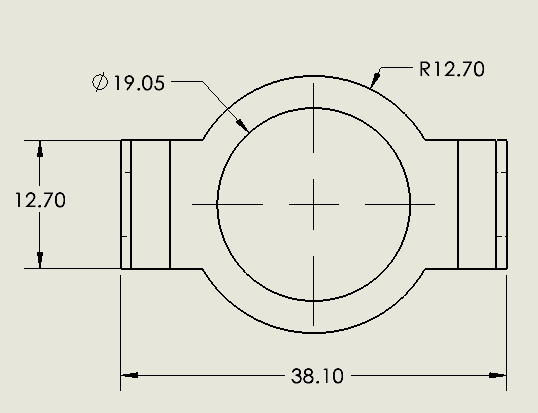
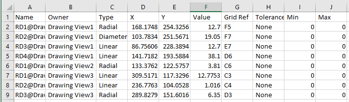

这个VBA宏允许将活动图纸中的所有尺寸信息导出到可以用Excel打开的CSV文件中。

宏将以下信息包含在报告中：

* 名称 - 尺寸的完整名称
* 所有者 - 尺寸所属的图纸视图或图纸页的名称
* 类型 - 尺寸的类型（如线性、角度、坐标等）
* X - 尺寸在当前图纸单位中的X位置
* Y - 尺寸在当前图纸单位中的Y位置
* 值 - 尺寸在当前单位中的值
* 网格参考 - 尺寸在图纸网格中的参考（如A5）
* 公差 - 分配给尺寸的公差类型（如基本、对称等）
* 最小值 - 公差的最小值（当前单位）
* 最大值 - 公差的最大值（当前单位）

{ width=600 }

输出文件保存在与原始图纸相同的文件夹中，命名为*[图纸名称]-dimensions.csv*

``` vb
Dim swApp As SldWorks.SldWorks

Sub main()

    Set swApp = Application.SldWorks
    
try_:
    On Error GoTo catch_:
    
    Dim swDraw As SldWorks.DrawingDoc
    
    Set swDraw = swApp.ActiveDoc
    
    If swDraw Is Nothing Then
        Err.Raise vbError, "", "请打开图纸"
    End If
    
    ExportDrawingDimensions swDraw
    
    GoTo finally_

catch_:
    swApp.SendMsgToUser2 Err.Description, swMessageBoxIcon_e.swMbStop, swMessageBoxBtn_e.swMbOk
finally_:

End Sub

Sub ExportDrawingDimensions(draw As SldWorks.DrawingDoc)
    
    Dim vSheets As Variant
    vSheets = draw.GetViews

    Dim fileNmb As Integer
    fileNmb = FreeFile
    
    Dim filePath As String
    filePath = draw.GetPathName
    
    If filePath = "" Then
        Err.Raise vbError, "", "请保存图纸文档"
    End If
    
    filePath = Left(filePath, InStrRev(filePath, ".") - 1) & "-dimensions.csv"
    
    Open filePath For Output As #fileNmb
    
    Dim header As String
    header = Join("名称", "所有者", "类型", "X", "Y", "值", "网格参考", "公差", "最小值", "最大值")

    Print #fileNmb, header
    
    Dim i As Integer
    
    For i = 0 To UBound(vSheets)
        
        Dim vViews As Variant
        vViews = vSheets(i)
        
        Dim j As Integer
        
        For j = 0 To UBound(vViews)
            
            Dim swView As SldWorks.view
            Set swView = vViews(j)
            
            ExportViewDimensions swView, draw, fileNmb
            
        Next
        
    Next

    Close #fileNmb
    
End Sub

Sub ExportViewDimensions(view As SldWorks.view, draw As SldWorks.DrawingDoc, fileNmb As Integer)
    
    Dim swDispDim As SldWorks.DisplayDimension
    Set swDispDim = view.GetFirstDisplayDimension5
    
    Dim swSheet As SldWorks.Sheet
    
    Set swSheet = view.Sheet
    
    If swSheet Is Nothing Then
        Set swSheet = draw.Sheet(view.name)
    End If
    
    While Not swDispDim Is Nothing
        
        Dim swAnn As SldWorks.Annotation
        Set swAnn = swDispDim.GetAnnotation
        
        Dim vPos As Variant
        vPos = swAnn.GetPosition()
        
        Dim swDim As SldWorks.dimension
        Set swDim = swDispDim.GetDimension2(0)
                
        Dim drwZone As String
        drwZone = swSheet.GetDrawingZone(vPos(0), vPos(1))
        vPos = GetPositionInDrawingUnits(vPos, draw)
        
        Dim tolType As String
        Dim minVal As Double
        Dim maxVal As Double
        
        GetDimensionTolerance draw, swDim, tolType, minVal, maxVal
        
        OutputDimensionData fileNmb, swDim.FullName, view.name, GetDimensionType(swDispDim), CDbl(vPos(0)), CDbl(vPos(1)), _
                CDbl(swDim.GetValue3(swInConfigurationOpts_e.swThisConfiguration, Empty)(0)), _
                drwZone, tolType, minVal, maxVal
        
        Set swDispDim = swDispDim.GetNext5
        
    Wend
    
End Sub

Function GetPositionInDrawingUnits(pos As Variant, draw As SldWorks.DrawingDoc) As Variant
    
    Dim dPt(1) As Double
    dPt(0) = ConvertToUserUnits(draw, CDbl(pos(0)), swLengthUnit)
    dPt(1) = ConvertToUserUnits(draw, CDbl(pos(1)), swLengthUnit)
    
    GetPositionInDrawingUnits = dPt
    
End Function

Function ConvertToUserUnits(model As SldWorks.ModelDoc2, val As Double, unitType As swUserUnitsType_e) As Double
    
    Dim swUserUnit As SldWorks.UserUnit
    Set swUserUnit = model.GetUserUnit(unitType)
    
    Dim convFactor As Double
    convFactor = swUserUnit.GetConversionFactor()
    
    ConvertToUserUnits = val * convFactor
    
End Function


Function GetDimensionType(dispDim As SldWorks.DisplayDimension) As String

    Select Case dispDim.Type2
        Case swDimensionType_e.swAngularDimension
            GetDimensionType = "角度"
        Case swDimensionType_e.swArcLengthDimension
            GetDimensionType = "弧长"
        Case swDimensionType_e.swChamferDimension
            GetDimensionType = "倒角"
        Case swDimensionType_e.swDiameterDimension
            GetDimensionType = "直径"
        Case swDimensionType_e.swDimensionTypeUnknown
            GetDimensionType = "未知"
        Case swDimensionType_e.swHorLinearDimension
            GetDimensionType = "水平线性"
        Case swDimensionType_e.swHorOrdinateDimension
            GetDimensionType = "水平坐标"
        Case swDimensionType_e.swLinearDimension
            GetDimensionType = "线性"
        Case swDimensionType_e.swOrdinateDimension
            GetDimensionType = "坐标"
        Case swDimensionType_e.swRadialDimension
            GetDimensionType = "半径"
        Case swDimensionType_e.swScalarDimension
            GetDimensionType = "标量"
        Case swDimensionType_e.swVertLinearDimension
            GetDimensionType = "垂直线性"
        Case swDimensionType_e.swVertOrdinateDimension
            GetDimensionType = "垂直坐标"
        Case swDimensionType_e.swZAxisDimension
            GetDimensionType = "Z轴"
    End Select
    
End Function

Sub GetDimensionTolerance(draw As SldWorks.DrawingDoc, swDim As SldWorks.dimension, ByRef tolType As String, ByRef minVal As Double, ByRef maxVal As Double)

    Dim swTol As SldWorks.DimensionTolerance
    Set swTol = swDim.Tolerance
    
    Select Case swTol.Type
        Case swTolType_e.swTolBASIC
            tolType = "基本"
        Case swTolType_e.swTolBILAT
            tolType = "双向"
        Case swTolType_e.swTolBLOCK
            tolType = "块"
        Case swTolType_e.swTolFIT
            tolType = "配合"
        Case swTolType_e.swTolFITTOLONLY
            tolType = "仅公差"
        Case swTolType_e.swTolFITWITHTOL
            tolType = "配合及公差"
        Case swTolType_e.swTolGeneral
            tolType = "通用"
        Case swTolType_e.swTolLIMIT
            tolType = "极限"
        Case swTolType_e.swTolMAX
            tolType = "最大"
        Case swTolType_e.swTolMETRIC
            tolType = "公制"
        Case swTolType_e.swTolMIN
            tolType = "最小"
        Case swTolType_e.swTolNONE
            tolType = "无"
        Case swTolType_e.swTolSYMMETRIC
            tolType = "对称"
    End Select

    swTol.GetMinValue2 minVal
    swTol.GetMaxValue2 maxVal
    
    Dim unitType As swUserUnitsType_e
    
    If swDim.GetType() = swDimensionParamType_e.swDimensionParamTypeDoubleAngular Then
        unitType = swUserUnitsType_e.swAngleUnit
    Else
        unitType = swUserUnitsType_e.swLengthUnit
    End If
    
    minVal = ConvertToUserUnits(draw, minVal, unitType)
    maxVal = ConvertToUserUnits(draw, maxVal, unitType)
    
End Sub

Sub OutputDimensionData(fileNmb As Integer, dimName As String, owner As String, dimType As String, x As Double, y As Double, value As Double, gridRef As String, tol As String, min As Double, max As Double)
    
    Dim line As String
    line = Join(dimName, owner, dimType, x, y, value, gridRef, tol, min, max)

    Print #fileNmb, line
    
End Sub

Function Join(ParamArray parts() As Variant) As String
    
    Dim res As String
    
    If Not IsEmpty(parts) Then
        Dim i As Integer
        For i = 0 To UBound(parts)
            res = res & IIf(i = 0, "", ", ") & parts(i)
        Next
    End If
    
    Join = res
    
End Function
```