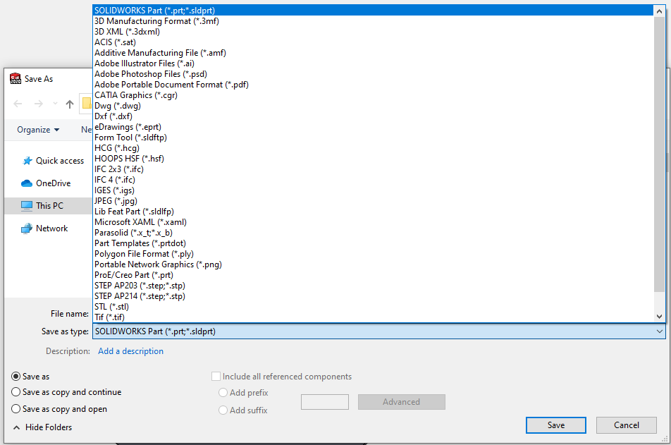

{ width=500 }

此VBA宏允许将活动的SOLIDWORKS文档导出为SOLIDWORKS支持的多种格式。宏支持灵活的选项来指定文件路径，并允许同时导出多种格式。

如果目录不存在，宏将自动创建目录。

## 配置

可以通过修改**OUT_NAME_TEMPLATES**、**OUT_FOLDER**和**ALL_CONFIGS**常量来配置宏

### 输出名称模板

此常量允许指定导出文件的输出路径模板。它应包含定义导出格式的扩展名。

这可以是绝对路径或相对路径。如果是后者，则结果将相对于文件目录保存，或者如果**OUT_FOLDER**常量不为空，则相对于指定的目录保存。

> **OUT_FOLDER**可以作为[宏的参数](https://cadplus.xarial.com/macro-arguments/)传递

支持以下占位符

* <\_FileName\_> - 文档文件的名称（不包括扩展名）
* <\_ConfName\_> - 此文件的活动配置的名称。如果将**ALL_CONFIGS**选项设置为**True**，则会更改此配置
* <[PropertyName]> - 任何自定义属性的名称，例如\<PartNo\>将替换为自定义属性*PartNo*的值。属性将尝试从配置中读取，如果不可用，则使用通用属性。

占位符将在运行时解析。

通过在宏的开头使用**Array**函数填充常量来配置值。根据需要指定尽可能多的数组元素。

以下示例将活动文档导出为PDF、DXF和JPG，并将输出文件命名为**PartNo**自定义属性。文件将保存在与原始文件相同的文件夹中。

~~~ vb
Sub main()
        
    OUT_NAME_TEMPLATES = Array("<PartNo>.pdf", "<PartNo>.dxf", "<PartNo>.jpg")
~~~

以下示例将活动文件导出为Parasolid格式到**D:\Exports**文件夹。文件以原始文件的名称命名。

~~~ vb
Sub main()
        
    OUT_NAME_TEMPLATES = Array("D:\Exports\<_FileName_>.x_t")
~~~

### 导出选项

可以通过更改**STEP_VERSION**常量的值来配置STEP格式的导出选项。将其设置为**214**以使用**AP214**格式，或将其设置为**203**以使用**AP203**格式。

~~~ vb
Const STEP_VERSION As Long = 214 '203或214
~~~

要导出3D PDF，请将**PDF_3D**常量设置为**True**

~~~ vb
Const PDF_3D As Boolean = True
~~~

### 将组件数量包含到文件名中

如果对装配体的所有组件运行此宏，则可能需要将BOM数量包含到文件名中。使用[将SOLIDWORKS装配体中的组件数量写入自定义属性](/docs/codestack/solidworks-api/document/assembly/components/write-quantities/)宏。在导出之前，对装配体运行此宏以创建具有数量值的自定义属性，然后使用**\<Qty\>**占位符将其包含到输出文件名中。

### 处理所有配置

如果将**ALL_CONFIGS**常量设置为**True**，宏将逐个激活所有配置（对于装配体和零件）或所有工作表（对于绘图）并运行导出命令。

## 故障排除

如果宏报告错误，在某些情况下，可能不会立即明确导致错误的原因，因为错误详细信息被异常处理程序“吞噬”了。为了禁用错误处理并显示导致错误的确切行，请在代码中的所有*On Error GoTo catch_*行之前放置撇号'符号，如下所示。

~~~ vb jagged
Sub main()
        
    Set swApp = Application.SldWorks
    
try_:
    'On Error GoTo catch_
~~~

请提交[错误报告](https://github.com/xarial/codestack/issues/new?labels=bug)，并附上此错误的快照和用于重现的模型（如果可能）

~~~ vb
Const ALL_CONFIGS As Boolean = False
Const OUT_FOLDER As String = ""
Const STEP_VERSION As Long = 214 '203或214
Const PDF_3D As Boolean = False '将3D PDF导出为True

Dim OUT_NAME_TEMPLATES As Variant

Dim swApp As SldWorks.SldWorks

Sub main()
        
    Dim origStepVersion As Long
        
    OUT_NAME_TEMPLATES = Array("PDFs\<_FileName_>_<_ConfName_>_<PartNo>.pdf", "IMGs\<_FileName_>_<_ConfName_>_<PartNo>.jpg")
    
    Set swApp = Application.SldWorks
    
try_:
    On Error GoTo catch_
    
    Dim swModel As SldWorks.ModelDoc2
    Set swModel = swApp.ActiveDoc
    
    If swModel Is Nothing Then
        Err.Raise vbError, "", "请打开文档"
    End If
    
    If swModel.GetPathName() = "" Then
        Err.Raise vbError, "", "请保存模型"
    End If
    
    Dim outFolder As String
    
    If Not TryGetOutDirFromArguments(outFolder) Then
        outFolder = OUT_FOLDER
    End If
    
    ReadOptions origStepVersion
    SetupOptions STEP_VERSION
    
    ExportFile swModel, OUT_NAME_TEMPLATES, ALL_CONFIGS, outFolder
    
    GoTo finally_
    
catch_:
    swApp.SendMsgToUser2 Err.Description, swMessageBoxIcon_e.swMbStop, swMessageBoxBtn_e.swMbOk
finally_:

    SetupOptions origStepVersion

End Sub

Sub ReadOptions(ByRef stepVersion As Long)

    stepVersion = swApp.GetUserPreferenceIntegerValue(swUserPreferenceIntegerValue_e.swStepAP)
    
End Sub

Sub SetupOptions(stepVersion As Long)
    
    If False = swApp.SetUserPreferenceIntegerValue(swUserPreferenceIntegerValue_e.swStepAP, stepVersion) Then
        Err.Raise vbError, "", "无法将Step导出版本设置为" & stepVersion
    End If
    
End Sub

Sub ExportFile(model As SldWorks.ModelDoc2, vOutNameTemplates As Variant, allConfigs As Boolean, outFolder As String)
    
    Dim i As Integer
    Dim j As Integer
    
    Dim curConf As String
    
    If model.GetType() = swDocumentTypes_e.swDocDRAWING Then
        Dim swDraw As SldWorks.DrawingDoc
        Set swDraw = model
        curConf = swDraw.GetCurrentSheet().GetName
    Else
        curConf = model.ConfigurationManager.ActiveConfiguration.Name
    End If
    
    Dim vConfs As Variant
    
    If allConfigs Then
        If model.GetType() = swDocumentTypes_e.swDocDRAWING Then
            vConfs = model.GetSheetNames()
        Else
            vConfs = model.GetConfigurationNames()
        End If
    Else
        Dim sConfs(0) As String
        sConfs(0) = curConf
        vConfs = sConfs
    End If
    
    For i = 0 To UBound(vConfs)
    
        If model.GetType() = swDocumentTypes_e.swDocDRAWING Then
            curConf = swDraw.ActivateSheet(CStr(vConfs(i)))
        Else
            model.ShowConfiguration2 CStr(vConfs(i))
        End If
                
        For j = 0 To UBound(vOutNameTemplates)
            
            Dim errs As Long
            Dim warns As Long
        
            Dim outNameTemplate As String
            outNameTemplate = vOutNameTemplates(j)
            
            Dim outFilePath As String
            outFilePath = ComposeOutFileName(outNameTemplate, model, outFolder)

            Dim outDir As String
            outDir = Left(outFilePath, InStrRev(outFilePath, "\"))
    
            CreateDirectories outDir
            
            Dim swExportData As Object
            
            If LCase(GetExtension(outFilePath)) = LCase("pdf") Then
                Dim swExportPdfData As SldWorks.ExportPdfData
                Set swExportPdfData = swApp.GetExportFileData(swExportDataFileType_e.swExportPdfData)
                swExportPdfData.ViewPdfAfterSaving = False
                swExportPdfData.ExportAs3D = PDF_3D
                Set swExportData = swExportPdfData
            Else
                Set swExportData = Nothing
            End If
            
            If False = model.Extension.SaveAs(outFilePath, swSaveAsVersion_e.swSaveAsCurrentVersion, swSaveAsOptions_e.swSaveAsOptions_Silent, swExportData, errs, warns) Then
                Err.Raise vberrror, "", "导出到" & outFilePath & "失败"
            End If
            
        Next
        
    Next
    
    If model.GetType() = swDocumentTypes_e.swDocDRAWING Then
        curConf = swDraw.ActivateSheet(curConf)
    Else
        model.ShowConfiguration2 curConf
    End If
    
End Sub

Function ComposeOutFileName(template As String, model As SldWorks.ModelDoc2, outFolder As String) As String

    Dim regEx As Object
    Set regEx = CreateObject("VBScript.RegExp")
    
    regEx.Global = True
    regEx.IgnoreCase = True
    regEx.Pattern = "<[^>]*>"
    
    Dim regExMatches As Object
    Set regExMatches = regEx.Execute(template)
    
    Dim i As Integer
    
    Dim outFileName As String
    outFileName = template
    
    For i = regExMatches.Count - 1 To 0 Step -1
        
        Dim regExMatch As Object
        Set regExMatch = regExMatches.Item(i)
                    
        Dim tokenName As String
        tokenName = Mid(regExMatch.Value, 2, Len(regExMatch.Value) - 2)
        
        outFileName = Left(outFileName, regExMatch.FirstIndex) & ResolveToken(tokenName, model) & Right(outFileName, Len(outFileName) - (regExMatch.FirstIndex + regExMatch.Length))
    Next
    
    ComposeOutFileName = ReplaceInvalidPathSymbols(GetFullPath(model, outFileName, outFolder))
    
End Function

Function ReplaceInvalidPathSymbols(path As String) As String
    
    Const REPLACE_SYMB As String = "_"
    
    Dim res As String
    res = Right(path, Len(path) - Len("X:\"))
    
    Dim drive As String
    drive = Left(path, Len("X:\"))
    
    Dim invalidSymbols As Variant
    invalidSymbols = Array("/", ":", "*", "?", """", "<", ">", "|")
    
    Dim i As Integer
    For i = 0 To UBound(invalidSymbols)
        Dim invalidSymb As String
        invalidSymb = CStr(invalidSymbols(i))
        res = Replace(res, invalidSymb, REPLACE_SYMB)
    Next
    
    ReplaceInvalidPathSymbols = drive + res
    
End Function

Function ResolveToken(token As String, model As SldWorks.ModelDoc2) As String
    
    Const FILE_NAME_TOKEN As String = "_FileName_"
    Const CONF_NAME_TOKEN As String = "_ConfName_"
    
    Select Case LCase(token)
        Case LCase(FILE_NAME_TOKEN)
            ResolveToken = GetFileNameWithoutExtension(model.GetPathName)
        Case LCase(CONF_NAME_TOKEN)
            If model.GetType() = swDocumentTypes_e.swDocDRAWING Then
                Dim swDraw As SldWorks.DrawingDoc
                Set swDraw = model
                ResolveToken = swDraw.GetCurrentSheet().GetName
            Else
                ResolveToken = model.ConfigurationManager.ActiveConfiguration.Name
            End If
        Case Else
            
            Dim swCustPrpMgr As SldWorks.CustomPropertyManager
            Dim resVal As String
            resVal = ""
            
            If model.GetType() <> swDocumentTypes_e.swDocDRAWING Then
                Set swCustPrpMgr = model.Extension.CustomPropertyManager(model.ConfigurationManager.ActiveConfiguration.Name)
                swCustPrpMgr.Get2 token, "", resVal
            End If
            
            If resVal = "" Then
                Set swCustPrpMgr = model.Extension.CustomPropertyManager("")
                swCustPrpMgr.Get2 token, "", resVal
            End If
            
            ResolveToken = resVal
    End Select
    
End Function

Function GetFileNameWithoutExtension(path As String) As String
    GetFileNameWithoutExtension = Mid(path, InStrRev(path, "\") + 1, InStrRev(path, ".") - InStrRev(path, "\") - 1)
End Function

Function GetExtension(path As String) As String
    GetExtension = Right(path, Len(path) - InStrRev(path, "."))
End Function

Function FileExists(filePath As String) As Boolean
    FileExists = Dir(filePath) <> ""
End Function

Sub CreateDirectories(path As String)

    Dim fso As Object
    Set fso = CreateObject("Scripting.FileSystemObject")

    If fso.FolderExists(path) Then
        Exit Sub
    End If

    CreateDirectories fso.GetParentFolderName(path)
    
    fso.CreateFolder path
    
End Sub

Function GetFullPath(model As SldWorks.ModelDoc2, path As String, outFolder As String)
    
    GetFullPath = path
        
    If IsPathRelative(path) Then
        
        If Left(path, 1) <> "\" Then
            path = "\" & path
        End If
        
        If outFolder = "" Then
        
            Dim modelPath As String
            Dim modelDir As String
            
            modelPath = model.GetPathName
            
            modelDir = Left(modelPath, InStrRev(modelPath, "\") - 1)
            
            outFolder = modelDir
        Else
            If Right(outFolder, 1) = "\" Then
                outFolder = Left(outFolder, Len(outFolder) - 1)
            End If
        End If
        
        GetFullPath = outFolder & path
        
    End If
    
End Function

Function IsPathRelative(path As String)
    IsPathRelative = Mid(path, 2, 1) <> ":" And Not IsPathUnc(path)
End Function

Function IsPathUnc(path As String)
    IsPathUnc = Left(path, 2) = "\\"
End Function

Function TryGetOutDirFromArguments(ByRef outDir As String) As Boolean

try_:

    On Error GoTo catch_

    Dim macroRunner As Object
    Set macroRunner = CreateObject("CadPlus.MacroRunner.Sw")
    
    Dim param As Object
    Set param = macroRunner.PopParameter(swApp)
    
    Dim vArgs As Variant
    vArgs = param.Get("Args")
    
    outDir = CStr(vArgs(0))
    TryGetOutDirFromArguments = True
    GoTo finally_
    
catch_:
    TryGetOutDirFromArguments = False
finally_:

End Function
~~~