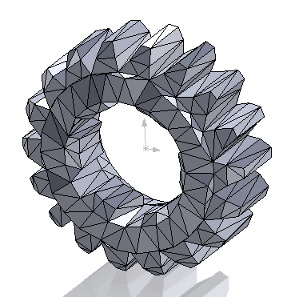

{ width=250 }

This C# VSTA macro exports active part or selected component in assembly to STL format using SOLIDWORKS API. Macro will also work with the components loaded lightweight.

This macro is not using the default exporter and overcomes the limitation when the model needs to be loaded in its own window, i.e. [IModelDocExtension::SaveAs](https://help.solidworks.com/2017/english/api/sldworksapi/solidworks.interop.sldworks~solidworks.interop.sldworks.imodeldocextension~saveas.html) SOLIDWORKS API function is not used. Macro will create stl from the tessellation triangles of the model.

Macro can optionally apply the transform to rotate or move the STL file. It is not required to create a coordinate system for this to happen.

For more information about the STL specification follow [this link](https://en.wikipedia.org/wiki/STL_(file_format)).

## Configuring the orientation

In order to configure the orientation of the output file it is required to change the values of 4x4 orientation matrix defined in the *m_Transform* at the beginning of the macro.

Use the [Get Coordinate System Transform](/docs/codestack/solidworks-api/geometry/transformation/get-coordinate-system-transform/) macro to retrieve the transformation from any selected coordinate system.

For example to set the 90 degrees rotation around X axis in clockwise direction it is required to change the values of the *m_Transform* array to the ones below:

~~~ cs
private double[] m_Transform = new double[]
{
    1,-0,0,0,
    0,-1,0,1,
    0,0,0,0,
    1,0,0,0
};
~~~

## Running instructions

* Open part

or

* Open assembly (can be opened lightweight)
* Select part component
* Browse the location of the output STL file
* File is exported

~~~ cs
using SolidWorks.Interop.sldworks;
using SolidWorks.Interop.swconst;
using System.Runtime.InteropServices;
using System;
using System.Collections.Generic;
using System.Diagnostics;
using System.IO;
using System.Text;
using System.Windows.Forms;

namespace ExportToStl.csproj
{
    public partial class SolidWorksMacro
    {
        private double[] m_Transform = new double[]
        {
            1, 0, 0, 0,
            1, 0, 0, 0,
            1, 0, 0, 0,
            1, 0, 0, 0
        };

        public void Main()
        {
            try
            {
                IModelDoc2 model = swApp.IActiveDoc2;

                if (model != null)
                {
                    string fileNameBase = "";

                    float[] tessTriangs;
                    float[] tessNorms;

                    if (model is IPartDoc)
                    {
                        fileNameBase = model.GetTitle();
                        GetTesselationDataFromPart(model as IPartDoc, out tessTriangs, out tessNorms);
                    }
                    else if (model is IAssemblyDoc)
                    {
                        IComponent2 comp = model.ISelectionManager.GetSelectedObjectsComponent3(1, -1) as IComponent2;

                        if (comp != null)
                        {
                            GetTesselationData(comp, out tessTriangs, out tessNorms);

                            fileNameBase = comp.GetPathName();
                        }
                        else
                        {
                            throw new NullReferenceException("Please select component");
                        }
                    }
                    else 
                    {
                        throw new NotSupportedException("Document type is not support, parts or assembly components are supported");
                    }

                    string filePath = BrowseFile(Path.GetFileNameWithoutExtension(fileNameBase));

                    if (!string.IsNullOrEmpty(filePath))
                    {
                        ExportToStl(filePath, tessTriangs, tessNorms, m_Transform);
                    }

                }
                else
                {
                    throw new NullReferenceException("Please open part or assembly");
                }
            }
            catch (Exception ex)
            {
                swApp.SendMsgToUser2(ex.Message, (int)swMessageBoxIcon_e.swMbStop, (int)swMessageBoxBtn_e.swMbOk);
            }
        }

        private void GetTesselationData(IComponent2 comp, out float[] tessTriangs, out float[] tessNorms)
        {
            IModelDoc2 compModel = comp.IGetModelDoc();

            if (compModel == null)
            {
                if (Path.GetExtension(comp.GetPathName()).Equals(".sldprt", StringComparison.CurrentCultureIgnoreCase))
                {
                    tessTriangs = comp.GetTessTriangles(true) as float[];
                    tessNorms = comp.GetTessNorms() as float[];
                }
                else
                {
                    throw new NotSupportedException("Only parts are supported");
                }
            }
            else
            {
                if (compModel is IPartDoc)
                {
                    GetTesselationDataFromPart(compModel as IPartDoc, out tessTriangs, out tessNorms);
                }
                else
                {
                    throw new NotSupportedException("Only parts are supported");
                }
            }
        }

        private void GetTesselationDataFromPart(IPartDoc part, out float[] tessTriangs, out float[] tessNorms) 
        {
            tessTriangs = part.GetTessTriangles(true) as float[];
            tessNorms = part.GetTessNorms() as float[];
        }

        private void ExportToStl(string filePath, float[] tessTriangs, float[] tessNorms, double[] transformMatrix)
        {
            IMathUtility mathUtils = swApp.IGetMathUtility();
            IMathTransform transform = (mathUtils.CreateTransform(transformMatrix) as IMathTransform).IInverse();

            using (FileStream fileStream = File.Create(filePath))
            {
                using (BinaryWriter writer = new BinaryWriter(fileStream))
                {
                    byte[] header = new byte[80];

                    writer.Write(header);

                    uint triangsCount = (uint)tessTriangs.Length / 9;
                    writer.Write(triangsCount);

                    for (uint i = 0; i < triangsCount; i++)
                    {
                        float normalX = tessNorms[i * 9];
                        float normalY = tessNorms[i * 9 + 1];
                        float normalZ = tessNorms[i * 9 + 2];

                        IMathVector mathVec = mathUtils.CreateVector(
                            new double[] { normalX, normalY, normalZ }) as IMathVector;

                        mathVec = mathVec.MultiplyTransform(transform) as IMathVector;

                        double[] vec = mathVec.ArrayData as double[];

                        writer.Write((float)vec[0]);
                        writer.Write((float)vec[1]);
                        writer.Write((float)vec[2]);

                        for (uint j = 0; j < 3; j++)
                        {
                            float vertX = tessTriangs[i * 9 + j * 3];
                            float vertY = tessTriangs[i * 9 + j * 3 + 1];
                            float vertZ = tessTriangs[i * 9 + j * 3 + 2];

                            IMathPoint mathPt = mathUtils.CreatePoint(
                                new double[] { vertX, vertY, vertZ }) as IMathPoint;

                            mathPt = mathPt.MultiplyTransform(transform) as IMathPoint;

                            double[] pt = mathPt.ArrayData as double[];

                            writer.Write((float)pt[0]);
                            writer.Write((float)pt[1]);
                            writer.Write((float)pt[2]);
                        }

                        ushort atts = 0;
                        writer.Write(atts);
                    }
                }
            }
        }

        private string BrowseFile(string defName)
        {
            SaveFileDialog dlg = new SaveFileDialog();
            dlg.Filter = "STL Files (*.stl)|*.stl";
            dlg.FileName = defName + ".stl";

            if (dlg.ShowDialog() == DialogResult.OK)
            {
                return dlg.FileName;
            }
            else
            {
                return "";
            }
        }

        public SldWorks swApp;
    }
}
~~~

