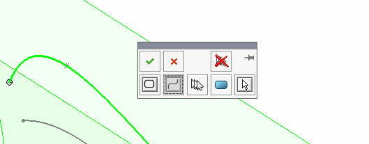

 该示例演示了如何使用SOLIDWORKS API通过轮廓作为剖面创建曲面放样特征。
image: lofted-surface-sketch-contours.png
labels: [曲面, 放样, 轮廓]
---
{ width=500 }

该示例演示了如何使用SOLIDWORKS API通过轮廓作为剖面创建曲面放样特征。

曲面放样特征不接受剖面中的草图段作为实体。这意味着如果只需要使用草图中的几个段作为剖面（而不是整个草图），则无法通过选择草图段来创建特征。必须使用草图轮廓来代替。

草图段在用户界面中也不受支持。当选择段时，会显示以下选择管理器，允许选择开放或闭合环。

{ width=250 }

* 打开零件并选择用于剖面的草图段。支持任何类型的草图段（样条线、直线、弧等）。草图中可能有多个草图段，只能选择其中的几个作为剖面。草图段也可以位于不同的草图中。
* 宏将为每个草图段找到相应的草图轮廓。
* 宏将使用相应的草图轮廓创建曲面放样特征。

> 此宏不是用于在同一草图中查找草图段的最佳性能代码，因为它将对草图中的所有草图段进行完整遍历，以查找各个草图段的相应轮廓。可以修改宏以在一次遍历循环中查找多个草图轮廓，避免重复。

~~~ vb
Dim swApp As SldWorks.SldWorks

Sub main()

    Dim swModel As SldWorks.ModelDoc2
    Dim swSelMgr As SldWorks.SelectionMgr
    
    Set swApp = Application.SldWorks
    Set swModel = swApp.ActiveDoc

    Set swSelMgr = swModel.SelectionManager
    
    Dim swContours() As SldWorks.SketchContour
    ReDim swContours(swSelMgr.GetSelectedObjectCount2(-1) - 1)
    
    Dim i As Integer
    
    For i = 1 To swSelMgr.GetSelectedObjectCount2(-1)
        Dim swSkSeg As SldWorks.SketchSegment
        Set swSkSeg = swSelMgr.GetSelectedObject6(i, -1)
        Set swContours(i - 1) = GetSketchContour(swSkSeg)
    Next
    
    swModel.ClearSelection2 True
    
    Dim swSelData As SldWorks.SelectData
        
    Set swSelData = swSelMgr.CreateSelectData
    
    swSelData.Mark = 1
        
    For i = 0 To UBound(swContours)
        Dim swSkContour As SldWorks.SketchContour
        Set swSkContour = swContours(i)
        swSkContour.Select2 True, swSelData
    Next
    
    swModel.InsertLoftRefSurface2 False, True, False, 1, 0, 0

End Sub

Function GetSketchContour(sketchSeg As SldWorks.SketchSegment) As SldWorks.SketchContour
    
    Dim swSketch As SldWorks.Sketch
    Set swSketch = sketchSeg.GetSketch
    
    Dim vSketchContours As Variant
    
    vSketchContours = swSketch.GetSketchContours
    
    If Not IsEmpty(vSketchContours) Then
        
        Dim i As Integer
        
        For i = 0 To UBound(vSketchContours)
            
            Dim swSkContour As SldWorks.SketchContour
            Set swSkContour = vSketchContours(i)
            
            Dim vSegs As Variant
            vSegs = swSkContour.GetSketchSegments()
            
            If Not IsEmpty(vSegs) Then
                
                Dim j As Integer
                
                Dim swCurSkSeg As SldWorks.SketchSegment
                Set swCurSkSeg = vSegs(j)
                
                If swApp.IsSame(sketchSeg, swCurSkSeg) = swObjectEquality.swObjectSame Then
                    Set GetSketchContour = swSkContour
                    Exit Function
                End If
                
            End If
            
        Next
        
    End If
    
End Function
~~~