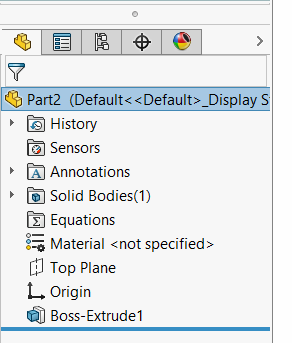

This VBA macro allows to make invisible selected features in the tree. The features still continue to be fully operational and visible in the graphics area (e.g. planes), but not visible in the feature manager tree.

Even default features (such as planes) can be made invisible.

To show the hidden features use the [Reveal Hidden Features](/docs/codestack/solidworks-api/document/features-manager/reveal-hidden-features/) macro.

~~~ vb
Dim swApp As SldWorks.SldWorks

Sub main()

    Set swApp = Application.SldWorks
    
    Dim swModel As SldWorks.ModelDoc2
    
    Set swModel = swApp.ActiveDoc
    
    If Not swModel Is Nothing Then
        
        Dim swSelMgr As SldWorks.SelectionMgr
        Set swSelMgr = swModel.SelectionManager
        
        Dim i As Integer
        
        For i = 1 To swSelMgr.GetSelectedObjectCount2(-1)
            Dim swFeat As SldWorks.Feature
            Set swFeat = swSelMgr.GetSelectedObject6(i, -1)
            swFeat.SetUIState swUIStates_e.swIsHiddenInFeatureMgr, True
        Next
        
        swModel.EditRebuild3
    Else
        MsgBox "Please open the model"
    End If
    
End Sub
~~~

