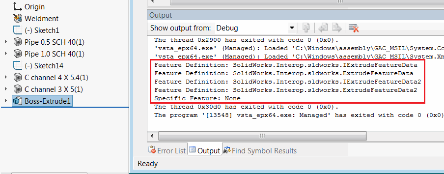

{ width=450 }

[IFeature::GetSpecificFeature2](https://help.solidworks.com/2012/english/api/sldworksapi/SolidWorks.Interop.sldworks~SolidWorks.Interop.sldworks.IFeature~GetSpecificFeature2.html) and [IFeature::GetDefinition](https://help.solidworks.com/2012/english/api/sldworksapi/solidworks.interop.sldworks~solidworks.interop.sldworks.ifeature~getdefinition.html) SOLIDWORKS API methods return dispatch pointers which in some cases are not easy to identify and cast to specific types.

The following code example allows to output all assignable interfaces for the selected feature's definition and specific feature. The result is output to the *Output* window of VSTA editor.

~~~ cs
using SolidWorks.Interop.sldworks;
using SolidWorks.Interop.swconst;
using System.Runtime.InteropServices;
using System;
using System.Collections.Generic;
using System.Diagnostics;

namespace CodeStack.csproj
{
    public partial class SolidWorksMacro
    {
        public void Main()
        {
            IFeature feat = swApp.IActiveDoc2.ISelectionManager.GetSelectedObject6(1, -1) as IFeature;

            PrintFeatureTypes(feat);
        }

        private void PrintFeatureTypes(IFeature feat) 
        {
            object featDef = feat.GetDefinition();

            if (featDef != null)
            {
                foreach (Type defType in FindSpecificInterfacesFromDispatch(featDef))
                {
                    Debug.Print("Feature Definition: " + defType.FullName);
                }
            }
            else
            {
                Debug.Print("Feature Definition: None");
            }

            object featSpec = feat.GetSpecificFeature2();

            if (featSpec != null)
            {
                foreach (Type specType in FindSpecificInterfacesFromDispatch(featSpec))
                {
                    Debug.Print("Specific Feature: " + specType.FullName);
                }
            }
            else
            {
                Debug.Print("Specific Feature: None");
            }
        }

        private IEnumerable<Type> FindSpecificInterfacesFromDispatch(object disp) 
        {
            if (disp == null) 
            {
                throw new ArgumentNullException("disp");
            }

            Type[] types = typeof(ISldWorks).Assembly.GetTypes();

            foreach (Type type in types) 
            {
                if (type.IsInstanceOfType(disp)) 
                {
                    yield return type;
                }
            }
        }

        public SldWorks swApp;
    }
}
~~~

