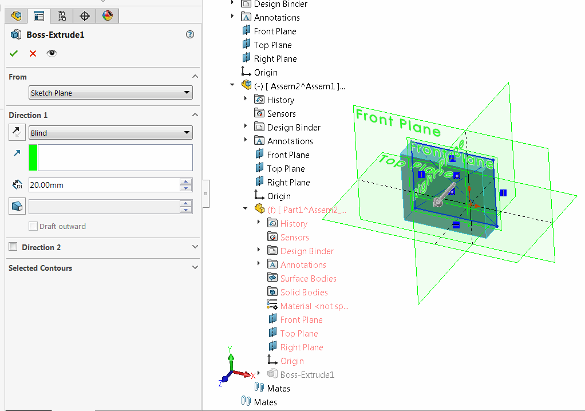

{ width=450 }

该示例演示了如何使用SOLIDWORKS API在装配上下文中修改特征定义。

宏中执行的步骤相当于在SOLIDWORKS用户界面中执行以下步骤：

* 选择包含挤压特征的零件的组件
* 在组件的上下文菜单中选择“编辑零件”菜单
* 选择挤压特征并从上下文菜单中选择“编辑”命令
* 修改挤压的正向方向的值
* 单击绿色勾号
* 退出编辑零件模式

在装配中编辑特征时，重要的是要遵循正确的[装配上下文](/docs/codestack/solidworks-api/document/assembly/context/)。

* 下面的示例实现为VSTA3宏
* 在装配中选择零件的组件
* 将挤压特征的名称指定为*EXTRUDE_FEAT_NAME*变量的值
~~~ cs
const string EXTRUDE_FEAT_NAME = "Boss-Extrude1";
~~~
* 运行宏。结果是将挤压的值更改为*EXTRUDE_DEPTH*变量的值（以米为单位）
~~~ cs
const double EXTRUDE_DEPTH = 0.02;
~~~

~~~ cs
using System;
using SolidWorks.Interop.sldworks;
using SolidWorks.Interop.swconst;

namespace ModifyFeatureInContextOfAssembly
{
    public partial class SolidWorksMacro
    {
        public void Main()
        {
            const string EXTRUDE_FEAT_NAME = "Boss-Extrude1";
            const double EXTRUDE_DEPTH = 0.02;
			
            try
            {
                SetExtrudeDepth(swApp.IActiveDoc2 as IAssemblyDoc,
                    swApp.IActiveDoc2.ISelectionManager.GetSelectedObjectsComponent3(1, -1) as IComponent2,
                    EXTRUDE_FEAT_NAME, EXTRUDE_DEPTH);
            }
            catch(Exception ex)
            {
                swApp.SendMsgToUser2(ex.Message, (int)swMessageBoxIcon_e.swMbStop, (int)swMessageBoxBtn_e.swMbOk);
            }

            return;
        }

        private void SetExtrudeDepth(IAssemblyDoc assy, IComponent2 comp, string extrudeFeatName, double depth)
        {
            if (comp != null)
            {
                if (comp.GetSuppression() == (int)swComponentSuppressionState_e.swComponentLightweight ||
                    comp.GetSuppression() == (int)swComponentSuppressionState_e.swComponentFullyLightweight)
                {
                    if (comp.SetSuppression2((int)swComponentSuppressionState_e.swComponentResolved) != (int)swSuppressionError_e.swSuppressionChangeOk)
                    {
                        throw new InvalidOperationException("无法将组件状态设置为已解析");
                    }
                }
                else if (comp.GetSuppression() == (int)swComponentSuppressionState_e.swComponentSuppressed)
                {
                    throw new NotSupportedException("不支持抑制的组件");
                }

                var feat = comp.FeatureByName(extrudeFeatName);

                if (feat == null)
                {
                    throw new MissingMemberException("在组件中找不到特征");
                }

                if (comp.Select4(false, null, false))
                {
                    int info = -1;
                    if (assy.EditPart2(true, false, ref info) == (int)swEditPartCommandStatus_e.swEditPartSuccessful)
                    {
                        var featData = feat.GetDefinition() as IExtrudeFeatureData2;

                        if (featData != null)
                        {
                            if (featData.AccessSelections(assy, comp))
                            {
                                featData.SetDepth(true, depth);
                                if (feat.ModifyDefinition(featData, assy, comp))
                                {
                                    (assy as IModelDoc2).ClearSelection2(true);
                                    assy.EditAssembly();//退出编辑零件模式
                                }
                                else
                                {
                                    throw new Exception("无法将深度设置为特征");
                                }
                            }
                            else
                            {
                                throw new InvalidOperationException("无法访问特征");
                            }
                        }
                        else
                        {
                            throw new InvalidCastException("所选特征不是挤压特征");
                        }
                    }
                    else
                    {
                        throw new InvalidOperationException("无法编辑零件");
                    }
                }
                else
                {
                    throw new InvalidOperationException("无法选择组件");
                }
            }
            else
            {
                throw new Exception("选择组件");
            }
        }

        public SldWorks swApp;
    }
}
~~~