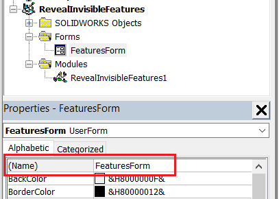

 该宏用于显示在SOLIDWORKS模型中特征管理器树中隐藏的所有特征，或者删除它们
image: hidden-feature.svg
labels: [defeature,parasolid]
group: Performance
---
{ width=250 }

这个VBA宏可以帮助显示在活动SOLIDWORKS模型中特征管理器树中隐藏的所有特征。

在SOLIDWORKS文件中，特征被隐藏的原因可能有很多。在某些情况下，这些特征是无效的或者是悬空的。这可能导致SOLIDWORKS的行为不可预测，包括性能问题或者不稳定，如崩溃或卡死。

* 创建一个新的宏，并将[模块代码](#macro-module)粘贴到宏中
* 在宏中添加一个新的[用户窗体](/docs/codestack/visual-basic/user-forms/)，并将其命名为*FeaturesForm*，然后粘贴[代码](#featuresform-user-form)。宏的结构应该类似于下面的图片

* 向窗体添加控件，并按照下面的图片命名。可以选择为控件指定更多的属性，如标题。

    * 名为*lstFeatures*的列表框
    * 名为*btnShow*的按钮
    * 名为*btnDelete*的按钮

运行宏后，所有隐藏的特征将显示在列表中。在列表中选择（或多选）特征，然后单击*Show*或*Delete*按钮，以显示或从模型中删除特征。

> !重要提示：使用删除选项时要自行承担风险。在某些情况下，隐藏的特征是由SOLIDWORKS或第三方应用程序创建的有效特征。例如，[属性](/docs/codestack/solidworks-api/data-storage/attributes/)可以被创建为隐藏特征，并且可能包含重要信息。删除它可能会产生意想不到的结果。

要隐藏特征，请使用[以下宏](/docs/codestack/solidworks-api/document/features-manager/hide-features/)。

## 宏模块

~~~ vb
Dim swApp As SldWorks.SldWorks

Sub main()

    Set swApp = Application.SldWorks
    
    Dim swModel As SldWorks.ModelDoc2
    
    Set swModel = swApp.ActiveDoc
    
    Dim swFeatsColl As Collection
    Set swFeatsColl = GetAllHiddenFeatures(swModel)
    
    If swFeatsColl.Count > 0 Then
        
        FeaturesForm.ShowFeatures swModel, swFeatsColl
        
    Else
        MsgBox "模型中没有隐藏的特征"
    End If
    
End Sub

Public Sub DeleteAllFeatures(model As SldWorks.ModelDoc2, feats As Variant)
    
    If Not IsEmpty(feats) Then
        ShowAllFeatures model, feats
        
        If model.Extension.MultiSelect2(feats, False, Nothing) <> UBound(feats) + 1 Then
            Err.Raise vbError, "", "选择要删除的特征失败"
        End If
        
        model.Extension.DeleteSelection2 swDeleteSelectionOptions_e.swDelete_Absorbed
    End If
    
End Sub

Public Sub ShowAllFeatures(model As SldWorks.ModelDoc2, feats As Variant)
    
    If Not IsEmpty(feats) Then
        Dim i As Integer
        
        For i = 0 To UBound(feats)
            Dim swFeat As SldWorks.Feature
            Set swFeat = feats(i)
            swFeat.SetUIState swUIStates_e.swIsHiddenInFeatureMgr, False
        Next
        
        model.ForceRebuild3 False
    End If
    
End Sub

Function GetAllHiddenFeatures(model As SldWorks.ModelDoc2) As Collection
    
    Dim swProcFeatsColl As Collection
    Set swProcFeatsColl = New Collection
    
    Dim swFeat As SldWorks.Feature
    Set swFeat = model.FirstFeature
    
    Dim isAfterOrigin As Boolean
    isAfterOrigin = False
    
    While Not swFeat Is Nothing
        
        If swFeat.GetTypeName2() <> "HistoryFolder" Then
            
            If isAfterOrigin Then
                AddFeatureIfRequired swProcFeatsColl, swFeat
            
                CollectAllSubFeatures swFeat, swProcFeatsColl
            End If
            
            If swFeat.GetTypeName2() = "OriginProfileFeature" Then
                isAfterOrigin = True
            End If
            
        End If
        
        Set swFeat = swFeat.GetNextFeature
        
    Wend
    
    Set GetAllHiddenFeatures = swProcFeatsColl
    
End Function

Sub CollectAllSubFeatures(parentFeat As SldWorks.Feature, procFeatsColl As Collection)
    
    Dim swSubFeat As SldWorks.Feature
    Set swSubFeat = parentFeat.GetFirstSubFeature
        
    While Not swSubFeat Is Nothing
        
        AddFeatureIfRequired procFeatsColl, swSubFeat
        
        CollectAllSubFeatures swSubFeat, procFeatsColl
        Set swSubFeat = swSubFeat.GetNextSubFeature
        
    Wend
    
End Sub

Sub AddFeatureIfRequired(featColl As Collection, feat As Feature)
    
    If False <> feat.GetUIState(swUIStates_e.swIsHiddenInFeatureMgr) Then
        If Not Contains(featColl, feat) Then
            featColl.Add feat
        End If
    End If
    
End Sub

Function Contains(coll As Collection, item As Object) As Boolean
    
    Dim i As Integer
    
    For i = 1 To coll.Count
        If coll.item(i) Is item Then
            Contains = True
            Exit Function
        End If
    Next
    
    Contains = False
    
End Function
~~~

## FeaturesForm 用户窗体

~~~ vb
Dim swModel As SldWorks.ModelDoc2
Dim swHiddenFeats As Collection

Private Sub UserForm_Initialize()
    Me.Caption = "隐藏特征"
    lstFeatures.MultiSelect = fmMultiSelectExtended
    lstFeatures.ColumnCount = 2
End Sub

Public Sub ShowFeatures(model As SldWorks.ModelDoc2, featsColl As Collection)
    
    Set swModel = model
    Set swHiddenFeats = featsColl
    
    Dim i As Integer
    
    For i = 1 To featsColl.Count
        Dim swFeat As SldWorks.Feature
        Set swFeat = featsColl.item(i)
        lstFeatures.AddItem swFeat.Name
        lstFeatures.List(i - 1, 1) = swFeat.GetTypeName2
    Next
    
    Show vbModeless
End Sub

Private Sub btnDelete_Click()
    DeleteAllFeatures swModel, CollectionToArray(ExtractSelected)
End Sub

Private Sub btnShow_Click()
    ShowAllFeatures swModel, CollectionToArray(ExtractSelected)
End Sub

Function ExtractSelected() As Collection
    
    Dim swSelFeats As Collection
    Set swSelFeats = New Collection
    
    Dim i As Integer
    
    For i = swHiddenFeats.Count To 1 Step -1
        If True = lstFeatures.Selected(i - 1) Then
            swSelFeats.Add swHiddenFeats(i)
            swHiddenFeats.Remove i
            lstFeatures.RemoveItem i - 1
        End If
    Next
    
    Set ExtractSelected = swSelFeats
    
End Function

Function CollectionToArray(coll As Collection) As Variant
    
    If coll.Count() > 0 Then
        
        Dim arr() As Object
        
        ReDim arr(coll.Count() - 1)
        Dim i As Integer
        
        For i = 1 To coll.Count
            Set arr(i - 1) = coll(i)
        Next
        
        CollectionToArray = arr
        
    Else
        CollectionToArray = Empty
    End If
    
End Function
~~~