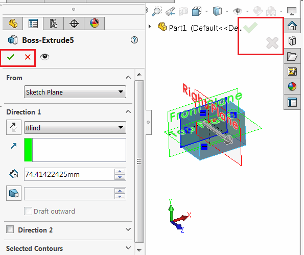

{ width=250 }

[SOLIDWORKS API方法ISldWorks::RunCommand](https://help.solidworks.com/2017/english/api/sldworksapi/solidworks.interop.sldworks~solidworks.interop.sldworks.isldworks~runcommand.html)允许运行任何命令。通常用于打开属性管理器页面。

然而，该命令是异步运行的，这意味着一旦命令开始（例如打开属性管理器页面），控制权就会返回给执行者。在某些情况下，需要在命令关闭后执行代码（例如关闭属性管理器页面）。

该示例演示了如何使用SOLIDWORKS API同步运行命令，以便在命令完成（而不是开始）后将控制权返回给执行者。

## 运行说明

* 打开/创建零件文档
* 创建任何带有矩形（或其他形状）的草图
* 选择草图
* 运行宏。结果将显示“Boss-Extrude”属性页面
* 修改选项并单击绿色勾号（确定）或叉号（取消）
* 当属性页面关闭时，宏将显示消息并显示结果（确定或取消）

### VBA宏

* 创建一个类模块并将其命名为*CommandRunManager*。复制以下代码：

```vb
Dim WithEvents swApp As SldWorks.SldWorks

Dim CurrentCommandId As Long
Dim IsCommandCompleted As Boolean
Dim CloseReason As Long

Private Sub Class_Initialize()
    
    Set swApp = Application.SldWorks
    
End Sub

Function RunCommand(cmd As swCommands_e) As Boolean
    
    IsCommandCompleted = False
    CurrentCommandId = cmd
    swApp.RunCommand cmd, ""
    
    While Not IsCommandCompleted
        DoEvents
    Wend
    
    RunCommand = CloseReason = swCommands_e.swCommands_PmOK
    
End Function

Private Function swApp_CommandCloseNotify(ByVal Command As Long, ByVal reason As Long) As Long
    
    If CurrentCommandId <> -1 Then
    
        If Command = CurrentCommandId Then
            CurrentCommandId = -1
            IsCommandCompleted = True
            CloseReason = reason
        End If
    
    End If
    
End Function
```

* 将以下代码复制到主模块（其中包含*main*函数）。根据需要修改*RunCommand*以传递任何其他命令ID。如果命令关闭时返回True，表示命令已使用确定按钮关闭；如果命令取消，则返回False。

```vb
Sub main()
    
    Dim cmdsMgr As CommandRunManager
    Set cmdsMgr = New CommandRunManager
    
    If cmdsMgr.RunCommand(swCommands_Extrude) Then
        MsgBox "命令已完成"
    Else
        MsgBox "命令已取消"
    End If
    
End Sub
```

### C&#35;

不建议在.NET语言（C#或VB.NET）中使用DoEvents函数来模拟异步操作。最好使用[使用async和await进行异步编程](https://docs.microsoft.com/en-us/dotnet/csharp/programming-guide/concepts/async/)。

下面的示例演示了RunCommand的异步版本的实现，可以在不锁定UI线程的情况下等待：

**SldWorksExtension.cs**

```cs
using SolidWorks.Interop.swcommands;
using System.Threading.Tasks;

namespace SolidWorks.Interop.sldworks
{
    public static class SldWorksExtension
    {
        public static Task<bool> RunCommandAsync(this ISldWorks app, swCommands_e cmd)
        {
            return Task.Run(() => 
            {
                if (app.RunCommand((int)cmd, ""))
                {
                    var isCmdCompleted = false;
                    var res = false;

                    (app as SldWorks).CommandCloseNotify += (int Command, int reason) =>
                    {
                        res = reason == (int)swCommands_e.swCommands_PmOK;
                        isCmdCompleted = true;
                        return 0;
                    };

                    while (!isCmdCompleted)
                    {
                        Task.Delay(10);
                    }

                    return res;
                }

                return false;
            });
        }
    }
}
```

可以从任何异步方法调用该扩展。例如：

```cs
using SolidWorks.Interop.sldworks;
using SolidWorks.Interop.swcommands;
using System;
using System.Threading.Tasks;

namespace RunCommandAsyncConsole
{
    class Program
    {
        static void Main(string[] args)
        {
            AsyncMain().Wait();
            return;
        }

        static async Task AsyncMain()
        {
            var app = Activator.CreateInstance(Type.GetTypeFromProgID("SldWorks.Application")) as ISldWorks;
            app.Visible = true;

            var res = await app.RunCommandAsync(swCommands_e.swCommands_Extrude);

            if (res)
            {
                app.SendMsgToUser("命令已完成");
            }
            else
            {
                app.SendMsgToUser("命令已取消");
            }
        }
    }
}
```

