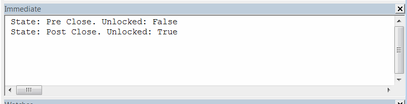
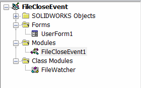

File closing (destroy) notification (such as [DestroyNotify2](https://help.solidworks.com/2017/english/api/sldworksapi/SOLIDWORKS.Interop.sldworks~SOLIDWORKS.Interop.sldworks.DAssemblyDocEvents_DestroyNotify2EventHandler.html)) for parts, assemblies and drawings are raised when the file is about to be closed (pre notification), which means that file is still not released from memory.

This could be a blocker for the applications such as Product Data Management (PDM) where closing of the file should unlock it as some additional operation might need to be performed (e.g. removing the file from the local cache, moving to the archive, post processing the stream, clearing resources).

This example demonstrates how to handle both pre and post notifications using SOLIDWORKS API.

* Open any SOLIDWORKS file
* Run the macro from the main method in the macro module. Temp form is displayed
* Close SOLIDWORKS file
* See the output in the Immediate window of VBA. There are 2 lines printed:
    * First - when the file is about to be closed
    * Second - when file is fully closed

At both handlers macro checks if the file is unlocked (i.e. released from the memory). As the result in first handler - file is locked and it is unlocked in the second handler, as expected.

**NOTE: IsFileUnlocked function is opening the stream for read-write and it can potentially corrupt the file. It is strongly recommended to use this macro on sample model only**

To create a macro add 2 more modules into your VBA Editor:

* Class Module named *FileWatcher* 
* User Form named *UserForm1*

{ width=250 }

Paste the codes into the corresponding modules as follows:

**FileWatcher Class Module**
~~~ vb
Public Event ModelClosed(path As String)
Public Event ModelClosing(path As String)
                         
Dim WithEvents swApp As SldWorks.SldWorks

Dim WithEvents swPart As SldWorks.PartDoc
Dim WithEvents swAssy As SldWorks.AssemblyDoc
Dim WithEvents swDraw As SldWorks.DrawingDoc

Dim IsClosing As Boolean
Dim ModelPath As String

Sub WatchModelClose(model As SldWorks.ModelDoc2)
    
    IsClosing = False
        
    If Not model Is Nothing Then
        Select Case model.GetType()
            Case swDocumentTypes_e.swDocPART
                Set swPart = model
            Case swDocumentTypes_e.swDocASSEMBLY
                Set swAssy = model
            Case swDocumentTypes_e.swDocDRAWING
                Set swDraw = model
        End Select
    Else
        Err.Raise vbError, "", "Model is null"
    End If
    
    ModelPath = model.GetPathName()
    
End Sub

Private Sub Class_Initialize()
    Set swApp = Application.SldWorks
End Sub

Private Function swApp_OnIdleNotify() As Long
    
    If IsClosing Then
        IsClosing = False
        RaiseEvent ModelClosed(ModelPath)
    End If
    
    swApp_OnIdleNotify = 0
    
End Function

Private Function swPart_DestroyNotify2(ByVal DestroyType As Long) As Long
    swPart_DestroyNotify2 = HandleDestroyEvent(DestroyType)
End Function

Private Function swAssy_DestroyNotify2(ByVal DestroyType As Long) As Long
    swAssy_DestroyNotify2 = HandleDestroyEvent(DestroyType)
End Function

Private Function swDraw_DestroyNotify2(ByVal DestroyType As Long) As Long
    swDraw_DestroyNotify2 = HandleDestroyEvent(DestroyType)
End Function

Function HandleDestroyEvent(ByVal DestroyType As Long) As Long
    
    If DestroyType = swDestroyNotifyType_e.swDestroyNotifyDestroy Then
        
        RaiseEvent ModelClosing(ModelPath)
        IsClosing = True
                
    End If
    
    HandleDestroyEvent = 0
    
End Function
~~~

**UserForm1 Form**
~~~ vb
Dim WithEvents FileCloseWatcher As FileWatcher

Private Sub FileCloseWatcher_ModelClosed(path As String)
    CheckFileLockState "Post Close", path
    End
End Sub

Private Sub FileCloseWatcher_ModelClosing(path As String)
    CheckFileLockState "Pre Close", path
End Sub

Private Sub UserForm_Initialize()
    
    Dim swApp As SldWorks.SldWorks
    
    Set swApp = Application.SldWorks

    Set FileCloseWatcher = New FileWatcher
    
    FileCloseWatcher.WatchModelClose swApp.ActiveDoc

End Sub

Sub CheckFileLockState(state As String, path As String)
    Debug.Print "State: " & state & ". Unlocked: " & IsFileUnlocked(path)
End Sub

Function IsFileUnlocked(filePath As String) As Boolean
    
    IsFileUnlocked = False
    
    Dim fileNmb As Integer
    
    fileNmb = FreeFile
    
    On Error Resume Next
    
    Open filePath For Input Lock Read Write As #fileNmb
    
    If Err.Number = 0 Then
        IsFileUnlocked = True
    End If
    
    Close fileNmb
    
End Function
~~~

**Macro Module**
~~~ vb
Dim swApp As SldWorks.SldWorks

Sub main()

    Set swApp = Application.SldWorks
    
    UserForm1.Show vbModeless
    
End Sub
~~~

