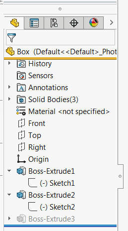

 使用SOLIDWORKS API查找与特定特征类型名称或名称模式匹配的所有或第一个特征的VBA宏
image: feature-manager-tree.png
labels: [遍历特征,名称模式,类型名称]
---
{ width=250 }

此VBA宏允许使用SOLIDWORKS API在特征管理器树中查找特征。

可以通过指定类型名称和/或名称模式（支持通配符）来查找特征。将名称或类型名称设为空字符串以忽略此过滤器。

## 示例

~~~vb
Dim swFeat As SldWorks.Feature
Set swFeat = GetFirstFeature(swModel, "WeldMemberFeat") '返回第一个WeldMemberFeat类型（即结构成员）的特征
~~~

~~~vb
Dim swFeat As SldWorks.Feature
Set swFeat = GetFirstFeature(swModel, "", "Sk*") '返回名称以Sk开头的第一个特征
~~~

~~~vb
Dim vFeats As Variant
vFeats = GetAllFeatures(swModel, "WeldMemberFeat") '返回所有WeldMemberFeat类型（即结构成员）的特征
~~~

~~~vb
Dim vFeats As Variant
vFeats = GetAllFeatures(swModel, "", "Sk*")'返回名称以Sk开头的所有特征
~~~

~~~ vb
Dim swApp As SldWorks.SldWorks

Sub main()

    Set swApp = Application.SldWorks
    
    Dim swModel As SldWorks.ModelDoc2
    
    Set swModel = swApp.ActiveDoc
    
    Dim swFirstWeldFeat As SldWorks.Feature
    Set swFirstWeldFeat = GetFirstFeature(swModel, "WeldMemberFeat")
    
    Dim swFirstSkFeat As SldWorks.Feature
    Set swFirstSkFeat = GetFirstFeature(swModel, "", "Sk*")
    
    Dim swAllWeldFeats As Variant
    swAllWeldFeats = GetAllFeatures(swModel, "WeldMemberFeat")
    
    Dim swAllSkFeats As Variant
    swAllSkFeats = GetAllFeatures(swModel, "", "Sk*")
    
End Sub

Function GetFirstFeature(model As SldWorks.ModelDoc2, Optional typeName As String = "", Optional namePattern As String = "") As SldWorks.Feature
    
    Dim vFeats As Variant
    vFeats = GetFeatures(model, typeName, True, namePattern)
    
    If Not IsEmpty(vFeats) Then
        Set GetFirstFeature = vFeats(0)
    Else
        Set GetFirstFeature = Nothing
    End If
    
End Function

Function GetAllFeatures(model As SldWorks.ModelDoc2, Optional typeName As String = "", Optional namePattern As String = "") As Variant
    GetAllFeatures = GetFeatures(model, typeName, False, namePattern)
End Function

Function GetFeatures(model As SldWorks.ModelDoc2, typeName As String, firstOnly As Boolean, Optional namePattern As String = "") As Variant
    
    Dim swTargFeatsColl As Collection
    Set swTargFeatsColl = New Collection
    
    Dim swProcFeatsColl As Collection
    Set swProcFeatsColl = New Collection
    
    Dim swFeat As SldWorks.Feature
    Set swFeat = model.FirstFeature()
    
    While Not swFeat Is Nothing
                
        If Not Contains(swProcFeatsColl, swFeat) Then
            swProcFeatsColl.Add swFeat
            
            If FilterFeature(swFeat, typeName, namePattern) Then
                swTargFeatsColl.Add swFeat
                If firstOnly Then
                    GetFeatures = CollectionToArray(swTargFeatsColl)
                    Exit Function
                End If
            End If
        End If
    
        CollectAllSubFeatures swFeat, swProcFeatsColl, swTargFeatsColl, typeName, namePattern, firstOnly
        
        If firstOnly And swTargFeatsColl.Count() >= 1 Then
            GetFeatures = CollectionToArray(swTargFeatsColl)
            Exit Function
        End If
        
        Set swFeat = swFeat.GetNextFeature
        
    Wend
    
    GetFeatures = CollectionToArray(swTargFeatsColl)
    
End Function

Function FilterFeature(feat As SldWorks.Feature, typeName As String, namePattern As String) As Boolean
    
    If typeName <> "" Then
        If LCase(feat.GetTypeName2()) <> LCase(typeName) Then
            FilterFeature = False
            Exit Function
        End If
    End If
    
    If namePattern <> "" Then
        If Not feat.Name Like namePattern Then
            FilterFeature = False
            Exit Function
        End If
    End If
    
    FilterFeature = True
    
End Function

Sub CollectAllSubFeatures(swFeat As SldWorks.Feature, procFeatsColl As Collection, targFeatsColl As Collection, typeName As String, namePattern As String, firstOnly As Boolean)
    
    Dim swSubFeat As SldWorks.Feature
    Set swSubFeat = swFeat.GetFirstSubFeature
        
    While Not swSubFeat Is Nothing
        
        If Not Contains(procFeatsColl, swSubFeat) Then
            procFeatsColl.Add swSubFeat
            If FilterFeature(swSubFeat, typeName, namePattern) Then
                targFeatsColl.Add swSubFeat
                If firstOnly Then
                    Exit Sub
                End If
            End If
        End If
        
        CollectAllSubFeatures swSubFeat, procFeatsColl, targFeatsColl, typeName, namePattern, firstOnly
        Set swSubFeat = swSubFeat.GetNextSubFeature
        
    Wend
    
End Sub

Function CollectionToArray(coll As Collection) As Variant
    
    If coll.Count() > 0 Then
        
        Dim arr() As Object
        
        ReDim arr(coll.Count() - 1)
        Dim i As Integer
        
        For i = 1 To coll.Count
            Set arr(i - 1) = coll(i)
        Next
        
        CollectionToArray = arr
        
    Else
        CollectionToArray = Empty
    End If
    
End Function

Function Contains(coll As Collection, item As Object) As Boolean
    
    Dim i As Integer
    
    For i = 1 To coll.Count
        If coll.item(i) Is item Then
            Contains = True
            Exit Function
        End If
    Next
    
    Contains = False
    
End Function
~~~