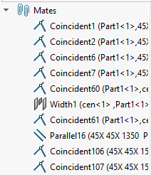

这个VBA宏会从活动装配体中删除所有约束并固定所有顶层零件。

通过更改常量的值，宏可以配置要在装配体上执行的操作。

~~~ vb
Const FIX_COMPONENTS As Boolean = True 'True表示固定零件，False表示保持零件不变
Const REMOVE_MATES As Boolean = True 'True表示删除约束，False表示保持约束
~~~

> 该宏将固定所有顶层零件，但不包括模式的实例零件。

这样可以显著提高装配体的性能。

~~~ vb
Const FIX_COMPONENTS As Boolean = True
Const REMOVE_MATES As Boolean = True

Dim swApp As SldWorks.SldWorks

Sub main()

    Set swApp = Application.SldWorks
    
    Dim swModel As SldWorks.ModelDoc2
    
    Set swModel = swApp.ActiveDoc
    
    If Not swModel Is Nothing Then
        
        If swModel.GetType() <> swDocumentTypes_e.swDocASSEMBLY Then
            Err.Raise vbError, "仅支持装配体文档"
        End If
        
        Dim swAssy As SldWorks.AssemblyDoc
        Set swAssy = swModel
        
        If REMOVE_MATES Then
        
            Dim vMates As Variant
            vMates = GetAllMates(swAssy)
            
            If Not IsEmpty(vMates) Then
                
                If swModel.Extension.MultiSelect2(vMates, False, Nothing) = UBound(vMates) + 1 Then
                    If False = swModel.Extension.DeleteSelection2(swDeleteSelectionOptions_e.swDelete_Absorbed) Then
                        Err.Raise vbError, "", "删除约束失败"
                    End If
                Else
                    Err.Raise vbError, "", "选择要删除的约束失败"
                End If
            End If
        
        End If
        
        If FIX_COMPONENTS Then
            
            Dim vComps As Variant
            vComps = GetAllComponents(swAssy)
            
            If Not IsEmpty(vComps) Then
                If swAssy.Extension.MultiSelect2(vComps, False, Nothing) = UBound(vComps) + 1 Then
                    swAssy.FixComponent
                Else
                    Err.Raise vbError, "", "选择零件失败"
                End If
            End If
            
        End If
        
    Else
        Err.Raise vbError, "", "请打开装配体文档"
    End If
    
End Sub

Function GetAllMates(assm As SldWorks.AssemblyDoc) As Variant
    
    Dim swMates() As SldWorks.Feature
    Dim isInit As Boolean
    isInit = False
    
    Dim swModel As SldWorks.ModelDoc2
    Set swModel = assm
    
    Dim swMateGroupFeat As SldWorks.Feature
    
    Dim featIndex As Integer
    featIndex = 0
        
    Do
        Set swMateGroupFeat = swModel.FeatureByPositionReverse(featIndex)
        
        featIndex = featIndex + 1
    Loop While swMateGroupFeat.GetTypeName2() <> "MateGroup"
    
    Dim swMateFeat As SldWorks.Feature
    
    Set swMateFeat = swMateGroupFeat.GetFirstSubFeature
    
    While Not swMateFeat Is Nothing
        
        If TypeOf swMateFeat.GetSpecificFeature2() Is SldWorks.Mate2 Then
            If isInit Then
                ReDim Preserve swMates(UBound(swMates) + 1)
            Else
                ReDim swMates(0)
                isInit = True
            End If
            Set swMates(UBound(swMates)) = swMateFeat
        End If
        
        Set swMateFeat = swMateFeat.GetNextSubFeature
    Wend
    
    If isInit Then
        GetAllMates = swMates
    Else
        GetAllMates = Empty
    End If
    
End Function

Function GetAllComponents(assm As SldWorks.AssemblyDoc) As Variant
    
    Dim swComps() As SldWorks.Component2
    Dim isInit As Boolean
    isInit = False
        
    Dim vComps As Variant
    vComps = assm.GetComponents(True)
    
    Dim i As Integer
    
    For i = 0 To UBound(vComps)
        
        Dim swComp As SldWorks.Component2
        Set swComp = vComps(i)
        
        If False = swComp.IsPatternInstance Then
            If Not isInit Then
                isInit = True
                ReDim swComps(0)
            Else
                ReDim Preserve swComps(UBound(swComps) + 1)
            End If
            Set swComps(UBound(swComps)) = swComp
        End If

    Next
    
    If isInit Then
        GetAllComponents = swComps
    Else
        GetAllComponents = Empty
    End If
    
End Function
~~~