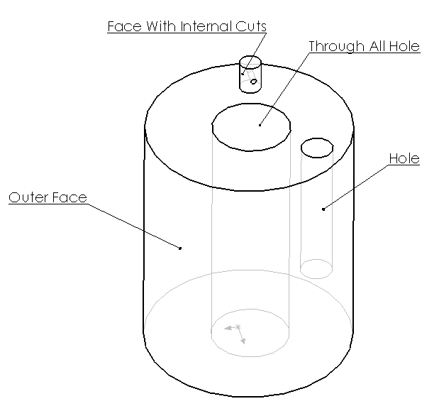

{ width=250 }

This macro identifies the type of the selected simple cylindrical face (through all hole, blind hole or external hole) based on the loops type using SOLIDWORKS API.

Macro will only work with cylindrical faces whose adjacent faces are planar faces and upper and lower boundaries of the cylinder are closed circular edges.

### Algorithm

Macro traverses the loops of coedges of upper and lower boundary edges. If there is at least one internal loop that means that selected face is a hole, otherwise it is an external boss. If both of the boundary loops are internal that means that the hole is through all, if one boundary loop is external but other is internal that means that the selected face is a blind hole (i.e. not a through all hole).

~~~ vb
Enum FaceType_e
    Outer
    BlindHole
    ThroughHole
    ContainsCutouts
End Enum

Dim swApp As SldWorks.SldWorks

Sub main()

    Set swApp = Application.SldWorks
    
    Dim swModel As SldWorks.ModelDoc2
    
    Set swModel = swApp.ActiveDoc
    
    If Not swModel Is Nothing Then
    
        Dim swSelMgr As SldWorks.SelectionMgr
        
        Set swSelMgr = swModel.SelectionManager
        
        Set swSelMgr = swModel.SelectionManager
        
        Dim swFace As SldWorks.Face2
        Set swFace = swSelMgr.GetSelectedObject6(1, -1)
        
        If Not swFace Is Nothing Then
            
            Dim swSurf As SldWorks.Surface
            Set swSurf = swFace.GetSurface
            
            If swSurf.IsCylinder() Then
                Dim faceType As FaceType_e
                faceType = GetCylindricalFaceType(swFace)
                
                Select Case faceType
                    Case FaceType_e.BlindHole
                        MsgBox "Selected face is a blind hole"
                    Case FaceType_e.Outer
                        MsgBox "Selected face is an outer face"
                    Case FaceType_e.ThroughHole
                        MsgBox "Selected face is through all hole"
                    Case FaceType_e.ContainsCutouts
                        MsgBox "Selected face contains cutouts"
                End Select
                
            Else
                MsgBox "Selected face is not cylindrical"
            End If
            
        Else
            MsgBox "Please select face"
        End If
        
    Else
        MsgBox "Please open the model"
    End If
    
End Sub

Function GetCylindricalFaceType(face As SldWorks.Face2) As FaceType_e

    Dim vEdges As Variant
        
    vEdges = face.GetEdges
    
    If UBound(vEdges) + 1 > 2 Then
        GetCylindricalFaceType = FaceType_e.ContainsCutouts
    ElseIf UBound(vEdges) + 1 = 2 Then
        
        Dim innerCount As Integer
        
        For i = 0 To UBound(vEdges)
            
            Dim swEdge As SldWorks.edge
            Set swEdge = vEdges(i)
            
            If HasInnerLoop(swEdge) Then
                innerCount = innerCount + 1
            End If
            
        Next
    
        If innerCount = 0 Then
            GetCylindricalFaceType = FaceType_e.Outer
        ElseIf innerCount = 1 Then
            GetCylindricalFaceType = FaceType_e.BlindHole
        ElseIf innerCount = 2 Then
            GetCylindricalFaceType = FaceType_e.ThroughHole
        End If
    End If
    
End Function

Function HasInnerLoop(edge As SldWorks.edge) As Boolean
    
    Dim vCoEdges As Variant
    vCoEdges = edge.GetCoEdges
    
    HasInnerLoop = False
    
    Dim i As Integer
    
    For i = 0 To UBound(vCoEdges)
    
        Dim swCoEdge As SldWorks.CoEdge
        Set swCoEdge = vCoEdges(i)
        
        Dim swLoop As SldWorks.Loop2
        Set swLoop = swCoEdge.GetLoop()
        
        If False = swLoop.IsOuter() Then
            HasInnerLoop = True
        End If
    Next
    
End Function
~~~

