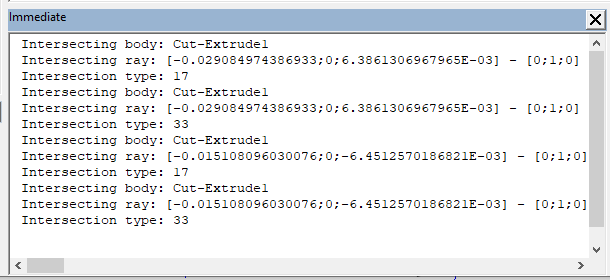

 VBA macro to find intersection points and the corresponding topology entities using rays in SOLIDWORKS part documents
image: ray-intersection-entities.png
---
This VBA macro example demonstrates how to find the intersection points and the corresponding topology entities between all solid bodies of the active SOLIDWORKS part document and rays created from the sketch points of the selected sketch.

## How To Run The Macro

* Open or create a part document with visible solid bodies.
* Create 2D sketch with sketch points. Sketch points will be used as the starting points of the ray. And the sketch normal will be used as the direction for the rays
* Select the sketch above
* Run the macro. Macro will find all the intersections and pause on every found result
    * Macro will output the information about each ray into the [VBA Immediate Window](/docs/codestack/visual-basic/vba/vba-editor/windows#immediate-window). Information includes the name of the body, ray information (starting point and direction), and intersection type as defined in [swRayPtsResults_e](https://help.solidworks.com/2020/english/api/swconst/SolidWorks.Interop.swconst~SolidWorks.Interop.swconst.swRayPtsResults_e.html)
    
    

    * Macro will select the corresponding entity (face or edge) which ray has hit. The selection point will indicate the point where the ray hit the entity
    * Continue macro with F5 or **Run** button in VBA editor to iterate all results

    

~~~ vb
Dim swApp As SldWorks.SldWorks
Const HIT_RADIUS As Double = 0.00000001

Sub main()

    Set swApp = Application.SldWorks
    
    Dim swModel As SldWorks.ModelDoc2
    Dim swPart As SldWorks.PartDoc
    
    Set swModel = swApp.ActiveDoc
    Set swPart = swModel
    
    Dim swSelMgr As SldWorks.SelectionMgr
    Set swSelMgr = swModel.SelectionManager
    
    Dim swSketch As SldWorks.sketch
    
    If swSelMgr.GetSelectedObjectType3(1, -1) = swSelectType_e.swSelSKETCHES Then
        Dim swFeat As SldWorks.Feature
        Set swFeat = swSelMgr.GetSelectedObject6(1, -1)
        Set swSketch = swFeat.GetSpecificFeature2
    Else
        Err.Raise vbError, "", "Sketch with sketch point rays is not selected"
    End If
    
    Dim vRayStartPts As Variant
    Dim vRayVecs As Variant
    
    GetRaysFromSketchPoints swSketch, vRayStartPts, vRayVecs
    
    Dim vBodies As Variant
    vBodies = swPart.GetBodies2(swBodyType_e.swSolidBody, True)
    
    Dim interCount As Integer
    interCount = swModel.Extension.RayIntersections(vBodies, vRayStartPts, vRayVecs, swRayPtsOpts_e.swRayPtsOptsENTRY_EXIT + swRayPtsOpts_e.swRayPtsOptsTOPOLS, HIT_RADIUS, 0, True)
    
    If interCount > 0 Then
        
        Dim vInterPoints As Variant
        vInterPoints = swModel.GetRayIntersectionsPoints()
        
        Dim vInterTopol As Variant
        vInterTopol = swModel.GetRayIntersectionsTopology
        
        Dim i As Integer
        
        For i = 0 To interCount - 1
            
            Dim bodyIndex As Integer
            Dim rayIndex As Integer
            Dim interType As Integer
            Dim dHitPt(2) As Double
            
            bodyIndex = CInt(vInterPoints(i * 9))
            rayIndex = CInt(vInterPoints(i * 9 + 1))
            interType = CInt(vInterPoints(i * 9 + 2))
            
            dHitPt(0) = CDbl(vInterPoints(i * 9 + 3))
            dHitPt(1) = CDbl(vInterPoints(i * 9 + 4))
            dHitPt(2) = CDbl(vInterPoints(i * 9 + 5))
            
            Dim swEnt As SldWorks.Entity
            Set swEnt = vInterTopol(i)
            
            Debug.Print "Intersecting body: " & vBodies(bodyIndex).Name
            Debug.Print "Intersecting ray: [" & vRayStartPts(rayIndex * 3) & ";" & vRayStartPts(rayIndex * 3 + 1) & ";" & vRayStartPts(rayIndex * 3 + 2) & "] - [" & vRayVecs(rayIndex * 3) & ";" & vRayVecs(rayIndex * 3 + 1) & ";" & vRayVecs(rayIndex * 3 + 2) & "]"
            Debug.Print "Intersection type: " & interType
            
            Dim swSelData As SldWorks.SelectData
            Set swSelData = swSelMgr.CreateSelectData
            
            swSelData.X = dHitPt(0)
            swSelData.Y = dHitPt(1)
            swSelData.Z = dHitPt(2)
            
            swEnt.Select4 False, swSelData
            
            Stop
            
        Next
        
    Else
        Err.Raise vbError, "", "No intersections found"
    End If
    
End Sub

Sub GetRaysFromSketchPoints(sketch As SldWorks.sketch, rayStartPts As Variant, rayVecs As Variant)
    
    If False = sketch.Is3D() Then
        
        Dim dRayStartPts() As Double
        Dim dRayVecs() As Double
        
        Dim vSkPoints As Variant
        vSkPoints = sketch.GetSketchPoints2
        
        If Not IsEmpty(vSkPoints) Then
            
            Dim swTransform As SldWorks.MathTransform
            Set swTransform = sketch.ModelToSketchTransform.Inverse
            
            Dim swMathUtils As SldWorks.MathUtility
            Set swMathUtils = swApp.GetMathUtility
            
            Dim dVec(2) As Double
            dVec(0) = 0: dVec(1) = 0: dVec(2) = 1
            
            Dim swMathVec As SldWorks.MathVector
            Set swMathVec = swMathUtils.CreateVector(dVec)
            Set swMathVec = swMathVec.MultiplyTransform(swTransform)
            
            ReDim dRayStartPts((UBound(vSkPoints) + 1) * 3 - 1)
            ReDim dRayVecs((UBound(vSkPoints) + 1) * 3 - 1)
            
            Dim i As Integer
            
            For i = 0 To UBound(vSkPoints)
                
                Dim swMathPt As SldWorks.MathPoint
                Dim dPt(2) As Double
                
                Dim swSkPt As SldWorks.SketchPoint
                Set swSkPt = vSkPoints(i)
                dPt(0) = swSkPt.X: dPt(1) = swSkPt.Y: dPt(2) = 0
                
                Set swMathPt = swMathUtils.CreatePoint(dPt)
                Set swMathPt = swMathPt.MultiplyTransform(swTransform)
                
                Dim vData As Variant
                vData = swMathPt.ArrayData
                
                dRayStartPts(i * 3) = vData(0)
                dRayStartPts(i * 3 + 1) = vData(1)
                dRayStartPts(i * 3 + 2) = vData(2)
                
                vData = swMathVec.ArrayData
                
                dRayVecs(i * 3) = vData(0)
                dRayVecs(i * 3 + 1) = vData(1)
                dRayVecs(i * 3 + 2) = vData(2)
                
            Next
            
            rayStartPts = dRayStartPts
            rayVecs = dRayVecs
            
        Else
            Err.Raise vbError, "", "No sketch points in the specified sketch"
        End If
        
    Else
        Err.Raise vbError, "", "Only 2D sketch can be used for rays"
    End If
    
End Sub
~~~

