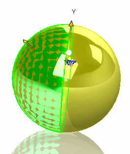

 Example demonstrates how to create spherical surface from the selected spherical face using SOLIDWORKS API in C#
image: reconstructed-sphere.png
labels: [curve, sphere, c#]
---

This example demonstrates how to create spherical surface (360 degress) from the selected spherical face (could be less than 360 degrees) using SOLIDWORKS API.

* Select any spherical surface and run the macro
* Reconstructed spherical surface is created as temp body and displayed in the graphics area
* Clear the selection to clear the preview

Spherical surface is created using the [IModeler::CreateSphericalSurface2](https://help.solidworks.com/2018/english/api/sldworksapi/solidworks.interop.sldworks~solidworks.interop.sldworks.imodeler~createsphericalsurface2.html) SOLIDWORKS API method which is trimmed using the [ISurface::CreateTrimmedSheet4](https://help.solidworks.com/2018/english/api/sldworksapi/solidworks.interop.sldworks~solidworks.interop.sldworks.isurface~createtrimmedsheet4.html)

~~~ cs
using SolidWorks.Interop.sldworks;
using SolidWorks.Interop.swconst;
using System.Runtime.InteropServices;
using System;

namespace CodeStackExample
{
    public partial class SolidWorksMacro
    {
        private IBody2 m_PreviewBody;

        public void Main()
        {
            PartDoc part = swApp.ActiveDoc as PartDoc;

            if (part != null)
            {
                IFace2 face = (part as IModelDoc2).ISelectionManager.GetSelectedObject6(1, -1) as IFace2;

                if (face != null && face.IGetSurface().IsSphere())
                {
                    double[] sphereParams = face.IGetSurface().SphereParams as double[];

                    IModeler modeler = swApp.IGetModeler();

                    ISurface sphereSurf = modeler.CreateSphericalSurface2(
                        new double[] { sphereParams[0], sphereParams[1], sphereParams[2] },
                        new double[] { 0, 0, 1 },
                        new double[] { 1, 0, 0 }, sphereParams[3]) as ISurface;

                    m_PreviewBody = sphereSurf.CreateTrimmedSheet4(new ICurve[] { null }, true) as IBody2;

                    m_PreviewBody.Display3(part, ToColorRef(255, 255, 0), (int)swTempBodySelectOptions_e.swTempBodySelectOptionNone);

                    part.ClearSelectionsNotify += new DPartDocEvents_ClearSelectionsNotifyEventHandler(OnClearSelections);
                }
                else 
                {
                    swApp.SendMsgToUser("Please select spherical surface");
                }
            }
            else 
            {
                swApp.SendMsgToUser("Please open part document");
            }
        }

        private int ToColorRef(byte r, byte g, byte b)
        {
            return (r << 0) | (g << 8) | (b << 16);
        }

        private int OnClearSelections()
        {
            m_PreviewBody = null;
            GC.Collect();
            return 0;
        }

        public SldWorks swApp;
    }
}
~~~

