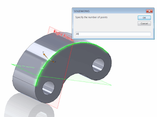
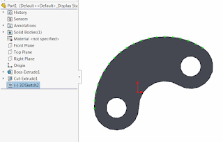

 Macro creates specified number of sketch points on the selected edge in the 3D sketch
image: sketch-points-edge.png
labels: [curve, evaluate, geometry, macro, points, solidworks api, spline, utility, vba]
redirect-from:
  - /2018/03/this-macro-creates-specified-number-of.html
---
This macro creates specified number of sketch points on the selected edge in the 3D sketch using SOLIDWORKS API.

1. Open SOLIDWORKS part
1. *(Optionally)* Open 3D Sketch to insert points to the existing sketch, otherwise new sketch will be created
1. Run the macro. Enter the number of points to generate

{ width=320 height=239 }

As the result specified number of sketch points is generated in the 3D sketch:

{ width=320 height=204 }

~~~ vb
Dim swApp As SldWorks.SldWorks
Dim swModel As SldWorks.ModelDoc2
Dim swSelMgr As SldWorks.SelectionMgr

Sub main()

    On Error Resume Next

    Set swApp = Application.SldWorks
    
    Set swModel = swApp.ActiveDoc
    
    Set swSelMgr = swModel.SelectionManager
    
    Dim isSketchActive As Boolean
    
    isSketchActive = Not swModel.SketchManager.ActiveSketch Is Nothing
    
    If isSketchActive Then
        If Not swModel.SketchManager.ActiveSketch.Is3D Then
            MsgBox "Points can only be inserted into 3D sketch"
            End
        End If
    End If
    
    Dim swEdge As SldWorks.Edge
    
    Set swEdge = swSelMgr.GetSelectedObject6(1, -1)
    
    If Not swEdge Is Nothing Then
        
        Dim swCurve As SldWorks.Curve
        
        Set swCurve = swEdge.GetCurve
        
        Dim vPts As Variant
        
        Dim pointsCount As Integer
        pointsCount = CInt(InputBox("Specify the number of points"))
        
        If pointsCount <= 0 Then
            MsgBox "Please specify the valid integer number more than 1"
            End
        End If
        
        vPts = SplitCurveByPoints(swCurve, pointsCount)
    
        swModel.ClearSelection2 True
    
        If Not isSketchActive Then 'open new 3D sketch
            swModel.SketchManager.Insert3DSketch True
        End If
        
        Dim i As Integer
        
        For i = 0 To (UBound(vPts) + 1) / 3 - 1
        
            swModel.SketchManager.CreatePoint vPts(i * 3), vPts(i * 3 + 1), vPts(i * 3 + 2)
            
        Next
    
    If Not isSketchActive Then 'only close sketch if it wasn't opened at the beginning
        swModel.SketchManager.Insert3DSketch True
    End If
        
    Else
        MsgBox "Please select edge"
    End If
            
End Sub

Function SplitCurveByPoints(swCurve As SldWorks.Curve, pointsNumber As Integer) As Variant
    
    Dim nStartParam As Double
    Dim nEndParam As Double
    Dim bIsClosed As Boolean
    Dim bIsPeriodic As Boolean
    
    Dim incr As Double
    Dim i As Integer
    Dim vParam As Variant
    
    Dim retVal() As Double
    
    ReDim retVal(pointsNumber * 3 - 1)
    
    swCurve.GetEndParams nStartParam, nEndParam, bIsClosed, bIsPeriodic
    
    incr = (nEndParam - nStartParam) / (pointsNumber - 1)
    
    For i = 0 To pointsNumber - 1
    
        vParam = swCurve.Evaluate(nStartParam + i * incr)
        
        retVal(i * 3) = vParam(0)
        retVal(i * 3 + 1) = vParam(1)
        retVal(i * 3 + 2) = vParam(2)
        
    Next
    
    SplitCurveByPoints = retVal
    
End Function

~~~

Alternatively, it is possible to create points based on the curve length. The following example will create points by calculating the approximate length from curve tessellation points:

~~~ vb
Function SplitCurveByLength(swCurve As SldWorks.Curve, chordLength As Double) As Variant
    
    Dim nStartParam As Double
    Dim nEndParam As Double
    Dim bIsClosed As Boolean
    Dim bIsPeriodic As Boolean
        
    swCurve.GetEndParams nStartParam, nEndParam, bIsClosed, bIsPeriodic
    
    SplitCurveByLength = swCurve.GetTessPts(0.01, chordLength, swCurve.Evaluate2(nStartParam, 1), swCurve.Evaluate2(nEndParam, 1))
    
End Function
~~~

or by calculating the distance based on the total curve length:

~~~ vb
Function SplitCurveByChord(swCurve As SldWorks.Curve, chordLength As Double) As Variant
    
    Dim swCurveSpline As SldWorks.Curve
    Dim nStartParam As Double
    Dim nEndParam As Double
    Dim bIsClosed As Boolean
    Dim bIsPeriodic As Boolean
    
    Dim incr As Double
    Dim i As Integer
    Dim vParam As Variant
    
    Dim retVal() As Double
        
    swCurve.GetEndParams nStartParam, nEndParam, bIsClosed, bIsPeriodic
    
    Dim curveLength As Double
    curveLength = swCurve.GetLength3(nStartParam, nEndParam)
    
    ReDim retVal(CInt(curveLength / chordLength) * 3 - 1)
    
    incr = (nEndParam - nStartParam) / (curveLength / chordLength)
    
    For i = 0 To (UBound(retVal) + 1) / 3 - 1
    
        vParam = swCurve.Evaluate2(nStartParam + i * incr, 1)
        
        retVal(i * 3) = vParam(0)
        retVal(i * 3 + 1) = vParam(1)
        retVal(i * 3 + 2) = vParam(2)
        
    Next
    
    SplitCurveByChord = retVal
    
End Function
~~~

