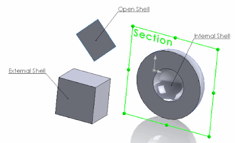

 Example identifies the type of the selected sheet body (open shell, internal shell, external shell)
image: face-shell-types.png
labels: [example, face, geometry, open geometry, shell, solidworks api, topology]
redirect-from:
  - /2018/03/solidworks-api-geometry-get-body-geometry-type.html
---
There are 3 types of faces in SOLIDWORKS bodies:  

* **Open Shell**. Faces from the sheet bodies which are together with connected faces do not form the closed geometry (for example planar face, while face of the shell cube or sphere won't be considered as open)
* **Internal Shell**. Faces in solid bodies which belong to the cavities.
* **External Shell**. Any other faces which do not belong to previous groups

{ width=400 height=243 }

The example below identifies the type of the selected sheet body using SOLIDWORKS API. If the body is of open geometry (contains open shell faces) or closed geometry (no open shell faces). The closed geometry sheet body can be converted to a solid body.  

~~~ cs
using System;
using SolidWorks.Interop.sldworks;
using SolidWorks.Interop.swconst;

namespace CodeStack
{
    public partial class SolidWorksMacro
    {
        public enum FaceShellType_e
        {
            Open = 0,
            Internal = 1,
            External = 2
        }

        public void Main()
        {
            IModelDoc2 model = swApp.IActiveDoc2;

            if (model != null)
            {
                SelectionMgr selMgr = model.ISelectionManager;

                IBody2 body = selMgr.GetSelectedObject6(1, -1) as IBody2;

                if (body != null)
                {
                    if (body.GetType() == (int)swBodyType_e.swSheetBody)
                    {
                        if (IsOpenGeometry(body))
                        {
                            swApp.SendMsgToUser("Selected body is an open geometry");
                        }
                        else
                        {
                            swApp.SendMsgToUser("Selected body is not an open geometry");
                        }
                    }
                    else
                    {
                        swApp.SendMsgToUser("Selected body is not a sheet body");
                    }
                }
                else
                {
                    swApp.SendMsgToUser("Please select sheet body");
                }
            }
            else
            {
                swApp.SendMsgToUser("Please open model");
            }

            return;
        }

        private static bool IsOpenGeometry(IBody2 body)
        {
            object[] faces = body.GetFaces() as object[];

            if (faces != null)
            {
                foreach (IFace2 face in faces)
                {
                    FaceShellType_e shellType = (FaceShellType_e)face.GetShellType();

                    if (shellType == FaceShellType_e.Open)
                    {
                        return true;
                    }
                }
            }

            return false;
        }

        public SldWorks swApp;
    }
}

~~~

