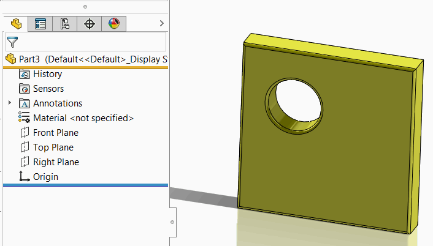

 Storing the temp body in the SOLIDWORKS document stream via 3rd party storage and restoring it on opening using SOLIDWORKS API
image: restored-body.png
labels: [3rd party storage,store body,restore body]
---
This VBA example demonstrates how to store the copy of the selected body in the new document's stream and restore and display the body on model opening.

Body is serialized and deserialized from the [3rd party storage](/docs/codestack/solidworks-api/data-storage/third-party/).

* Create new macro and add new form. Name it *UserForm1* (default name)
* Add the button. Specify the caption *Store Body* and name *cmdStoreBody* as shown below

{ width=450 }

* Paste the following into the user form's code behind:

~~~ vb
Const BODY_STREAM_NAME = "_CodeStackBody_"

Dim WithEvents swApp As SldWorks.SldWorks
Dim swModeler As SldWorks.Modeler
Dim WithEvents swCurPart As SldWorks.PartDoc
Dim swCurBody As SldWorks.Body2

Private Sub UserForm_Initialize()
    
    Set swApp = Application.SldWorks
    Set swModeler = swApp.GetModeler
    
End Sub

Private Function swApp_DocumentLoadNotify(ByVal docTitle As String, ByVal docPath As String) As Long
    
    If docPath <> "" Then
    
        Dim swModel As SldWorks.ModelDoc2
        Set swModel = swApp.GetOpenDocumentByName(docPath)
        
        If TypeOf swModel Is SldWorks.PartDoc Then
            Set swCurPart = swModel
        End If
        
    End If
    
End Function

Private Function swCurPart_LoadFromStorageNotify() As Long
    DisplayBodyFromStream
    swCurPart_LoadFromStorageNotify = 0
End Function

Private Function swCurPart_SaveToStorageNotify() As Long

    If Not swCurBody Is Nothing Then
        StoreBodyToStream
        MsgBox "Body is stored to the model stream. Close and reopen the model to restore the body"
    End If
    
    swCurPart_SaveToStorageNotify = 0
    
End Function

Private Sub cmdStoreBody_Click()
    
    Dim swModel As SldWorks.ModelDoc2
    Set swModel = swApp.ActiveDoc
    
    Dim swSelMgr As SldWorks.SelectionMgr
    Set swSelMgr = swModel.SelectionManager
    
    Set swCurBody = swSelMgr.GetSelectedObject6(1, -1)
    
    If Not swCurBody Is Nothing Then
        Set swCurBody = swCurBody.Copy
        Dim partTemplate As String
        partTemplate = swApp.GetUserPreferenceStringValue(swUserPreferenceStringValue_e.swDefaultTemplatePart)
        Set swCurPart = swApp.NewDocument(partTemplate, swDwgPaperSizes_e.swDwgPapersUserDefined, 0, 0)
        MsgBox "Save this document to store the body in its stream"
    Else
        MsgBox "Please select body"
    End If
    
End Sub

Sub DisplayBodyFromStream()
    
    Dim swModel As SldWorks.ModelDoc2
    Set swModel = swCurPart
    
    Dim swStream As Variant
    Set swStream = swModel.IGet3rdPartyStorage(BODY_STREAM_NAME, False)
    
    If Not swStream Is Nothing Then
        
        Set swCurBody = swModeler.Restore(swStream)
        swModel.IRelease3rdPartyStorage BODY_STREAM_NAME
        swCurBody.Display3 swModel, RGB(255, 255, 0), swTempBodySelectOptions_e.swTempBodySelectable
        
    End If
    
End Sub

Sub StoreBodyToStream()
    
    Dim swModel As SldWorks.ModelDoc2
    Set swModel = swCurPart
    Dim swStream As Variant
    Set swStream = swModel.IGet3rdPartyStorage(BODY_STREAM_NAME, True)
    swCurBody.Save swStream
    swModel.IRelease3rdPartyStorage BODY_STREAM_NAME
    
End Sub
~~~

* Insert the following code into the macro's main module:

~~~ vb
Sub main()

    UserForm1.Show vbModeless
    
End Sub
~~~

## Running Macro

* Start the macro from the main module. Note, if you run the macro when form is active in the macro editor - form will be displayed as modal window and will prevent selections and saving
* Open any part document with any geometry
* Select solid body from the tree and click *Store Body* in the user form
* New part document is created and the following message is displayed: *Save this document to store the body in its stream*
* Save this file. When file is saving the body from different part is serialized into the stream of new document and no longer related to the original body.
* Once completed, the following message is displayed: *Body is stored to the model stream. Close and reopen the model to restore the body*
* Now, close all documents and reopen the last saved file. The body is deserialized and displayed. Note, that there is no feature tree in the model.

{ width=350 }

* You can close SOLIDWORKS session and reopen the model. The body will still be loaded. Note, you need to run the macro before opening the model.