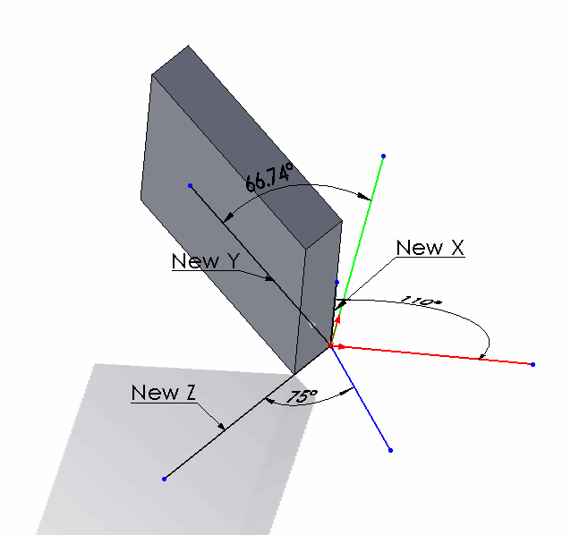

 Example explains transformation of rotation and translation for components in the assembly
image: comp-translation.png
labels: [acos, angle, component, example, orientation, point, position, rotation, solidworks api, transform, translation, vector]
redirect-from:
  - /2018/03/component-transformation-in-assembly.html
---
SOLIDWORKS components are instances of models (parts or assemblies) in the another parent assembly. Component's position in its space is driven by its transformation (regardless if the component is constrained by mates or moved in the space by free drag-n-drop operation). Transformation consists of 3 components: translation, rotation and scale.

To get the transformation of the component use the [IComponent2::Transform2](https://help.solidworks.com/2012/english/api/sldworksapi/solidworks.interop.sldworks~solidworks.interop.sldworks.icomponent2~transform2.html) SOLIDWORKS API property. The transform in this case represents the relation of the component origin coordinate systems to the root assembly origin coordinate system. It is not required to multiple the transform of sub-assemblies for its children components to get the total transformation of these components relative to root assembly.

## Translation Transformation

In the example below the component is moved in space Along X, Y and Z coordinates. The following example will calculate the new positions of the component's origin:

{ width=640 }

~~~ vb
Dim swApp As SldWorks.SldWorks
Dim swMathUtils As SldWorks.MathUtility
Dim swModel As SldWorks.ModelDoc2
Dim swSelMgr As SldWorks.SelectionMgr
Dim swComp As SldWorks.Component2

Sub main()

    Set swApp = Application.SldWorks
    
    Set swMathUtils = swApp.GetMathUtility
    
    Set swModel = swApp.ActiveDoc
    
    Set swSelMgr = swModel.SelectionManager
    
    Set swComp = swSelMgr.GetSelectedObject6(1, -1)
    
    Dim swTransform As SldWorks.MathTransform
    Set swTransform = swComp.Transform2
    
    Dim dOrigPt(2) As Double
    dOrigPt(0) = 0: dOrigPt(1) = 0: dOrigPt(2) = 0
    
    Dim swMathPt As SldWorks.MathPoint
    
    Set swMathPt = swMathUtils.CreatePoint(dOrigPt)
    
    Set swMathPt = swMathPt.MultiplyTransform(swTransform)
    
    Dim vCompOriginPt As Variant

    vCompOriginPt = swMathPt.ArrayData
    
    Debug.Print "Along X: " & vCompOriginPt(0) * 1000 & "mm; " & "Along Y: " & vCompOriginPt(1) * 1000 & "mm; " & "Along Z: " & vCompOriginPt(2) * 1000 & "mm"
    
End Sub
~~~

The following line will be output to the Watch window as the result of running the macro on [this sample model](transform-translation.SLDASM):

> Along X: 75mm; Along Y: -50mm; Along Z: -100mm

## Rotation Transformation

Now let's rotate the component and try to find the rotation angles. This component is rotated in all directions. **Red line** below - is the X axis of the assembly, **Green line** - Y axis, **Blue line** - Z axis. New X, New Y and New Z - are orientation of the corresponding axes in the component and dimensions indicate the angles between those axes.

{ width=640 }

~~~ vb
Const PI As Double = 3.14159265359

Dim swApp As SldWorks.SldWorks
Dim swMathUtils As SldWorks.MathUtility
Dim swModel As SldWorks.ModelDoc2
Dim swSelMgr As SldWorks.SelectionMgr
Dim swComp As SldWorks.Component2

Sub main()

    Set swApp = Application.SldWorks
    
    Set swMathUtils = swApp.GetMathUtility
    
    Set swModel = swApp.ActiveDoc
    
    Set swSelMgr = swModel.SelectionManager
    
    Set swComp = swSelMgr.GetSelectedObject6(1, -1)
    
    Dim swTransform As SldWorks.MathTransform
    Set swTransform = swComp.Transform2
    
    Debug.Print "Angle between X axes: " & Round(GetAngle(1, 0, 0, swTransform) * 180 / PI, 2) & " deg"
    Debug.Print "Angle between Y axes: " & Round(GetAngle(0, 1, 0, swTransform) * 180 / PI, 2) & " deg"
    Debug.Print "Angle between Z axes: " & Round(GetAngle(0, 0, 1, swTransform) * 180 / PI, 2) & " deg"
    
End Sub

Function GetAngle(x As Double, y As Double, z As Double, transform As SldWorks.MathTransform) As Variant
    
    Dim dVect(2) As Double
    dVect(0) = x: dVect(1) = y: dVect(2) = z
    
    Dim swMathVecOrig As SldWorks.MathVector
    Dim swMathVecTrans As SldWorks.MathVector
    
    Set swMathVecOrig = swMathUtils.CreateVector(dVect)
    
    Set swMathVecTrans = swMathVecOrig.MultiplyTransform(transform)
    
    'cos a= a*b/(|a|*|b|)
    GetAngle = ACos(swMathVecOrig.Dot(swMathVecTrans) / (swMathVecOrig.GetLength() * swMathVecTrans.GetLength()))
    
End Function

Function ACos(val As Double) As Double
    
    If val = 1 Then
        ACos = 0
    ElseIf val = -1 Then
        ACos = 4 * Atn(1)
    Else
        ACos = Atn(-val / Sqr(-val * val + 1)) + 2 * Atn(1)
    End If
    
End Function
~~~

Running the code above will output the following results for [this sample model](transform-rotation.SLDASM):

> Angle between X axes: 110 deg

> Angle between Y axes: 66.74 deg

> Angle between Z axes: 75 deg

## Preserving Transformation State In Configurations

By default transformation state of the floating component in the configuration will be overridden by another configuration state in case of assembly modifications, such as new component addition, mate changes etc. This is different from the manual behavior when floating component's position will not be changed if another configuration modified.

To demonstrate the issue consider the following scenario:

* Download the [sample assembly](preserve-transform.zip) which has a single component
* There are 2 configurations in the assembly
  * Configuration **A** has the component position fully defined by mates
  * Configuration **B** has a floating component without any mates in the random position
* Run the following macro. Macro will align the corner of the component with the origin of the assembly in the Configuration B

* Macro will stop at several points. Read the comment indicating the state
* On the last step the transformation assigned to the floating component was overridden by the transformation in the Configuration A driven by mates.

~~~ vb
#If VBA7 Then
     Private Declare PtrSafe Function SendMessage Lib "User32" Alias "SendMessageA" (ByVal hWnd As Long, ByVal wMsg As Long, ByVal wParam As Long, lParam As Any) As Long
#Else
     Private Declare Function SendMessage Lib "User32" Alias "SendMessageA" (ByVal hWnd As Long, ByVal wMsg As Long, ByVal wParam As Long, lParam As Any) As Long
#End If

Dim swApp As SldWorks.SldWorks

Sub main()

    Set swApp = Application.SldWorks
    
    Dim swModel As SldWorks.ModelDoc2
    
    Set swModel = swApp.ActiveDoc
    
    swModel.ShowConfiguration2 "B"
    
    Dim swRootComp As SldWorks.Component2
    Set swRootComp = swModel.ConfigurationManager.ActiveConfiguration.GetRootComponent3(False)
    
    Dim swComp As SldWorks.Component2
    
    Set swComp = swRootComp.GetChildren()(0)
    
    Dim swTransform As SldWorks.MathTransform
    
    Dim dMatrix(15) As Double
    dMatrix(0) = 1: dMatrix(1) = 0: dMatrix(2) = 0: dMatrix(3) = 0
    dMatrix(4) = 1: dMatrix(5) = 0: dMatrix(6) = 0: dMatrix(7) = 0
    dMatrix(8) = 1: dMatrix(9) = -0.03: dMatrix(10) = -0.05: dMatrix(11) = -0.01
    dMatrix(12) = 1: dMatrix(13) = 0: dMatrix(14) = 0: dMatrix(15) = 0
    
    Dim swMathUtils As SldWorks.MathUtility
    
    Set swMathUtils = swApp.GetMathUtility
    
    Set swTransform = swMathUtils.CreateTransform(dMatrix)
    
    swComp.Transform = swTransform
    
    swModel.EditRebuild3
    
    Stop 'Component is aligned
	
    'FixComponentInThisConfiguration swComp
        
    swModel.ShowConfiguration2 "A"
    
    Dim swAssy As SldWorks.AssemblyDoc
    Set swAssy = swModel
    
    swAssy.AddComponent5 swComp.GetPathName(), 0, 0, False, "", 0.2, 0.2, 0.2
    
    swModel.EditRebuild3
    
    Stop 'New component is added into configuration A
	
    swModel.ShowConfiguration2 "B"
	
    Stop 'Component in configuraiton B lost its position
    
End Sub

Sub FixComponentInThisConfiguration(comp As SldWorks.Component2)
    
    If False <> comp.Select4(False, Nothing, False) Then
        Const WM_COMMAND As Long = &H111
        Const CMD_FixCompInThisConf As Long = 51605
        SendMessage swApp.Frame().GetHWnd(), WM_COMMAND, CMD_FixCompInThisConf, 0
    Else
        Err.Raise vbError, "", "Failed to select component"
    End If
    
End Sub
~~~

In order to preserve the transformation it is required to [fix](/docs/codestack/solidworks-api/document/assembly/components/fix-float/) the component in the Configuration B.

* Uncomment the following line
* Close the assembly without saving and reopen it again

~~~ vb
'FixComponentInThisConfiguration swComp
~~~

to

~~~ vb
FixComponentInThisConfiguration swComp
~~~

* Run macro again. Now the transformation is preserved
