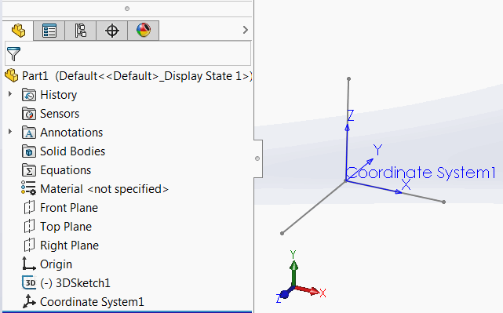

 VBA macro to get the 4x4 transformation matrix from the selected coordinate systems and output the result in the immediate window
image: coordinate-system.png
labels: [transform,coordinate system]
---
{ width=450 }

This VBA macro extract the 4x4 [transformation matrix](/docs/codestack/solidworks-api/geometry/transformation/) from the selected coordinate system in the feature manager tree.

The comma separated results are output to the immediate (ctrl+G) window of VBA editor.

{ width=350 }

~~~ vb
Dim swApp As SldWorks.SldWorks

Sub main()

    Set swApp = Application.SldWorks
    
    Dim swModel As SldWorks.ModelDoc2
    
    Set swModel = swApp.ActiveDoc
    
    If Not swModel Is Nothing Then
        
        Dim swFeat As SldWorks.Feature
        Set swFeat = swModel.SelectionManager.GetSelectedObject6(1, -1)
        
        If Not swFeat Is Nothing Then
            
            If swFeat.GetTypeName2() = "CoordSys" Then
                
                Dim swCoordSys As SldWorks.CoordinateSystemFeatureData
                
                Set swCoordSys = swFeat.GetDefinition
                Dim swMathTransform As SldWorks.MathTransform
                Set swMathTransform = swCoordSys.Transform
                
                Dim vMatrix As Variant
                vMatrix = swMathTransform.ArrayData
                
                Debug.Print vMatrix(0) & "," & vMatrix(1) & "," & vMatrix(2) & "," & vMatrix(3) & ","
                Debug.Print vMatrix(4) & "," & vMatrix(5) & "," & vMatrix(6) & "," & vMatrix(7) & ","
                Debug.Print vMatrix(8) & "," & vMatrix(9) & "," & vMatrix(10) & "," & vMatrix(11) & ","
                Debug.Print vMatrix(12) & "," & vMatrix(13) & "," & vMatrix(14) & "," & vMatrix(15)
                
            Else
                MsgBox "Selected feature is not a coordinate system"
            End If
        Else
            MsgBox "Please select coordinate system feature"
        End If
        
    Else
        MsgBox "Please open model"
    End If
    
End Sub
~~~

