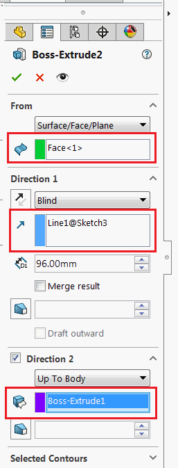

This C# VSTA macro extracts the information about the selection entities specified in the From Entity, End Condition and Direction selection boxes in the Boss-Extrude feature definition using SOLIDWORKS API.

Extracted data is output to the Output Window of VSTA Editor in the following format.

~~~
From Entity: Yes [swSelFACES]
End Condition (Direction 1): No
End Condition (Direction 2): No
Direction (Direction 1): Yes [swSelSKETCHSEGS]
Direction (Direction 2): No
~~~

~~~ cs
using SolidWorks.Interop.sldworks;
using SolidWorks.Interop.swconst;
using System.Runtime.InteropServices;
using System;
using System.Diagnostics;

namespace GetExtrudeFeatureSelection.csproj
{
    public partial class SolidWorksMacro
    {
        public void Main()
        {
            IModelDoc2 model = swApp.IActiveDoc2;

            if (model != null)
            {
                IFeature feat = model.ISelectionManager.GetSelectedObject6(1, -1) as IFeature;

                if (feat != null)
                {
                    IExtrudeFeatureData2 featData = feat.GetDefinition() as IExtrudeFeatureData2;

                    if (featData != null)
                    {
                        if (featData.AccessSelections(model, null))
                        {
                            object fromEntity;
                            int fromEntType;
                            featData.GetFromEntity(out fromEntity, out fromEntType);

                            Debug.Print(string.Format("From Entity: {0}",
                                    fromEntity != null ? string.Format("Yes [{0}]", (swSelectType_e)fromEntType) : "No"));

                            int endCondRefType;
                            object endCondRef = featData.GetEndConditionReference(true, out endCondRefType);

                            Debug.Print(string.Format("End Condition (Direction 1): {0}",
                                    endCondRef != null ? string.Format("Yes [{0}]", (swSelectType_e)endCondRef) : "No"));

                            endCondRef = featData.GetEndConditionReference(false, out endCondRefType);

                            Debug.Print(string.Format("End Condition (Direction 2): {0}",
                                    endCondRef != null ? string.Format("Yes [{0}]", (swSelectType_e)endCondRef) : "No"));

                            object firstDirDirRef;
                            int firstDirDirRefType;
                            object secondDirDirRef;
                            int secondDirDirRefType;

                            featData.GetDirectionReference(out firstDirDirRef, out firstDirDirRefType, out secondDirDirRef, out secondDirDirRefType);

                            Debug.Print(string.Format("Direction (Direction 1): {0}",
                                    firstDirDirRef != null ? string.Format("Yes [{0}]", (swSelectType_e)firstDirDirRefType) : "No"));

                            Debug.Print(string.Format("Direction (Direction 2): {0}",
                                    secondDirDirRef != null ? string.Format("Yes [{0}]", (swSelectType_e)secondDirDirRefType) : "No"));

                            featData.ReleaseSelectionAccess();
                        }
                        else
                        {
                            throw new InvalidOperationException("Failed to access feature selection");
                        }
                    }
                    else 
                    {
                        throw new InvalidCastException("Selected feature is not Boss-Extrude");
                    }
                }
                else 
                {
                    throw new NullReferenceException("Select feature");
                }
            }
            else 
            {
                throw new NullReferenceException("Open model");
            }
        }

        public SldWorks swApp;
    }
}
~~~

