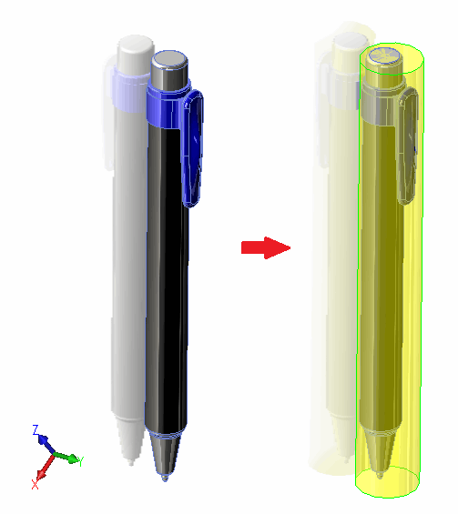

{ width=400 }

本示例演示如何使用SOLIDWORKS API查找实体的包围圆柱体。

宏要求用户选择输入参数以确定圆柱体的方向。用户可以选择圆形面（在这种情况下，轴将用作参考）或平面特征（在这种情况下，法线将用作参考）。

结果将创建一个新的特征，表示实体的圆柱形边界。

> 该宏将为任意方向的实体创建最佳拟合的包围圆柱体。实体不一定需要与XYZ轴对齐。

可以在[此链接](GetBoundingCylinderBin.zip)下载宏。解压缩宏并从“工具”->“宏”->“运行”菜单命令中运行它。按照下面的说明指定正确的过滤器：

{ width=500 }

### SolidWorksMacro.cs
这是VSTA宏的入口点。在此模块中处理输入参数并创建输出体。
~~~ cs
using SolidWorks.Interop.sldworks;
using SolidWorks.Interop.swconst;
using System.Runtime.InteropServices;
using System;
using CodeStack;

namespace CodeStack
{
    public partial class SolidWorksMacro
    {
        public void Main()
        {
            try
            {
                IModelDoc2 model = swApp.IActiveDoc2;

                if (model is IPartDoc)
                {
                    BodyHelper proc = new BodyHelper(swApp.IGetMathUtility());

                    object selObj = model.ISelectionManager.GetSelectedObject6(1, -1);

                    CylinderParams cylParams = proc.GetBoundingCylinder(
                        GetBodyToProcess(model as IPartDoc, selObj),
                        GetDirection(model, selObj));

                    CreateCylindricalBody(model as IPartDoc, cylParams);

                }
                else
                {
                    throw new NullReferenceException("No Part Document opened");
                }
            }
            catch (Exception ex)
            {
                swApp.SendMsgToUser2("Error: " + ex.Message, 
                    (int)swMessageBoxIcon_e.swMbStop, (int)swMessageBoxBtn_e.swMbOk);
            }
        }

        private void CreateCylindricalBody(IPartDoc part, CylinderParams cylParams)
        {
            IBody2 cylTempBody = swApp.IGetModeler().CreateBodyFromCyl(new double[]
                    {
                        cylParams.Origin[0], cylParams.Origin[1], cylParams.Origin[2],
                        cylParams.Direction[0], cylParams.Direction[1], cylParams.Direction[2],
                        cylParams.Radius, cylParams.Height
                    }) as IBody2;

            IFeature feat = part.CreateFeatureFromBody3(cylTempBody, false,
                (int)swCreateFeatureBodyOpts_e.swCreateFeatureBodySimplify) as IFeature;

            IBody2 body = feat.GetBody() as IBody2;

            body.MaterialPropertyValues2 = new double[] { 1, 1, 0, 0.5, 0.5, 0.5, 0.5, 0.5, 0.5 };

        }

        private IBody2 GetBodyToProcess(IPartDoc part, object inputObj)
        {
            if (inputObj is IFace2)
            {
                return (inputObj as IFace2).GetBody() as IBody2;
            }
            else
            {
                object[] solidBodies = part.GetBodies2((int)swBodyType_e.swSolidBody, true) as object[];

                if (solidBodies != null && solidBodies.Length == 1)
                {
                    return solidBodies[0] as IBody2;
                }
            }

            throw new NullReferenceException("Failed to find the input body. Either select cylindrical face or use single body part");
        }

        private double[] GetDirection(IModelDoc2 model, object inputObj)
        {
            if (inputObj is IFace2)
            {
                ISurface surf = (inputObj as IFace2).GetSurface() as ISurface;

                if (surf.IsCylinder())
                {
                    double[] cylParams = surf.CylinderParams as double[];

                    return new double[] { cylParams[3], cylParams[4], cylParams[5] };
                }
            }
            else if (inputObj is IFeature)
            {
                IRefPlane refPlane = (inputObj as IFeature).GetSpecificFeature2() as IRefPlane;

                if (refPlane != null)
                {
                    IMathUtility mathUtils = swApp.GetMathUtility() as IMathUtility;
                    IMathVector vec = mathUtils.CreateVector(new double[] { 0, 0, 1 }) as IMathVector;
                    vec = vec.MultiplyTransform(refPlane.Transform) as IMathVector;
                    return vec.ArrayData as double[];
                }
            }

            throw new NullReferenceException("Failed to find the direction. Please select cylindrical face or plane");
        }

        public SldWorks swApp;
    }
}

~~~

### CylinderParams.cs
此结构表示包围圆柱体的详细信息
~~~ cs
using System;
using System.Collections.Generic;
using System.Text;

namespace CodeStack
{
    public class CylinderParams
    {
        public double Height;
        public double[] Origin;
        public double[] Direction;
        public double Radius;

        public CylinderParams(double height, double[] origin, double[] dir, double rad)
        {
            Height = height;
            Origin = origin;
            Radius = rad;
            Direction = dir;
        }
    }
}

~~~

### BodyHelper.cs
此实用程序类允许查找体的方向并将其适配到圆柱体中
~~~ cs
using System;
using System.Collections.Generic;
using System.Text;
using SolidWorks.Interop.sldworks;
using SolidWorks.Interop.swconst;

namespace CodeStack
{
    public class BodyHelper
    {
        private IMathUtility m_MathUtils;
        private MathHelper m_MathHelper;

        public BodyHelper(IMathUtility mathUtils) 
        {
            m_MathUtils = mathUtils;
            m_MathHelper = new MathHelper(mathUtils);
        }

        public CylinderParams GetBoundingCylinder(IBody2 body, double[] dir)
        {
            double[] xAxis = new double[] { 1, 0, 0 };
            double[] yAxis = new double[] { 0, 1, 0 };
            double[] zAxis = new double[] { 0, 0, 1 };

            bool isAligned = m_MathHelper.ArrayEqual(dir, yAxis);
            IMathTransform alignTransform = null;

            if (!isAligned)
            {
                alignTransform = m_MathHelper.GetTransformBetweenVectorsAroundPoint(
                    dir, yAxis, new double[] { 0, 0, 0 });

                IBody2 bodyCopy = body.ICopy();

                bodyCopy.ApplyTransform(alignTransform as MathTransform);

                body = bodyCopy;
            }

            double[] rootPt;
            double[] endPt;
            GetExtremePoints(body, yAxis, out rootPt, out endPt);

            double height = Math.Abs(endPt[1] - rootPt[1]);

            dir = new double[] { 0, endPt[1] - rootPt[1], 0 };

            List<double[]> perPoints = GetPerimeterPoints(body, xAxis, zAxis);
            List<Point> points = new List<Point>();

            foreach (double[] pt in perPoints)
            {
                points.Add(new Point(pt[0], pt[2]));
            }

            Circle cir = SmallestEnclosingCircle.MakeCircle(points);

            double[] circCenter = new double[] { cir.c.x, rootPt[1], cir.c.y };

            if (!isAligned)
            {
                circCenter = m_MathHelper.TransformPoint(circCenter, alignTransform.IInverse());
                dir = m_MathHelper.TransformVector(dir, alignTransform.IInverse());
            }

            double radius = cir.r;

            return new CylinderParams(height, circCenter, dir, radius);
        }

        private List<double[]> GetPerimeterPoints(IBody2 body, params double[][] directions) 
        {
            List<double[]> perPoints = new List<double[]>();
            double[] pt1;
            double[] pt2;

            foreach (double[] dir in directions)
            {
                GetExtremePoints(body, dir, out pt1, out pt2);

                perPoints.Add(pt1);
                perPoints.Add(pt2);
            }

            return perPoints;
        }

        private void GetExtremePoints(IBody2 body, double[] dir, out double[] pt1, out double[] pt2) 
        {
            double x;
            double y;
            double z;

            body.GetExtremePoint(dir[0], dir[1], dir[2], out x, out y, out z);
            pt1 = new double[] { x, y, z };

            body.GetExtremePoint(-dir[0], -dir[1], -dir[2], out x, out y, out z);
            pt2 = new double[] { x, y, z };
        }
    }
}

~~~

### BodyHelper.cs
此模块提供了用于处理向量、变换和点的实用函数
~~~ cs
using System;
using System.Collections.Generic;
using System.Text;
using SolidWorks.Interop.sldworks;

namespace CodeStack
{
    public class MathHelper
    {
        private IMathUtility m_MathUtils;

        public MathHelper(IMathUtility mathUtils)
        {
            m_MathUtils = mathUtils;
        }

        public double[] TransformVector(double[] dir, IMathTransform transform)
        {
            IMathVector vec = m_MathUtils.CreateVector(dir) as IMathVector;
            vec = vec.MultiplyTransform(transform) as IMathVector;
            return vec.ArrayData as double[];
        }

        public double[] TransformPoint(double[] pt, IMathTransform transform)
        {
            IMathPoint point = m_MathUtils.CreatePoint(pt) as IMathPoint;
            point = point.MultiplyTransform(transform) as IMathPoint;
            return point.ArrayData as double[];
        }

        public IMathTransform GetTransformBetweenVectorsAroundPoint(
            double[] vec1, double[] vec2, double[] pt)
        {
            IMathVector mathVec1 = m_MathUtils.CreateVector(vec1) as IMathVector;
            IMathVector mathVec2 = m_MathUtils.CreateVector(vec2) as IMathVector;
            IMathVector crossVec = mathVec1.Cross(mathVec2) as IMathVector;

            double dot = mathVec1.Dot(mathVec2);
            double vec1Len = mathVec1.GetLength();
            double vec2Len = mathVec2.GetLength();

            double angle = Math.Acos(dot / vec1Len * vec2Len);

            IMathPoint mathPt = m_MathUtils.CreatePoint(pt) as IMathPoint;

            return m_MathUtils.CreateTransformRotateAxis(mathPt, crossVec, angle) as IMathTransform;
        }

        public bool ArrayEqual(double[] arr1, double[] arr2)
        {
            if (arr1 != null && arr2 != null)
            {
                if (arr1.Length == arr2.Length)
                {
                    for (int i = 0; i < arr1.Length; i++)
                    {
                        if (arr1[i] != arr2[i])
                        {
                            return false;
                        }
                    }
                }
            }

            return false;
        }
    }
}

~~~

此宏需要引用[Smallest enclosing circle - Library (C#)](https://www.nayuki.io/page/smallest-enclosing-circle) by Project Nayuki。