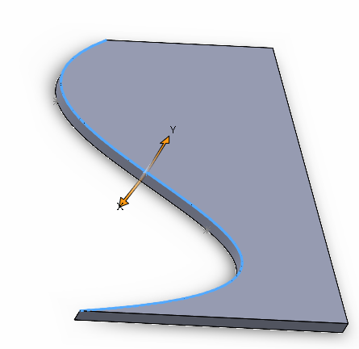

 使用 SOLIDWORKS API 从图形视图中选定的边获取 B-Spline 曲线的参数（维度、阶数、周期性、控制点和节点）。
image: selected-bspline-edge.png
labels: [bspline, parameters, modeler, edge]
---
{ width=250 }

这个 VBA 示例从选定的 B-Spline 类型边（例如从样条线段派生的边）中提取参数（维度、阶数、周期性、控制点和节点）。提取的数据可以在 [IModeler::CreateBsplineCurve](https://help.solidworks.com/2012/English/api/sldworksapi/SolidWorks.Interop.sldworks~SolidWorks.Interop.sldworks.IModeler~CreateBsplineCurve.html) SOLIDWORKS API 方法中使用，以构建相同几何形状的曲线。

数据以以下格式输出到 VBA 编辑器的即时窗口中：

~~~
属性：
 维度 值
 阶数 值
 控制点数量 值
 周期性 值
节点：
 值 1
 ...
 值 N
控制点：
 值 1
 ...
 值 N
~~~

~~~ vb
Dim swApp As SldWorks.SldWorks
Dim swModel As SldWorks.ModelDoc2
Dim swSelMgr As SldWorks.SelectionMgr

Sub main()

    Set swApp = Application.SldWorks
    
    Set swModel = swApp.ActiveDoc
    
    Set swSelMgr = swModel.SelectionManager
    
    Dim swEdge As SldWorks.Edge
    
    Set swEdge = swSelMgr.GetSelectedObject6(1, -1)
    
    Dim swCurve As SldWorks.Curve
    
    Set swCurve = swEdge.GetCurve
    
    Dim swSplineData As SldWorks.SplineParamData
    Set swSplineData = swCurve.GetBCurveParams5(False, False, False, False)
    
    Dim i As Integer
    
    Debug.Print "属性："
    Debug.Print swSplineData.Dimension
    Debug.Print swSplineData.Order
    Debug.Print swSplineData.ControlPointsCount
    Debug.Print swSplineData.Periodic
    
    Debug.Print "节点："
    Dim vKnotPts As Variant
    swSplineData.GetKnotPoints vKnotPts
    
    For i = 0 To UBound(vKnotPts)
        Debug.Print vKnotPts(i)
    Next
    
    Debug.Print "控制点："
    Dim vCtrlPts As Variant
    swSplineData.GetControlPoints vCtrlPts
    For i = 0 To UBound(vCtrlPts)
        Debug.Print vCtrlPts(i)
    Next
    
End Sub
~~~