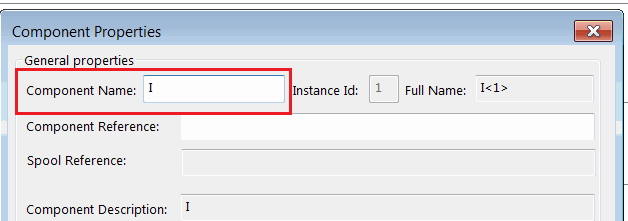

{ width=200 }

该示例演示了如何从完整的名称层次结构中检索到[SOLIDWORKS API中的IComponent2](https://help.solidworks.com/2017/english/api/sldworksapi/solidworks.interop.sldworks~solidworks.interop.sldworks.icomponent2.html)方法的指针，该方法可以在装配体的任意级别上使用。

组件的名称被定义为一个路径，每个级别之间用/符号分隔。组件实例ID用-符号指定（例如，FirstLevelComp-1/SecondLevelComp-2/TargetComp-1）。

在SOLIDWORKS用户界面中，可以在以下对话框中找到组件名称：

{ width=250 }

请参考[通过名称选择组件](/docs/codestack/solidworks-api/document/selection/select-component-by-name)示例，了解通过名称选择组件的另一种方法。

~~~ vb
Dim swApp As SldWorks.SldWorks

Sub main()

    Set swApp = Application.SldWorks
    
    Dim swAssy As SldWorks.AssemblyDoc
    
    Set swAssy = swApp.ActiveDoc

    Dim swComp As SldWorks.Component2
    Set swComp = GetComponentByName(swAssy, "E-1/F^E-1/I-1")
    
    If Not swComp Is Nothing Then
        Debug.Print "找到组件：" & swComp.Name2
        swComp.Select4 False, Nothing, False
    Else
        Debug.Print "未找到组件"
    End If
    
End Sub

Function GetComponentByName(assy As SldWorks.AssemblyDoc, name As String) As SldWorks.Component2
    
    Dim vNameParts As Variant
    vNameParts = Split(name, "/")
    
    Dim swComp As SldWorks.Component2
    
    Dim i As Integer
    
    For i = 0 To UBound(vNameParts)
        
        Dim swCompFeat As SldWorks.Feature
        
        If i = 0 Then
            Set swCompFeat = assy.FeatureByName(vNameParts(i))
        Else
            Set swCompFeat = swComp.FeatureByName(vNameParts(i))
        End If
        
        If swCompFeat Is Nothing Then
            Set GetComponentByName = Nothing
            Exit Function
        End If
        
        Set swComp = swCompFeat.GetSpecificFeature2
        
    Next
    
    Set GetComponentByName = swComp
    
End Function
~~~