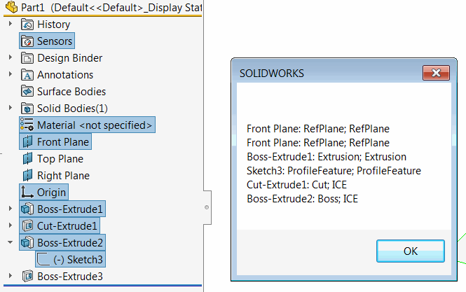

 使用SOLIDWORKS API获取所选特征的类型名称的VBA宏，并在消息框中显示结果
image: type-names-msg-box.png
labels: [类型名称,特征,种类]
---

这个VBA宏使用SOLIDWORKS API读取特征管理器树中所选特征的类型名称，并以以下格式在消息框中显示结果：

~~~
<特征名称>: <类型名称1>, <类型名称2>
~~~

{ width=350 }

其中，*类型名称1* 是通过[SOLIDWORKS API](https://help.solidworks.com/2016/english/api/sldworksapi/solidworks.interop.sldworks~solidworks.interop.sldworks.ifeature~gettypename.html)中的[IFeature::GetTypeName](https://help.solidworks.com/2016/english/api/sldworksapi/solidworks.interop.sldworks~solidworks.interop.sldworks.ifeature~gettypename.html)方法检索到的旧版本特征类型名称，而*类型名称2*是通过[IFeature::GetTypeName2](https://help.solidworks.com/2016/english/api/sldworksapi/solidworks.interop.sldworks~solidworks.interop.sldworks.ifeature~gettypename2.html)方法检索到的新版本特征类型名称。

对于使用Instant3D功能创建的基准挤出和切割挤出特征，*类型名称2*将等于*ICE*。使用*类型名称1*的值来获取特定的特征类型名称。

如果需要将结果复制为文本格式，只需点击消息框，按下*Ctrl+C*复制该值，然后通过*Ctrl+V*将其粘贴到任何文本编辑器（如记事本）中：

{ width=250 }

```vb
Dim swApp As SldWorks.SldWorks

Sub main()

    Set swApp = Application.SldWorks
    
    Dim swModel As SldWorks.ModelDoc2
    
    Set swModel = swApp.ActiveDoc
    
    If Not swModel Is Nothing Then
        MsgBox GetTypeNames(swModel.SelectionManager)
    Else
        MsgBox "请打开模型"
    End If
    
End Sub

Function GetTypeNames(selMgr As SldWorks.SelectionMgr) As String
    
    Dim typeNames As String
    
    Dim i As Integer
    
    For i = 1 To selMgr.GetSelectedObjectCount2(-1)
        
        On Error Resume Next
        
        Dim swFeat As SldWorks.Feature
        Set swFeat = selMgr.GetSelectedObject6(i, -1)
        
        If Not swFeat Is Nothing Then
            typeNames = typeNames & vbLf & swFeat.Name & ": " & swFeat.GetTypeName() & "; " & swFeat.GetTypeName2
        End If
        
    Next
    
    GetTypeNames = typeNames
    
End Function
```

